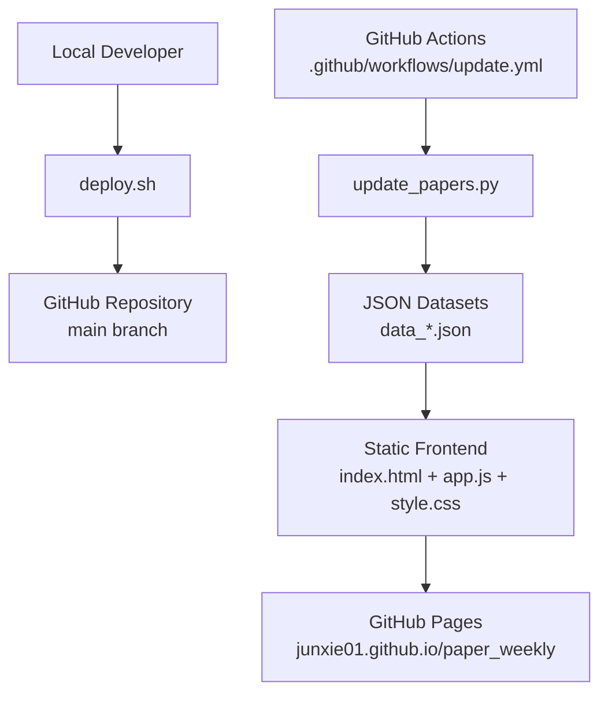
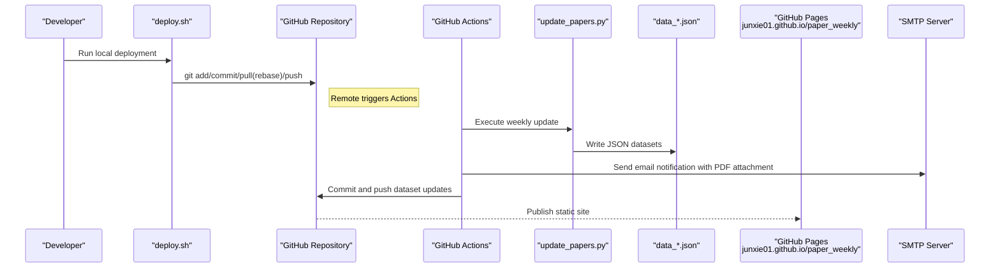
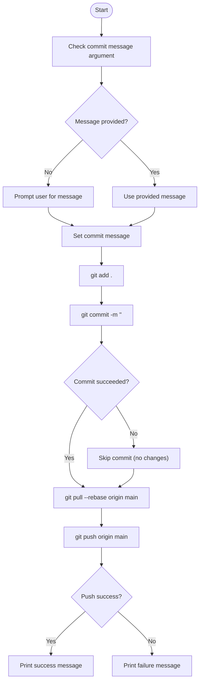
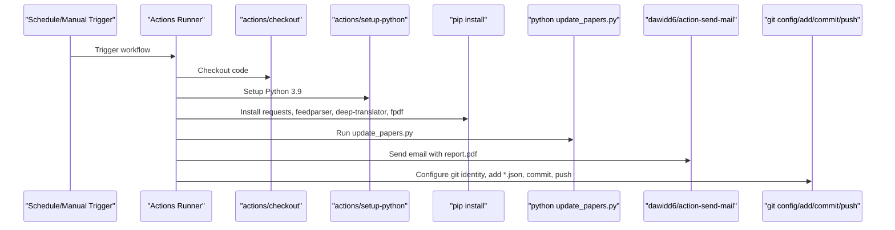
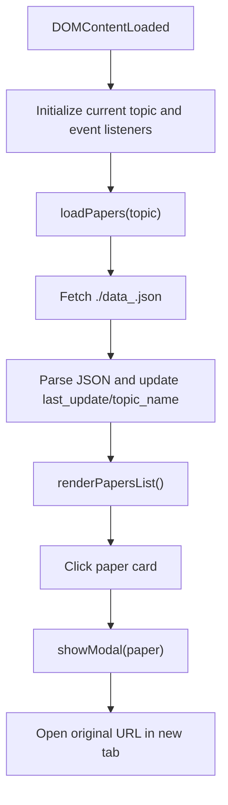
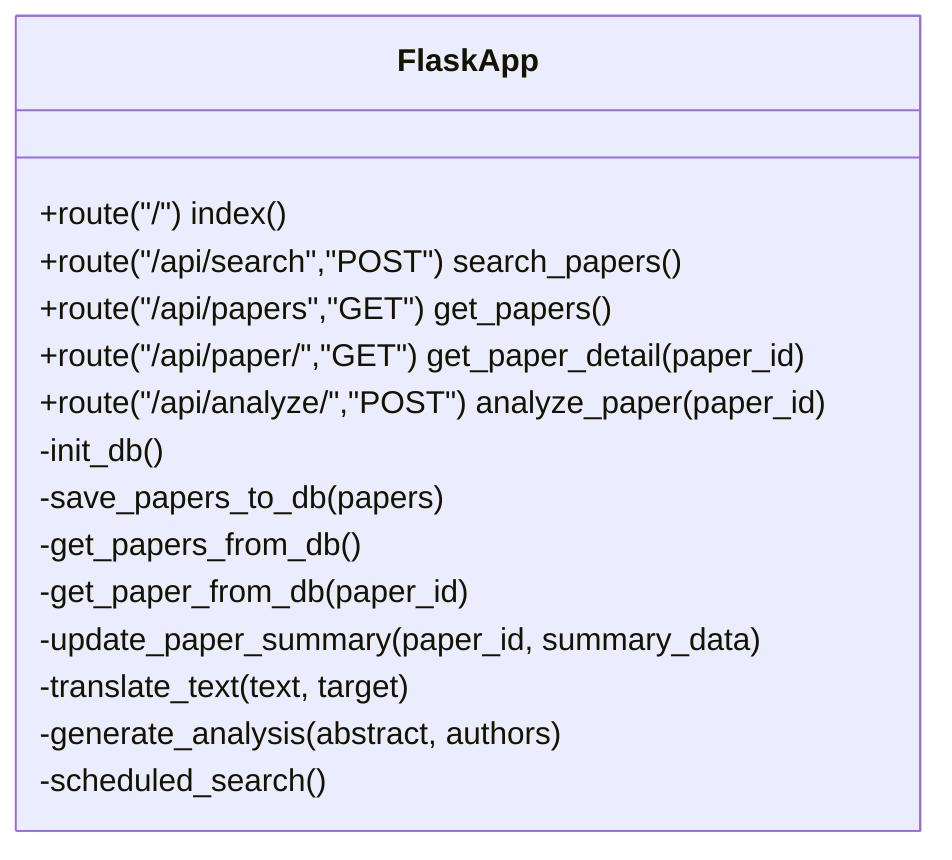
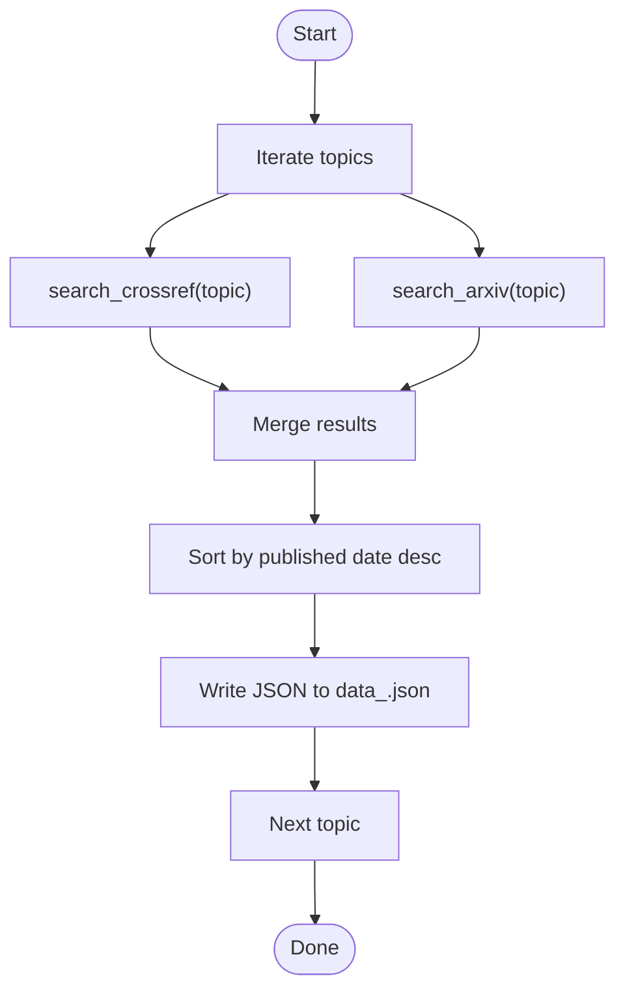
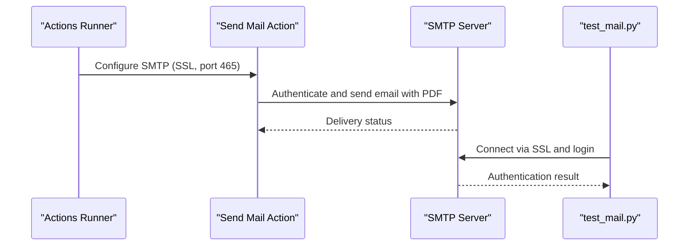
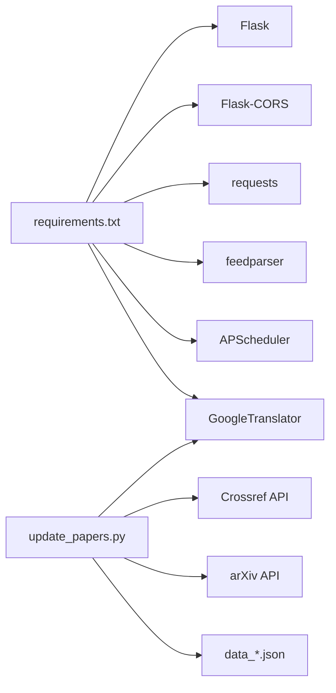

# Deployment Configuration

<cite>
**Referenced Files in This Document**
- [deploy.sh](file://deploy.sh)
- [.github/workflows/update.yml](file://.github/workflows/update.yml)
- [README.md](file://README.md)
- [update_papers.py](file://update_papers.py)
- [requirements.txt](file://requirements.txt)
- [backend/app.py](file://backend/app.py)
- [index.html](file://index.html)
- [style.css](file://style.css)
- [app.js](file://app.js)
- [data_cryo.json](file://data_cryo.json)
- [email_body.txt](file://email_body.txt)
- [test_mail.py](file://test_mail.py)
</cite>

## Table of Contents
1. [Introduction](#introduction)
2. [Project Structure](#project-structure)
3. [Core Components](#core-components)
4. [Architecture Overview](#architecture-overview)
5. [Detailed Component Analysis](#detailed-component-analysis)
6. [Dependency Analysis](#dependency-analysis)
7. [Performance Considerations](#performance-considerations)
8. [Security Considerations](#security-considerations)
9. [Environment-Specific Configurations](#environment-specific-configurations)
10. [Monitoring and Maintenance](#monitoring-and-maintenance)
11. [Troubleshooting Guide](#troubleshooting-guide)
12. [Conclusion](#conclusion)

## Introduction
This document explains the deployment configuration for the paper_weekly system, covering:
- Local deployment script functionality (Git operations, file management, and update processes)
- GitHub Pages deployment setup for web hosting, domain configuration, and custom domain mapping
- Hexo blog integration process including theme customization, content synchronization, and automated publishing workflows
- Security considerations for production deployment including HTTPS configuration, access controls, and backup strategies
- Environment-specific configurations, staging deployments, and rollback procedures
- Monitoring setup, performance optimization, and maintenance procedures for production environments

## Project Structure
The repository is organized around a lightweight web frontend and a Python-based update pipeline. The frontend is served statically and consumes JSON datasets generated by the update scripts. GitHub Actions automates weekly updates and notifications.

**Diagram sources**
- [deploy.sh:1-34](file://deploy.sh#L1-L34)
- [.github/workflows/update.yml:1-48](file://.github/workflows/update.yml#L1-L48)
- [update_papers.py:1-149](file://update_papers.py#L1-L149)
- [index.html:1-50](file://index.html#L1-L50)
- [app.js:1-148](file://app.js#L1-L148)
- [style.css:1-179](file://style.css#L1-L179)

**Section sources**
- [README.md:1-40](file://README.md#L1-L40)
- [deploy.sh:1-34](file://deploy.sh#L1-L34)
- [.github/workflows/update.yml:1-48](file://.github/workflows/update.yml#L1-L48)
- [update_papers.py:1-149](file://update_papers.py#L1-L149)
- [index.html:1-50](file://index.html#L1-L50)
- [app.js:1-148](file://app.js#L1-L148)
- [style.css:1-179](file://style.css#L1-L179)

## Core Components
- Local deployment script: Automates Git operations and pushes changes to the remote repository.
- GitHub Actions workflow: Runs weekly updates, generates JSON datasets, sends email notifications, and commits/pushes changes.
- Static frontend: Renders topic-specific datasets and provides a responsive UI.
- Backend service (Flask): Provides APIs for paper search and detail analysis; intended for development/testing.
- Email notification system: Sends weekly reports via SMTP with attachments.

**Section sources**
- [deploy.sh:1-34](file://deploy.sh#L1-L34)
- [.github/workflows/update.yml:1-48](file://.github/workflows/update.yml#L1-L48)
- [update_papers.py:1-149](file://update_papers.py#L1-L149)
- [backend/app.py:1-236](file://backend/app.py#L1-L236)
- [email_body.txt:1-74](file://email_body.txt#L1-L74)

## Architecture Overview
The system follows a CI-driven update pipeline with a static frontend and optional backend API.

**Diagram sources**
- [deploy.sh:1-34](file://deploy.sh#L1-L34)
- [.github/workflows/update.yml:1-48](file://.github/workflows/update.yml#L1-L48)
- [update_papers.py:1-149](file://update_papers.py#L1-L149)
- [email_body.txt:1-74](file://email_body.txt#L1-L74)

## Detailed Component Analysis

### Local Deployment Script (deploy.sh)
The script automates Git operations for local-to-remote synchronization:
- Prompts for a commit message if none is provided
- Adds all changes, commits with the message (skips if no changes), pulls remote with rebase, and pushes to origin/main
- Provides success/failure feedback

**Diagram sources**
- [deploy.sh:1-34](file://deploy.sh#L1-L34)

**Section sources**
- [deploy.sh:1-34](file://deploy.sh#L1-L34)

### GitHub Actions Workflow (.github/workflows/update.yml)
Automates weekly updates and notifications:
- Triggers on schedule (weekly) and manual dispatch
- Sets up Python, installs dependencies, runs the update script, sends email notification, and commits/pushes dataset changes

**Diagram sources**
- [.github/workflows/update.yml:1-48](file://.github/workflows/update.yml#L1-L48)
- [update_papers.py:1-149](file://update_papers.py#L1-L149)
- [email_body.txt:1-74](file://email_body.txt#L1-L74)

**Section sources**
- [.github/workflows/update.yml:1-48](file://.github/workflows/update.yml#L1-L48)
- [update_papers.py:1-149](file://update_papers.py#L1-L149)
- [email_body.txt:1-74](file://email_body.txt#L1-L74)

### Static Frontend (index.html, app.js, style.css)
The frontend loads topic-specific JSON datasets and renders a responsive UI:
- Navigation buttons switch topics and load corresponding data files
- Modal displays paper details and links to original sources
- Uses fetch to load JSON datasets and displays translated abstracts

**Diagram sources**
- [index.html:1-50](file://index.html#L1-L50)
- [app.js:1-148](file://app.js#L1-L148)
- [style.css:1-179](file://style.css#L1-L179)

**Section sources**
- [index.html:1-50](file://index.html#L1-L50)
- [app.js:1-148](file://app.js#L1-L148)
- [style.css:1-179](file://style.css#L1-L179)

### Backend Service (Flask API)
Provides endpoints for searching papers and retrieving details:
- Initializes SQLite database and defines CRUD-like operations
- Exposes endpoints for search, listing, and paper detail retrieval
- Includes scheduled job runner for periodic updates

**Diagram sources**
- [backend/app.py:1-236](file://backend/app.py#L1-L236)

**Section sources**
- [backend/app.py:1-236](file://backend/app.py#L1-L236)

### Update Pipeline (update_papers.py)
Generates topic-specific JSON datasets:
- Defines topics and keywords, retrieves from Crossref and arXiv
- Translates abstracts, cleans content, sorts by publication date, and writes JSON files
- Outputs last update timestamp and topic metadata

**Diagram sources**
- [update_papers.py:1-149](file://update_papers.py#L1-L149)

**Section sources**
- [update_papers.py:1-149](file://update_papers.py#L1-L149)

### Email Notification (GitHub Actions + test_mail.py)
- GitHub Actions uses an action to send emails with SMTP SSL (port 465) and attaches a PDF report
- A local test script validates SMTP credentials and connectivity

**Diagram sources**
- [.github/workflows/update.yml:27-39](file://.github/workflows/update.yml#L27-L39)
- [test_mail.py:1-37](file://test_mail.py#L1-L37)

**Section sources**
- [.github/workflows/update.yml:27-39](file://.github/workflows/update.yml#L27-L39)
- [test_mail.py:1-37](file://test_mail.py#L1-L37)

## Dependency Analysis
- Runtime dependencies for the backend are declared in requirements.txt
- Frontend depends on static assets and JSON datasets produced by the update pipeline
- GitHub Actions depends on Python packages installed via pip and external APIs (Crossref, arXiv, translation services)

**Diagram sources**
- [requirements.txt:1-7](file://requirements.txt#L1-L7)
- [update_papers.py:1-149](file://update_papers.py#L1-L149)

**Section sources**
- [requirements.txt:1-7](file://requirements.txt#L1-L7)
- [update_papers.py:1-149](file://update_papers.py#L1-L149)

## Performance Considerations
- Reduce API latency by caching translated content and minimizing repeated translations
- Limit concurrent API calls to Crossref and arXiv; batch requests where possible
- Optimize frontend rendering by virtualizing long lists and deferring heavy DOM operations
- Compress JSON datasets and enable gzip on GitHub Pages for faster transfers
- Use CDN-backed GitHub Pages for improved global delivery

## Security Considerations
- HTTPS: GitHub Pages serves over HTTPS by default; ensure custom domains use TLS certificates managed by GitHub Pages or your DNS provider
- Access controls: No authentication is implemented in the frontend or backend; restrict sensitive secrets to GitHub Actions only
- Secrets management: Store email credentials as GitHub Secrets; avoid committing credentials to the repository
- Backup strategies: Back up JSON datasets and maintain a recent snapshot of the repository; consider archiving PDF reports
- Network security: Use SMTP SSL (port 465) as configured; avoid plaintext SMTP

**Section sources**
- [.github/workflows/update.yml:27-39](file://.github/workflows/update.yml#L27-L39)
- [README.md:19-32](file://README.md#L19-L32)

## Environment-Specific Configurations
- Staging deployments: Use a separate branch or fork for testing updates and frontend changes before merging to main
- Rollback procedures: Revert to the previous commit on main if dataset generation fails; use GitHub’s branch protection rules to prevent force pushes
- Environment variables: Configure GitHub Actions secrets for email credentials; keep local environment variables minimal and ephemeral

**Section sources**
- [.github/workflows/update.yml:41-47](file://.github/workflows/update.yml#L41-L47)
- [README.md:19-32](file://README.md#L19-L32)

## Monitoring and Maintenance
- Monitoring: Track GitHub Actions logs for failures; monitor email delivery status; verify dataset timestamps in JSON files
- Maintenance: Periodically review dependencies in requirements.txt; update translation libraries; ensure external APIs remain accessible
- Frontend health: Validate JSON datasets exist and are readable; confirm modal rendering and loading states

**Section sources**
- [.github/workflows/update.yml:1-48](file://.github/workflows/update.yml#L1-L48)
- [data_cryo.json:1-5](file://data_cryo.json#L1-L5)

## Troubleshooting Guide
- Local deployment fails with merge conflicts:
  - Resolve conflicts locally, commit, and rerun the script
- GitHub Actions email authentication errors:
  - Verify two-step verification and application-specific password; ensure SMTP SSL and port 465 are set
- Empty or missing datasets:
  - Confirm update_papers.py ran successfully and wrote JSON files; check network connectivity to external APIs
- Frontend shows empty topic:
  - Ensure the corresponding data file exists and is readable; verify CORS settings if running locally

**Section sources**
- [deploy.sh:20-33](file://deploy.sh#L20-L33)
- [.github/workflows/update.yml:27-39](file://.github/workflows/update.yml#L27-L39)
- [README.md:26-32](file://README.md#L26-L32)
- [update_papers.py:126-149](file://update_papers.py#L126-L149)
- [app.js:42-71](file://app.js#L42-L71)

## Conclusion
The paper_weekly system combines a CI-driven update pipeline with a static frontend to deliver timely research summaries. By leveraging GitHub Actions for automation, GitHub Pages for hosting, and a simple local deployment script, the system achieves reliable, low-maintenance operation. For production, focus on robust secret management, HTTPS enforcement, and continuous monitoring to ensure availability and reliability.