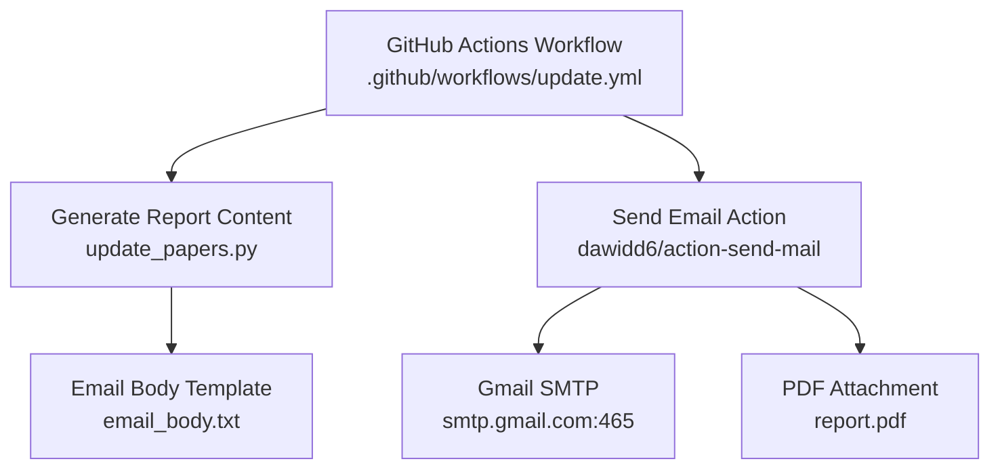
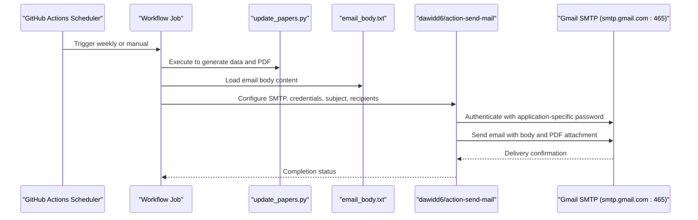
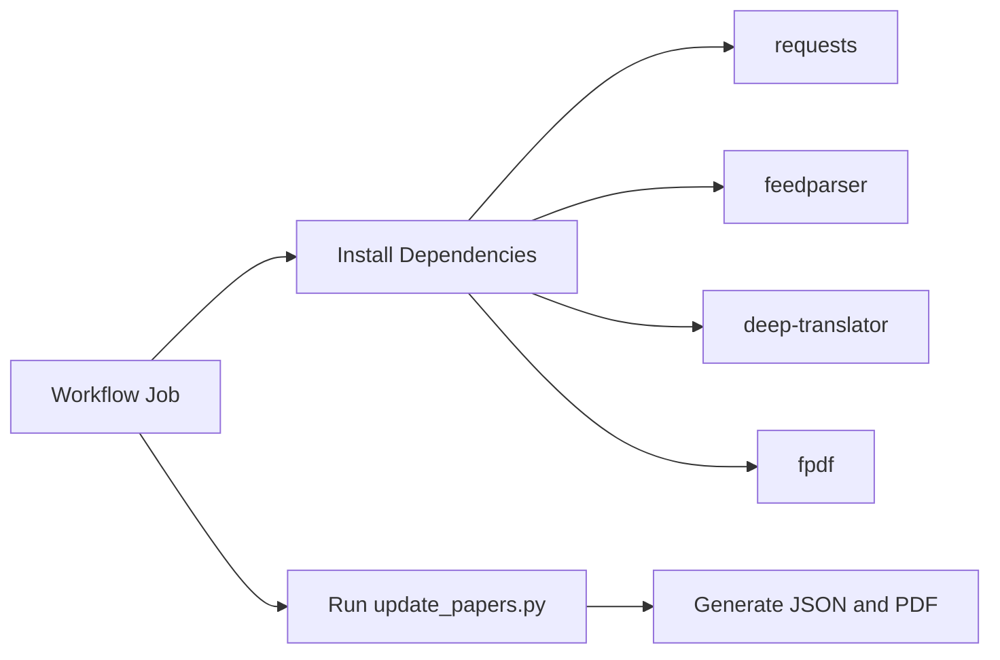

# Email Notification System

<cite>
**Referenced Files in This Document**
- [email_body.txt](file://email_body.txt)
- [test_mail.py](file://test_mail.py)
- [update_papers.py](file://update_papers.py)
- [.github/workflows/update.yml](file://.github/workflows/update.yml)
- [README.md](file://README.md)
- [requirements.txt](file://requirements.txt)
</cite>

## Table of Contents
1. [Introduction](#introduction)
2. [Project Structure](#project-structure)
3. [Core Components](#core-components)
4. [Architecture Overview](#architecture-overview)
5. [Detailed Component Analysis](#detailed-component-analysis)
6. [Dependency Analysis](#dependency-analysis)
7. [Performance Considerations](#performance-considerations)
8. [Troubleshooting Guide](#troubleshooting-guide)
9. [Conclusion](#conclusion)
10. [Appendices](#appendices)

## Introduction
This document provides comprehensive setup and configuration guidance for the email notification system used by the automated weekly paper report pipeline. It covers Gmail SMTP configuration, authentication with OAuth2 and application-specific passwords, the email body template structure, attachment of PDF reports, recipient and sender identity configuration, and troubleshooting for common delivery failures, rate limiting, and security policy conflicts. It also outlines alternative SMTP providers and backup notification methods.

## Project Structure
The email notification system integrates with the weekly update workflow and relies on a GitHub Actions job to:
- Generate the weekly report content
- Attach a PDF report
- Send an email via Gmail SMTP

Key components involved in email delivery:
- Workflow definition for scheduling and sending emails
- Template content for the email body
- Test script for validating SMTP credentials
- Dependencies required for PDF generation and translation

**Diagram sources**
- [.github/workflows/update.yml:27-40](file://.github/workflows/update.yml#L27-L40)
- [update_papers.py:126-149](file://update_papers.py#L126-L149)
- [email_body.txt:1-74](file://email_body.txt#L1-L74)

**Section sources**
- [.github/workflows/update.yml:1-48](file://.github/workflows/update.yml#L1-L48)
- [README.md:19-32](file://README.md#L19-L32)

## Core Components
- Gmail SMTP configuration
  - Server address: smtp.gmail.com
  - Port: 465
  - Encryption: SSL/TLS enabled
- Authentication
  - Application-specific password (16-character) stored in GitHub Secrets
  - Sender identity configured as “Seismology Bot <username>"
- Email body template
  - Plain-text content generated by the update script and referenced by the workflow
- Attachment
  - PDF report named report.pdf attached to the email
- Recipients
  - Single or multiple recipients configured via GitHub Secrets

**Section sources**
- [.github/workflows/update.yml:30-39](file://.github/workflows/update.yml#L30-L39)
- [README.md:21-24](file://README.md#L21-L24)
- [email_body.txt:1-74](file://email_body.txt#L1-L74)

## Architecture Overview
The email notification pipeline is orchestrated by GitHub Actions. The workflow:
- Runs on a weekly schedule and on demand
- Installs dependencies including a PDF library
- Executes the update script to generate JSON data and a PDF report
- Sends an email with the body loaded from email_body.txt and the PDF attached

**Diagram sources**
- [.github/workflows/update.yml:27-40](file://.github/workflows/update.yml#L27-L40)
- [update_papers.py:126-149](file://update_papers.py#L126-L149)
- [email_body.txt:1-74](file://email_body.txt#L1-L74)

## Detailed Component Analysis

### Gmail SMTP Configuration
- Server address: smtp.gmail.com
- Port: 465
- Encryption: TLS/SSL enabled
- Authentication: Requires application-specific password (16 characters) stored in GitHub Secrets
- Sender identity: “Seismology Bot <username>”
- Recipients: Configured via MAIL_TO secret

These settings are defined in the workflow and enforced by the action.

**Section sources**
- [.github/workflows/update.yml:30-39](file://.github/workflows/update.yml#L30-L39)
- [README.md:21-24](file://README.md#L21-L24)

### Authentication Process and Security
- Two-factor authentication must be enabled on the Gmail account
- Application-specific password must be used (not the regular Gmail password)
- The workflow sets secure: true and uses port 465

Common authentication error and resolution:
- Error: 535 Login fail
  - Cause: Incorrect or missing application-specific password, or incorrect YAML configuration
  - Resolution: Ensure 2FA is enabled, generate a 16-character app password, remove spaces, and confirm server_port is 465 and secure is true

**Section sources**
- [README.md:26-31](file://README.md#L26-L31)
- [.github/workflows/update.yml:30-32](file://.github/workflows/update.yml#L30-L32)

### Email Body Template Structure
- Location: email_body.txt
- Format: Plain text
- Content: Weekly report header, separator lines, and article entries with title, authors, date, abstract summary, and link
- The workflow loads the body content from this file and sends it as the email message body

Customization options:
- Modify the header and separators to reflect branding or locale
- Adjust article formatting to include or exclude fields (e.g., links)
- Ensure the content remains readable and concise for email clients

**Section sources**
- [email_body.txt:1-74](file://email_body.txt#L1-L74)
- [.github/workflows/update.yml:38](file://.github/workflows/update.yml#L38)

### Attachment Process for PDF Reports
- The workflow attaches a file named report.pdf
- The update script generates the PDF during the workflow run
- Ensure the PDF is generated and present under the expected path before sending

**Section sources**
- [.github/workflows/update.yml:39](file://.github/workflows/update.yml#L39)
- [update_papers.py:126-149](file://update_papers.py#L126-L149)

### Recipient Configuration and Sender Identity Setup
- Recipients: MAIL_TO secret
- Sender identity: “Seismology Bot <username>”
- Username: MAIL_USERNAME secret

Ensure secrets are set in GitHub repository settings under Actions.

**Section sources**
- [.github/workflows/update.yml:33-37](file://.github/workflows/update.yml#L33-L37)
- [README.md:21-24](file://README.md#L21-L24)

### Testing SMTP Credentials Locally
- A local test script demonstrates connecting to Gmail SMTP over SSL, authenticating, and sending a verification email
- Use this script to validate credentials before relying on the GitHub Actions workflow

Key elements validated by the script:
- SMTP server and port
- SSL connection
- Login with username and application-specific password
- Sending a test message to a receiver

**Section sources**
- [test_mail.py:12-36](file://test_mail.py#L12-L36)

## Dependency Analysis
External dependencies required for the workflow:
- requests, feedparser, deep-translator for data fetching and translation
- fpdf for PDF generation

These are installed in the workflow job prior to running the update script.

**Diagram sources**
- [.github/workflows/update.yml:20-25](file://.github/workflows/update.yml#L20-L25)
- [requirements.txt:1-7](file://requirements.txt#L1-L7)

**Section sources**
- [.github/workflows/update.yml:20-25](file://.github/workflows/update.yml#L20-L25)
- [requirements.txt:1-7](file://requirements.txt#L1-L7)

## Performance Considerations
- Network latency and timeouts: The update script includes timeouts for external APIs; ensure robust retry logic if needed
- Translation costs: Using a translation service may incur usage limits; monitor quotas
- PDF generation: Large reports may increase processing time; optimize content length and formatting
- Rate limiting: External APIs (Crossref, arXiv) may throttle requests; consider staggering or caching

[No sources needed since this section provides general guidance]

## Troubleshooting Guide

### Common Authentication Errors
- Symptom: 535 Login fail
  - Verify two-factor authentication is enabled on the Gmail account
  - Confirm the application-specific password is 16 characters and has no spaces
  - Ensure the workflow YAML specifies server_port: 465 and secure: true

**Section sources**
- [README.md:26-31](file://README.md#L26-L31)
- [.github/workflows/update.yml:30-32](file://.github/workflows/update.yml#L30-L32)

### Email Delivery Failures
- Validate recipient address in MAIL_TO
- Confirm the email_body.txt file exists and is readable by the workflow
- Ensure report.pdf is generated and attached before sending

**Section sources**
- [.github/workflows/update.yml:38-39](file://.github/workflows/update.yml#L38-L39)

### Rate Limiting Issues
- External APIs may limit requests per second or minute
- Add delays between API calls if necessary
- Consider caching recent results to reduce repeated calls

**Section sources**
- [update_papers.py:104-124](file://update_papers.py#L104-L124)

### Security Policy Conflicts
- Some organizations restrict SMTP relay or require specific authentication mechanisms
- Use application-specific passwords for Gmail
- For enterprise environments, configure an internal SMTP relay or use a compliant email service

**Section sources**
- [README.md:26-31](file://README.md#L26-L31)

## Conclusion
The email notification system is designed to reliably deliver a weekly paper report via Gmail SMTP. By following the configuration steps, using application-specific passwords, and validating credentials locally, you can minimize authentication and delivery issues. The workflow’s structure supports easy customization of the email body and attachments while maintaining robustness against external API limitations.

[No sources needed since this section summarizes without analyzing specific files]

## Appendices

### Alternative SMTP Providers
- Outlook/Office 365
  - Server: smtp-mail.outlook.com
  - Port: 587
  - Encryption: TLS
  - Authentication: Standard username/password or OAuth2 depending on provider settings
- Yahoo Mail
  - Server: smtp.mail.yahoo.com
  - Port: 587
  - Encryption: TLS
  - Authentication: Standard username/password or OAuth2
- Generic SMTP
  - Use your provider’s SMTP host, port, and TLS settings
  - Authentication: Username/password or OAuth2 as supported

[No sources needed since this section provides general guidance]

### Backup Notification Methods
- Slack or Teams webhooks for channel notifications
- Email to multiple recipients or distribution lists
- RSS feeds or Atom feeds for subscribers
- GitHub Discussions or Issues for announcements

[No sources needed since this section provides general guidance]