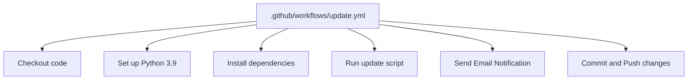
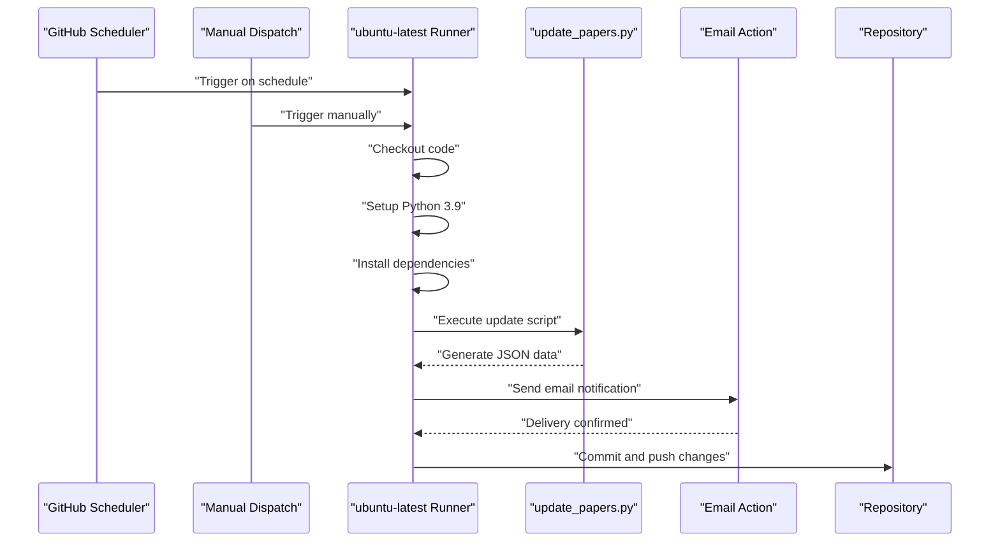
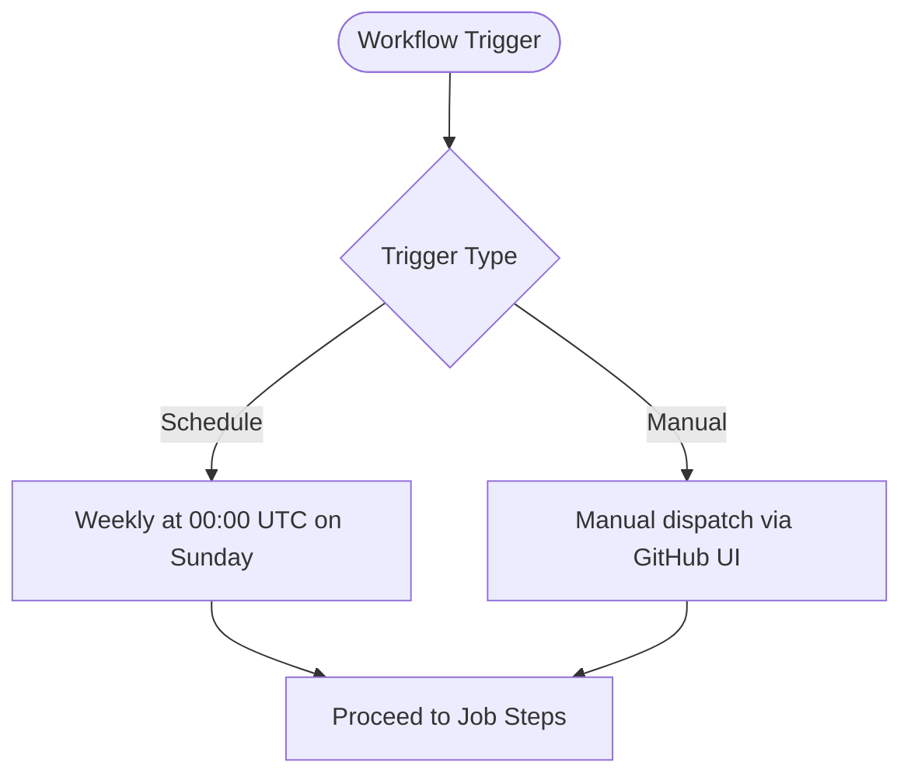
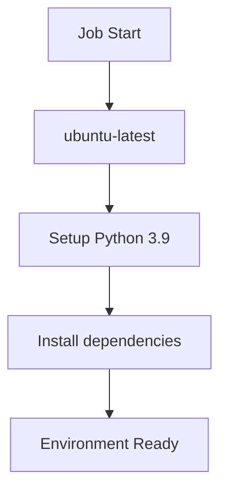
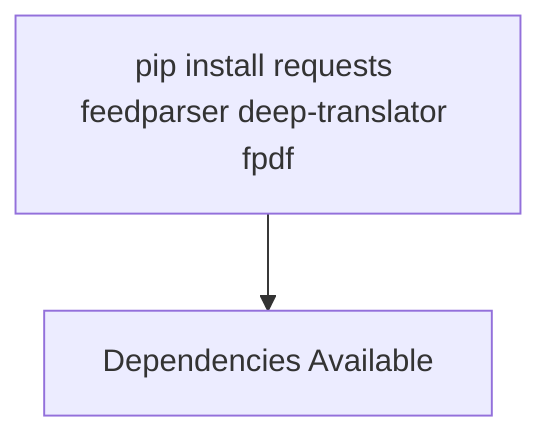
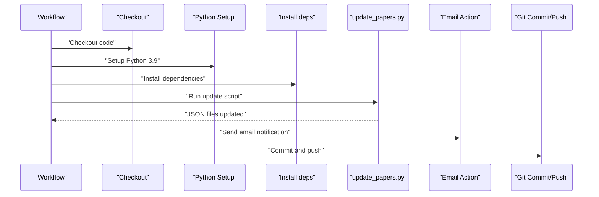
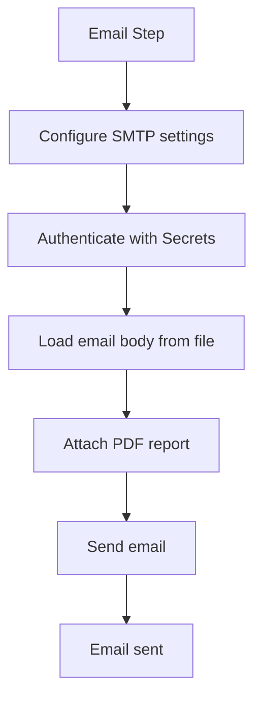
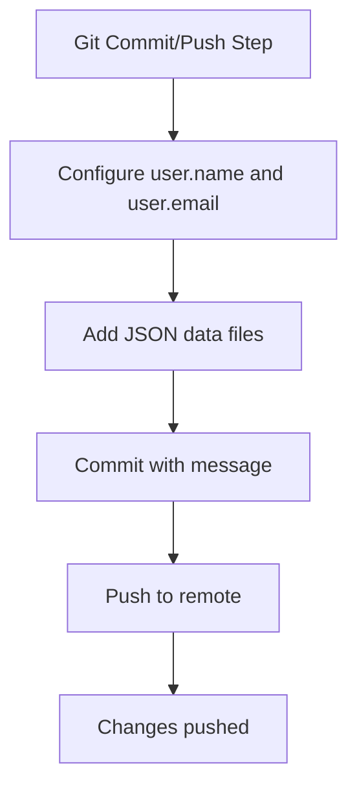
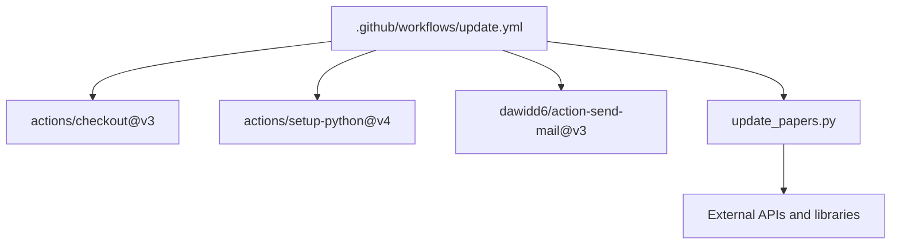

# GitHub Actions Workflow

<cite>
**Referenced Files in This Document**
- [update.yml](file://.github/workflows/update.yml)
- [update_papers.py](file://update_papers.py)
- [requirements.txt](file://requirements.txt)
- [email_body.txt](file://email_body.txt)
- [README.md](file://README.md)
- [deploy.sh](file://deploy.sh)
- [test_mail.py](file://test_mail.py)
- [data_cryo.json](file://data_cryo.json)
- [data_ai.json](file://data_ai.json)
- [data_imaging.json](file://data_imaging.json)
</cite>

## Table of Contents
1. [Introduction](#introduction)
2. [Project Structure](#project-structure)
3. [Core Components](#core-components)
4. [Architecture Overview](#architecture-overview)
5. [Detailed Component Analysis](#detailed-component-analysis)
6. [Dependency Analysis](#dependency-analysis)
7. [Performance Considerations](#performance-considerations)
8. [Troubleshooting Guide](#troubleshooting-guide)
9. [Conclusion](#conclusion)
10. [Appendices](#appendices)

## Introduction
This document explains how to configure and operate the GitHub Actions workflow for the paper_weekly project. It covers the weekly cron schedule, job environment setup, dependency installation, triggers (scheduled and manual), step-by-step execution flow, environment variable usage with GitHub Secrets, security considerations, troubleshooting, and guidance for customization and monitoring.

## Project Structure
The workflow is defined in a YAML file under the GitHub Actions workflows directory. The workflow orchestrates:
- Code checkout
- Python environment setup
- Dependency installation
- Execution of the update script
- Email notification sending
- Automatic Git commit and push

**Diagram sources**
- [update.yml:1-48](file://.github/workflows/update.yml#L1-L48)

**Section sources**
- [.github/workflows/update.yml:1-48](file://.github/workflows/update.yml#L1-L48)

## Core Components
- Workflow definition: Declares schedule and manual dispatch triggers, and the job steps.
- Update script: Performs paper fetching, translation, and JSON data generation.
- Email template: Provides the email body content.
- Secrets: Credentials and recipient configured via GitHub Actions Secrets.
- Deployment helper: Local deployment script for manual updates.

**Section sources**
- [update.yml:1-48](file://.github/workflows/update.yml#L1-L48)
- [update_papers.py:1-149](file://update_papers.py#L1-L149)
- [email_body.txt:1-74](file://email_body.txt#L1-L74)
- [README.md:19-32](file://README.md#L19-L32)
- [deploy.sh:1-34](file://deploy.sh#L1-L34)

## Architecture Overview
The workflow executes on a Linux runner, installs Python 3.9, runs the update script, sends an email notification, and pushes changes to the repository.

**Diagram sources**
- [update.yml:3-47](file://.github/workflows/update.yml#L3-L47)
- [update_papers.py:126-149](file://update_papers.py#L126-L149)

## Detailed Component Analysis

### Cron Schedule and Triggers
- Schedule: Weekly at midnight on Sundays in UTC.
- Manual dispatch: Allows triggering the workflow from the GitHub UI.

**Diagram sources**
- [update.yml:4-6](file://.github/workflows/update.yml#L4-L6)

**Section sources**
- [update.yml:4-6](file://.github/workflows/update.yml#L4-L6)

### Job Environment Setup
- Runner: ubuntu-latest
- Python: 3.9 via actions/setup-python
- Dependencies: Installed via pip in the workflow

**Diagram sources**
- [update.yml:10-22](file://.github/workflows/update.yml#L10-L22)

**Section sources**
- [update.yml:10-22](file://.github/workflows/update.yml#L10-L22)

### Dependency Installation
- The workflow installs packages required by the update script.
- The repository also includes a requirements.txt file for local development.

**Diagram sources**
- [update.yml:20-22](file://.github/workflows/update.yml#L20-L22)
- [requirements.txt:1-7](file://requirements.txt#L1-L7)

**Section sources**
- [update.yml:20-22](file://.github/workflows/update.yml#L20-L22)
- [requirements.txt:1-7](file://requirements.txt#L1-L7)

### Step-by-Step Execution Flow
1. Checkout code
2. Set up Python 3.9
3. Install dependencies
4. Run update script
5. Send email notification
6. Commit and push changes

**Diagram sources**
- [update.yml:12-47](file://.github/workflows/update.yml#L12-L47)
- [update_papers.py:126-149](file://update_papers.py#L126-L149)

**Section sources**
- [update.yml:12-47](file://.github/workflows/update.yml#L12-L47)
- [update_papers.py:126-149](file://update_papers.py#L126-L149)

### Email Notification Sending
- Uses a community action to send SMTP emails.
- Reads credentials and recipients from GitHub Secrets.
- Sends the generated email body and attaches a PDF report.

**Diagram sources**
- [update.yml:27-39](file://.github/workflows/update.yml#L27-L39)
- [email_body.txt:1-74](file://email_body.txt#L1-L74)

**Section sources**
- [update.yml:27-39](file://.github/workflows/update.yml#L27-L39)
- [email_body.txt:1-74](file://email_body.txt#L1-L74)

### Automatic Git Commits and Push
- Configures a bot user for commits.
- Adds JSON data files and pushes changes.
- Handles “no changes to commit” gracefully.

**Diagram sources**
- [update.yml:41-47](file://.github/workflows/update.yml#L41-L47)

**Section sources**
- [update.yml:41-47](file://.github/workflows/update.yml#L41-L47)

### Environment Variables and GitHub Secrets
- Secrets used:
  - MAIL_USERNAME: Sender address
  - MAIL_PASSWORD: Application-specific password
  - MAIL_TO: Recipient address
- These are referenced in the workflow to configure the email action.

Security considerations:
- Use application-specific passwords for Gmail.
- Store sensitive values only in GitHub Secrets.
- Keep the workflow minimal and scoped to necessary permissions.

**Section sources**
- [update.yml:33-36](file://.github/workflows/update.yml#L33-L36)
- [README.md:19-32](file://README.md#L19-L32)

### Data Generation and Output
- The update script generates topic-specific JSON files.
- Example outputs include:
  - data_cryo.json
  - data_ai.json
  - data_imaging.json

These files are committed and pushed by the workflow.

**Section sources**
- [update_papers.py:14-44](file://update_papers.py#L14-L44)
- [data_cryo.json:1-5](file://data_cryo.json#L1-L5)
- [data_ai.json:1-5](file://data_ai.json#L1-L5)
- [data_imaging.json:1-5](file://data_imaging.json#L1-L5)

## Dependency Analysis
The workflow depends on:
- actions/checkout for code retrieval
- actions/setup-python for Python runtime
- A community email action for notifications
- The update script for data generation

**Diagram sources**
- [update.yml:12-22](file://.github/workflows/update.yml#L12-L22)
- [update.yml:27-39](file://.github/workflows/update.yml#L27-L39)
- [update_papers.py:1-10](file://update_papers.py#L1-L10)

**Section sources**
- [update.yml:12-39](file://.github/workflows/update.yml#L12-L39)
- [update_papers.py:1-10](file://update_papers.py#L1-10)

## Performance Considerations
- Network timeouts: The update script sets timeouts for external API calls.
- Translation limits: The translator is constrained by length and rate limits.
- Dependency installation: Installing lightweight packages reduces runtime overhead.
- Email delivery: Using SSL/TLS with correct ports improves reliability.

[No sources needed since this section provides general guidance]

## Troubleshooting Guide
Common issues and resolutions:
- Email authentication failure:
  - Ensure two-factor authentication is enabled.
  - Use a 16-character application-specific password.
  - Verify SMTP settings in the workflow match the provider’s requirements.
- No changes to commit:
  - The workflow handles this case gracefully; ensure the update script produces data.
- Manual testing:
  - Use the provided script to test SMTP connectivity locally.

**Section sources**
- [README.md:26-32](file://README.md#L26-L32)
- [test_mail.py:12-36](file://test_mail.py#L12-L36)

## Conclusion
The GitHub Actions workflow automates weekly paper updates, email notifications, and repository synchronization. By leveraging scheduled and manual triggers, a controlled Python environment, and secure secret management, the system reliably maintains updated research data and notifies stakeholders.

[No sources needed since this section summarizes without analyzing specific files]

## Appendices

### Modifying Execution Schedules
- Adjust the cron expression in the schedule section to change the weekly cadence.
- Consider timezone implications; the schedule runs in UTC.

**Section sources**
- [update.yml:5](file://.github/workflows/update.yml#L5)

### Adding Custom Steps
- Extend the workflow by adding new steps after dependency installation.
- Ensure any new dependencies are installed in the workflow.

**Section sources**
- [update.yml:20-22](file://.github/workflows/update.yml#L20-L22)

### Monitoring Workflow Performance
- Review workflow logs for errors during dependency installation, script execution, email sending, and Git operations.
- Use the manual dispatch option to quickly validate changes.

**Section sources**
- [update.yml:6](file://.github/workflows/update.yml#L6)