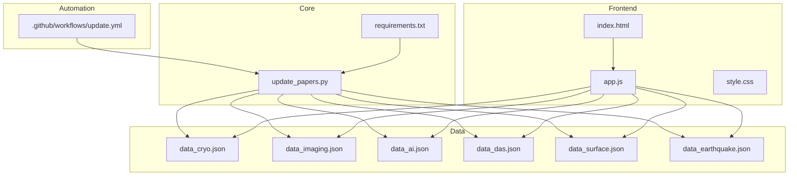
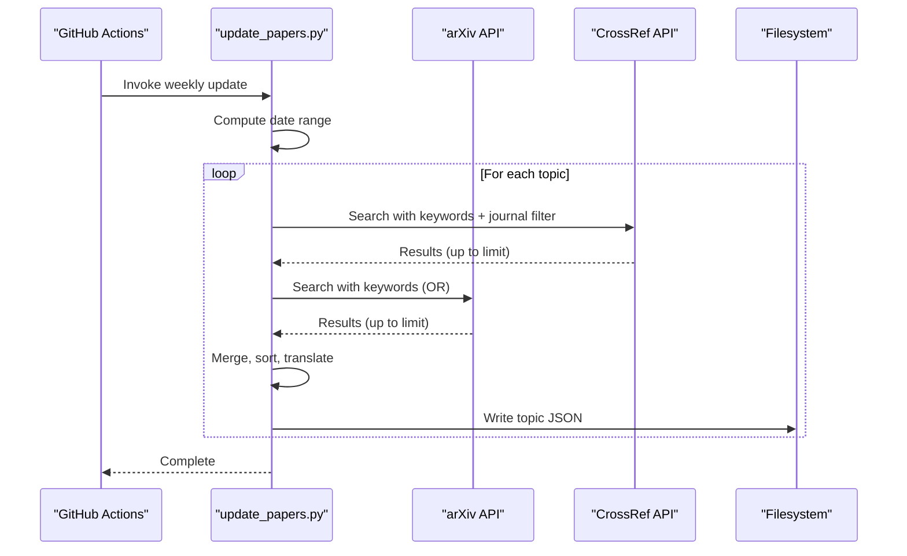
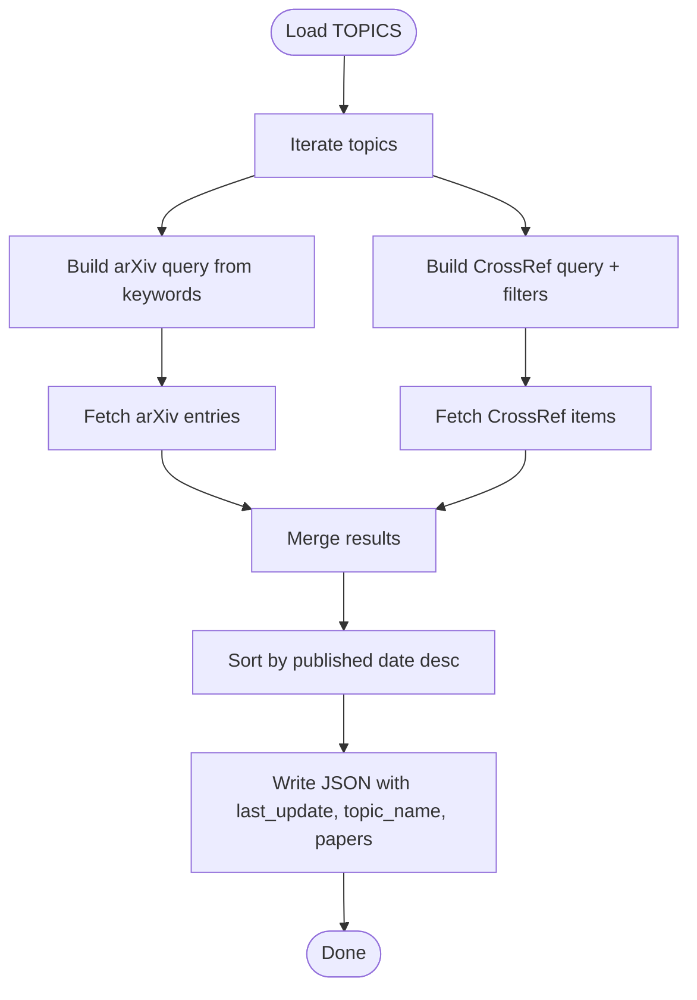
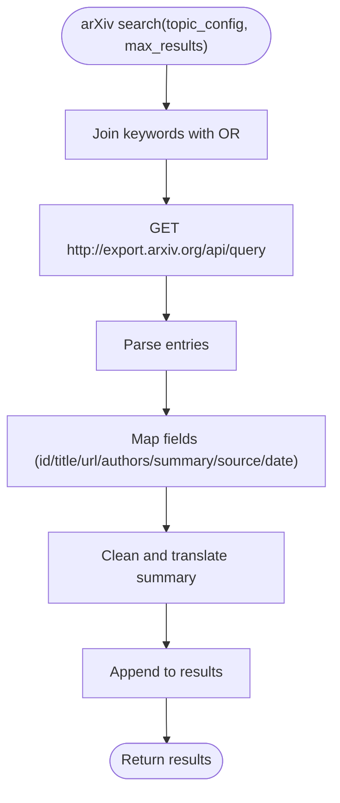
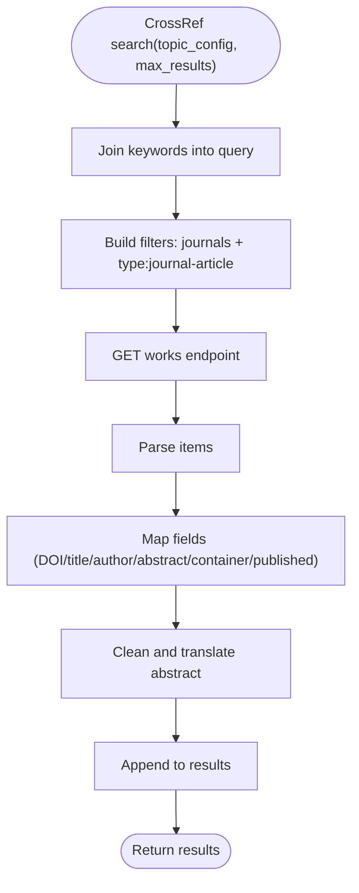
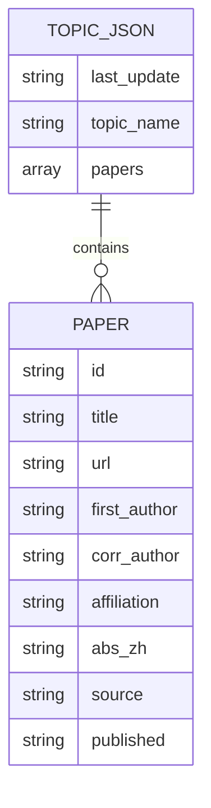
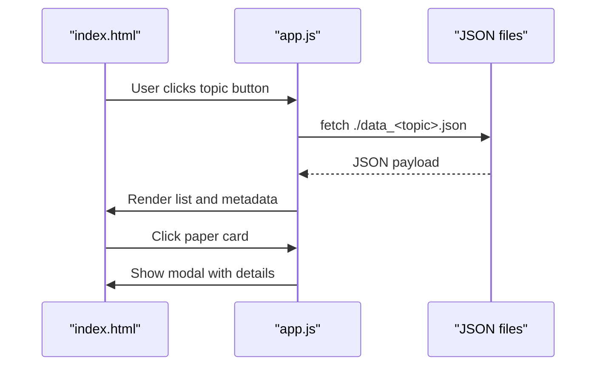
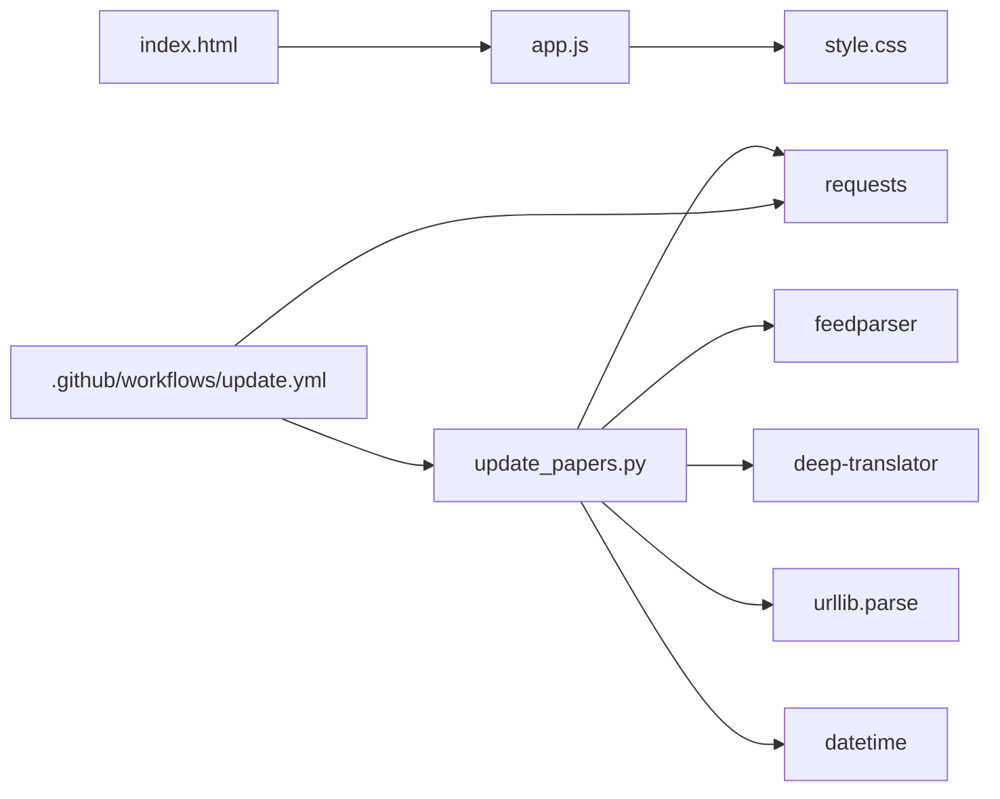

# Topic Configuration

<cite>
**Referenced Files in This Document**
- [update_papers.py](file://update_papers.py)
- [index.html](file://index.html)
- [app.js](file://app.js)
- [style.css](file://style.css)
- [.github/workflows/update.yml](file://.github/workflows/update.yml)
- [README.md](file://README.md)
- [requirements.txt](file://requirements.txt)
- [data_cryo.json](file://data_cryo.json)
- [data_imaging.json](file://data_imaging.json)
- [data_ai.json](file://data_ai.json)
- [data_das.json](file://data_das.json)
- [data_surface.json](file://data_surface.json)
- [data_earthquake.json](file://data_earthquake.json)
- [backend/app.py](file://backend/app.py)
</cite>

## Update Summary
**Changes Made**
- Added comprehensive documentation for the new AI earthquake prediction topic
- Updated topic configuration reference to include the new AI topic
- Enhanced search parameter customization section with AI-specific keyword coverage
- Updated frontend integration documentation to reflect new navigation button
- Added guidance for AI topic keyword optimization and search algorithm considerations

## Table of Contents
1. [Introduction](#introduction)
2. [Project Structure](#project-structure)
3. [Core Components](#core-components)
4. [Architecture Overview](#architecture-overview)
5. [Detailed Component Analysis](#detailed-component-analysis)
6. [Dependency Analysis](#dependency-analysis)
7. [Performance Considerations](#performance-considerations)
8. [Troubleshooting Guide](#troubleshooting-guide)
9. [Conclusion](#conclusion)
10. [Appendices](#appendices)

## Introduction
This document explains how to configure research topics and search parameters in the paper_weekly system. It focuses on the topic definition structure used in the update script, how search queries are constructed for arXiv and CrossRef APIs, and how results are processed and stored. It also provides guidance on modifying existing topic configurations for seismology areas (cryo, AI, imaging, surface wave, earthquake), customizing parameters such as date ranges, keyword filters, and result limits, and adding new topics. Finally, it covers topic-specific considerations and performance optimization strategies.

**Updated** Added comprehensive coverage of the new AI earthquake prediction topic with advanced machine learning and deep learning keyword strategies.

## Project Structure
The paper_weekly system consists of:
- A Python update script that defines topics, builds queries, fetches results from arXiv and CrossRef, translates abstracts, and writes JSON files per topic.
- A static web frontend that reads the topic JSON files and renders the weekly reports.
- A GitHub Actions workflow that automates weekly updates.

**Diagram sources**
- [update_papers.py:42-84](file://update_papers.py#L42-L84)
- [index.html:16-23](file://index.html#L16-L23)
- [app.js:4-11](file://app.js#L4-L11)
- [.github/workflows/update.yml:24-25](file://.github/workflows/update.yml#L24-L25)
- [requirements.txt:1-7](file://requirements.txt#L1-L7)

**Section sources**
- [README.md:33-36](file://README.md#L33-L36)
- [update_papers.py:42-84](file://update_papers.py#L42-L84)
- [index.html:16-23](file://index.html#L16-L23)
- [app.js:4-11](file://app.js#L4-L11)
- [.github/workflows/update.yml:24-25](file://.github/workflows/update.yml#L24-L25)

## Core Components
- Topic definitions and keyword lists: Topics are defined as a dictionary keyed by topic IDs. Each topic includes a Chinese name, a list of keywords, and the output JSON filename.
- Search functions:
  - arXiv search: Builds a query combining keywords with OR logic and retrieves recent submissions.
  - CrossRef search: Builds a query with keywords and filters by selected journals and article type, sorted by publication date.
- Data processing:
  - Cleans abstracts, translates when needed, and normalizes metadata.
  - Sorts results by publication date and writes a standardized JSON structure per topic.

Key configuration points:
- Keyword lists per topic define the semantic coverage and relevance.
- Result limits for arXiv and CrossRef are configurable within the search functions.
- Date range is computed dynamically for the weekly update window.

**Updated** Enhanced with comprehensive AI topic keyword coverage including machine learning, deep learning, neural networks, and AI seismic applications.

**Section sources**
- [update_papers.py:42-84](file://update_papers.py#L42-L84)
- [update_papers.py:172-192](file://update_papers.py#L172-L192)
- [update_papers.py:111-170](file://update_papers.py#L111-L170)
- [update_papers.py:204-216](file://update_papers.py#L204-L216)

## Architecture Overview
The system follows a simple pipeline:
- Weekly trigger (GitHub Actions) runs the update script.
- The script computes a date range, iterates topics, queries arXiv and CrossRef, merges and sorts results, and writes JSON files.
- The frontend loads the appropriate JSON file based on the selected topic and displays the results.

**Diagram sources**
- [.github/workflows/update.yml:24-25](file://.github/workflows/update.yml#L24-L25)
- [update_papers.py:204-216](file://update_papers.py#L204-L216)
- [update_papers.py:111-170](file://update_papers.py#L111-L170)
- [update_papers.py:172-192](file://update_papers.py#L172-L192)

## Detailed Component Analysis

### Topic Definition Structure
Each topic is defined with:
- id: short identifier used in URLs and filenames.
- name_zh: human-readable Chinese name for display.
- keywords: list of semantically relevant terms used for search queries.
- file: output JSON filename for the topic.

**Updated** The AI topic now includes comprehensive keyword coverage for machine learning seismic analysis, deep learning earthquake detection, neural network seismology, and AI seismic imaging applications.

Example structure and usage:
- Topic keys are used to iterate topics and to select the correct output file.
- The frontend maps topic IDs to JSON filenames for loading.

**Diagram sources**
- [update_papers.py:42-84](file://update_papers.py#L42-L84)
- [update_papers.py:172-192](file://update_papers.py#L172-L192)
- [update_papers.py:111-170](file://update_papers.py#L111-L170)
- [update_papers.py:204-216](file://update_papers.py#L204-L216)

**Section sources**
- [update_papers.py:42-84](file://update_papers.py#L42-L84)
- [app.js:4-11](file://app.js#L4-L11)

### Search Query Construction

#### arXiv Search
- Query construction: Keywords are joined with OR logic to broaden recall.
- Sorting: Results are sorted by submitted date in descending order.
- Limits: Configurable via the max_results parameter.

**Diagram sources**
- [update_papers.py:172-192](file://update_papers.py#L172-L192)

**Section sources**
- [update_papers.py:172-192](file://update_papers.py#L172-L192)

#### CrossRef Search
- Query construction: Keywords are passed as a free-text query.
- Filters: Selected journals and article type are combined as filters.
- Sorting: Results are sorted by published date descending.
- Limits: Configurable via the max_results parameter.

**Diagram sources**
- [update_papers.py:111-170](file://update_papers.py#L111-L170)

**Section sources**
- [update_papers.py:111-170](file://update_papers.py#L111-L170)

### Data Processing and Storage
- Cleaning: Removes XML-like tags and standardizes abstract prefixes.
- Translation: Uses a translation service to convert abstracts to Chinese; applies cleaning again to translated text.
- Sorting: Sorts merged results by published date descending.
- JSON structure per topic:
  - last_update: Human-readable date range and time.
  - topic_name: Chinese topic name.
  - papers: List of paper objects with normalized fields.

**Diagram sources**
- [update_papers.py:210-214](file://update_papers.py#L210-L214)
- [update_papers.py:131-141](file://update_papers.py#L131-L141)
- [update_papers.py:179-190](file://update_papers.py#L179-L190)

**Section sources**
- [update_papers.py:93-100](file://update_papers.py#L93-L100)
- [update_papers.py:210-214](file://update_papers.py#L210-L214)

### Frontend Integration
- Topic buttons map to topic IDs and trigger loading of the corresponding JSON file.
- The app fetches the JSON, updates the last update and topic name, and renders cards with previews.
- Clicking a card opens a modal with author and translated abstract details.

**Updated** Added new AI topic navigation button with robot emoji icon and comprehensive keyword coverage.

**Diagram sources**
- [index.html:16-23](file://index.html#L16-L23)
- [app.js:42-71](file://app.js#L42-L71)
- [app.js:94-127](file://app.js#L94-L127)

**Section sources**
- [index.html:16-23](file://index.html#L16-L23)
- [app.js:4-11](file://app.js#L4-L11)
- [app.js:42-71](file://app.js#L42-L71)

## Dependency Analysis
- update_papers.py depends on:
  - requests and feedparser for API calls and parsing.
  - deep-translator for abstract translation.
  - datetime and urllib for date range computation and URL encoding.
- Frontend depends on:
  - app.js to load and render JSON data.
  - style.css for presentation.
- Automation depends on:
  - GitHub Actions to run the update script and push changes.

**Diagram sources**
- [update_papers.py:1-12](file://update_papers.py#L1-L12)
- [requirements.txt:1-7](file://requirements.txt#L1-L7)
- [index.html:7](file://index.html#L7)
- [style.css:1-179](file://style.css#L1-L179)
- [.github/workflows/update.yml:20-25](file://.github/workflows/update.yml#L20-L25)

**Section sources**
- [requirements.txt:1-7](file://requirements.txt#L1-L7)
- [update_papers.py:1-12](file://update_papers.py#L1-L12)
- [.github/workflows/update.yml:20-25](file://.github/workflows/update.yml#L20-L25)

## Performance Considerations
- Query limits: Adjust max_results for arXiv and CrossRef to balance freshness and performance.
- Sorting and deduplication: The script merges results and sorts by date; ensure keyword lists avoid excessive overlap to reduce duplicates.
- Translation costs: Translation is applied to abstracts; consider limiting the length or number of translated items if rate limits apply.
- Network timeouts: Requests have timeout parameters; tune for reliability under network variability.
- Frontend rendering: Large JSON files increase load time; consider pagination or lazy loading if needed.

**Updated** AI topic keyword coverage is extensive and may require careful tuning of result limits to balance comprehensiveness with performance.

## Troubleshooting Guide
- Translation failures: The translation wrapper catches exceptions and falls back to a placeholder; verify credentials and network connectivity if translations fail repeatedly.
- API errors: arXiv and CrossRef calls are wrapped in try-except; check logs for error messages and adjust query parameters or retry logic if needed.
- Empty results: Verify keyword lists and date range; ensure journals list is appropriate for the domain.
- Frontend empty state: If a topic JSON is missing or unreadable, the frontend shows an empty state message; run the update script to regenerate data.

**Section sources**
- [update_papers.py:102-110](file://update_papers.py#L102-L110)
- [update_papers.py:142-170](file://update_papers.py#L142-L170)
- [update_papers.py:177-192](file://update_papers.py#L177-L192)
- [app.js:46-71](file://app.js#L46-L71)

## Conclusion
The paper_weekly system provides a straightforward, extensible framework for weekly topic-based research tracking. Topic configuration centers on keyword lists and output filenames, with flexible search parameters for arXiv and CrossRef. The frontend cleanly renders topic-specific results, and automation ensures regular updates. Modifying topics, adjusting search parameters, and adding new topics are straightforward tasks that leverage the existing structure.

**Updated** The addition of the AI earthquake prediction topic demonstrates the system's capability to handle emerging research domains with comprehensive keyword coverage and advanced search strategies.

## Appendices

### A. Topic Configuration Reference
- Location: Topic definitions and keyword lists.
- Fields:
  - id: short topic ID.
  - name_zh: display name.
  - keywords: list of terms.
  - file: output JSON filename.

**Updated** Added comprehensive AI topic configuration with extensive keyword coverage for machine learning and deep learning applications in seismology.

**Section sources**
- [update_papers.py:42-84](file://update_papers.py#L42-L84)

### B. Search Parameter Customization
- arXiv:
  - Query: OR-joined keywords.
  - Sorting: submitted date descending.
  - Limit: max_results parameter.
- CrossRef:
  - Query: keywords.
  - Filters: journals and article type.
  - Sorting: published descending.
  - Limit: rows parameter.

**Updated** AI topic requires careful keyword management due to the broad scope of machine learning and deep learning applications in seismology.

**Section sources**
- [update_papers.py:172-192](file://update_papers.py#L172-L192)
- [update_papers.py:111-170](file://update_papers.py#L111-L170)

### C. JSON Data Structure for Each Topic
- Keys:
  - last_update: date range and time.
  - topic_name: Chinese topic name.
  - papers: list of paper objects.

Paper object fields:
- id, title, url, first_author, corr_author, affiliation, abs_zh, source, published.

**Section sources**
- [update_papers.py:210-214](file://update_papers.py#L210-L214)
- [update_papers.py:131-141](file://update_papers.py#L131-L141)
- [update_papers.py:179-190](file://update_papers.py#L179-L190)

### D. Modifying Existing Topic Configurations for Seismology Areas
- Cryo (glacier seismology): Broaden keywords to include calving, ice shelf, and glacial seismicity.
- DAS (Distributed Acoustic Sensing): Add terms like phase-sensitive OTDR and fiber optic seismic monitoring.
- Surface wave: Include ambient noise interferometry and surface wave detection.
- Imaging: Add full waveform inversion and body wave tomography.
- Earthquake: Extend to focal mechanism and source mechanism inversion.
- **AI**: Comprehensive coverage of machine learning, deep learning, neural networks, and AI applications in seismology.

**Updated** AI topic provides extensive keyword coverage spanning multiple AI methodologies and seismology applications.

Adjust the keywords list per topic and rerun the update script to reflect changes.

**Section sources**
- [update_papers.py:43-83](file://update_papers.py#L43-L83)

### E. Adding a New Topic
Steps:
- Define a new topic entry with id, name_zh, keywords, and file.
- Ensure the output JSON filename exists or is handled by the script.
- Optionally add a frontend button mapping to the new topic ID.
- Run the update script to generate the new topic's JSON.

**Updated** AI topic serves as an excellent example of comprehensive keyword coverage and frontend integration.

**Section sources**
- [update_papers.py:42-84](file://update_papers.py#L42-L84)
- [index.html:16-23](file://index.html#L16-L23)
- [app.js:4-11](file://app.js#L4-L11)

### F. Optimizing Query Performance
- Tune max_results for arXiv and CrossRef to balance freshness and speed.
- Keep keyword lists concise and domain-relevant to reduce noise.
- Consider caching or incremental updates if the system grows larger.
- Monitor translation service quotas and apply fallbacks gracefully.

**Updated** AI topic keyword coverage is extensive and may require careful performance tuning to balance comprehensiveness with system responsiveness.

### G. AI Topic Specific Considerations
- **Keyword Strategy**: The AI topic includes comprehensive coverage of machine learning seismic analysis, deep learning earthquake detection, neural network seismology, and AI seismic imaging applications.
- **Search Algorithm**: The broad keyword scope requires careful tuning of result limits to prevent performance degradation.
- **Domain Coverage**: Extensive coverage spans multiple AI methodologies and seismology applications.
- **Integration**: Seamless frontend integration with dedicated navigation button and JSON file structure.

**Section sources**
- [update_papers.py:68-83](file://update_papers.py#L68-L83)
- [index.html:22](file://index.html#L22)
- [app.js:10](file://app.js#L10)