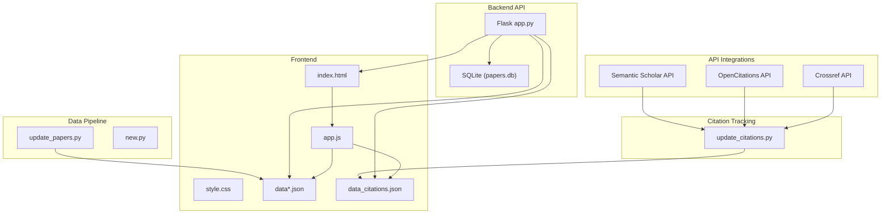
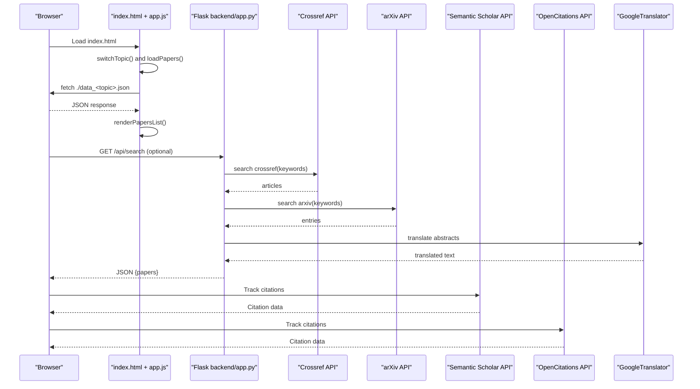
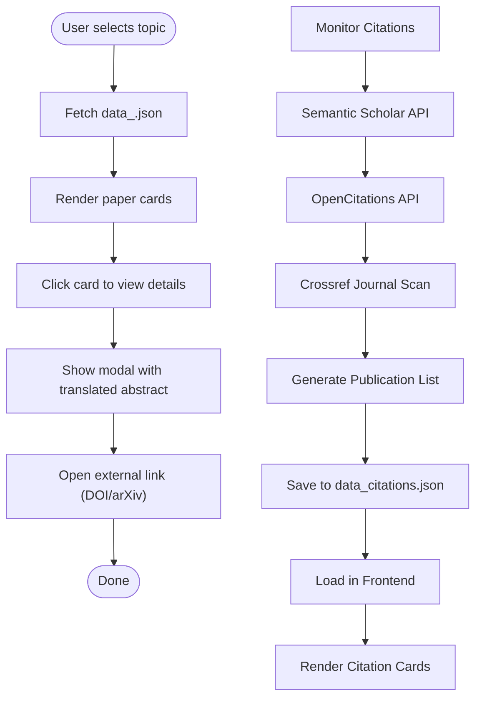
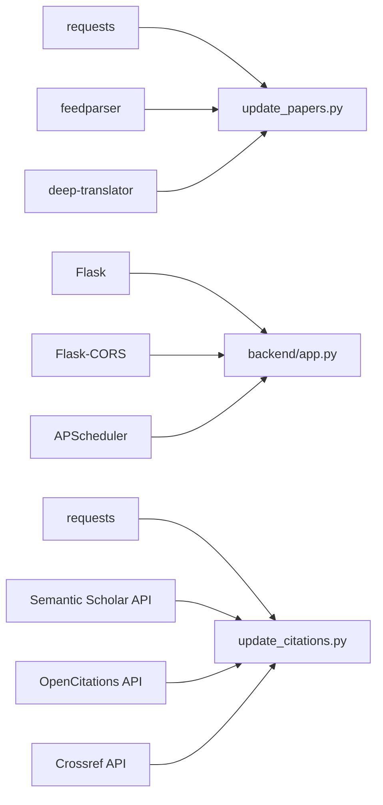

# Core Components

<cite>
**Referenced Files in This Document**
- [update_papers.py](file://update_papers.py)
- [update_citations.py](file://update_citations.py)
- [generate_report.py](file://generate_report.py)
- [backend/app.py](file://backend/app.py)
- [index.html](file://index.html)
- [app.js](file://app.js)
- [style.css](file://style.css)
- [data.json](file://data.json)
- [data_citations.json](file://data_citations.json)
- [data_cryo.json](file://data_cryo.json)
- [data_das.json](file://data_das.json)
- [requirements.txt](file://requirements.txt)
- [README.md](file://README.md)
</cite>

## Update Summary
**Changes Made**
- Added comprehensive citation tracking system with Semantic Scholar API integration
- Enhanced paper collection engine with multi-strategy scanning approach
- Integrated automatic publication list generation for researchers
- Added new data_citations.json for citation tracking functionality
- Updated frontend to support citation topic navigation
- Enhanced backend architecture to handle citation data processing

## Table of Contents
1. [Introduction](#introduction)
2. [Project Structure](#project-structure)
3. [Core Components](#core-components)
4. [Architecture Overview](#architecture-overview)
5. [Detailed Component Analysis](#detailed-component-analysis)
6. [Dependency Analysis](#dependency-analysis)
7. [Performance Considerations](#performance-considerations)
8. [Troubleshooting Guide](#troubleshooting-guide)
9. [Conclusion](#conclusion)
10. [Appendices](#appendices)

## Introduction
This document explains the core components of the paper_weekly system, focusing on:
- The Python backend scripts that integrate APIs, process data, translate content, and generate JSON for the frontend.
- The web frontend architecture including HTML structure, JavaScript for dynamic content loading, and CSS styling.
- Component interactions, data models for paper representation, and the modular design supporting multiple seismology topics.
- The enhanced citation tracking system with Semantic Scholar API integration and multi-strategy scanning approach.
- Practical integration patterns, configuration parameters, and user interaction behaviors.

**Updated** The system now includes an integrated citation tracking system with sophisticated Semantic Scholar API integration, multi-strategy scanning approach, and automatic publication list generation for researchers. The core components feature enhanced paper collection engine capabilities with comprehensive citation detection pipeline.

The system is designed to automatically collect recent papers from high-impact journals and arXiv, track citations to researcher publications, translate abstracts, validate text content, and present them in a responsive, topic-filtered web interface with robust citation tracking capabilities.

## Project Structure
The repository organizes the system into:
- A Python data pipeline that scrapes, filters, translates, validates, and writes JSON files for each topic.
- A specialized citation tracking system that monitors citations to researcher publications using Semantic Scholar, OpenCitations, and Crossref APIs.
- A lightweight Flask backend that serves the frontend and exposes a simple API for fetching and analyzing papers.
- A static frontend with HTML, CSS, and JavaScript that renders topic-specific paper lists and modals.
- A comprehensive citation tracking system that generates automatic publication lists for researchers.

**Diagram sources**
- [update_papers.py:194-217](file://update_papers.py#L194-L217)
- [update_citations.py:523-592](file://update_citations.py#L523-L592)
- [backend/app.py:175-236](file://backend/app.py#L175-L236)
- [index.html:16-24](file://index.html#L16-L24)
- [app.js:4-12](file://app.js#L4-L12)

**Section sources**
- [README.md:33-36](file://README.md#L33-L36)

## Core Components
- Python data pipeline (update_papers.py): Defines topic configurations, searches Crossref and arXiv, cleans and translates abstracts, validates text content, and writes topic-specific JSON files.
- Citation tracking system (update_citations.py): Monitors citations to researcher publications using Semantic Scholar, OpenCitations, and Crossref APIs with multi-strategy scanning approach.
- Flask backend (backend/app.py): Initializes a database, exposes endpoints to search and fetch papers, and performs on-demand translations and analysis.
- Frontend (index.html, app.js, style.css): Renders topic navigation including citation tracking, loads JSON data dynamically, displays cards, and shows a modal with translated abstracts and links.
- API integrations: Semantic Scholar, OpenCitations, and Crossref APIs for comprehensive citation tracking.

Key responsibilities:
- API integration: Crossref and arXiv via HTTP requests and feedparser, Semantic Scholar for citation tracking.
- Data processing: Cleaning XML/HTML tags, translating text, validating abstracts, and structuring paper records.
- JSON generation: Producing topic-scoped JSON with metadata and translated abstracts.
- Citation tracking: Monitoring citations to researcher publications with multi-strategy approach.
- Frontend rendering: Dynamic loading, modal presentation, and responsive styling.
- Database management: Storing and retrieving paper data with analysis capabilities.

**Section sources**
- [update_papers.py:14-84](file://update_papers.py#L14-L84)
- [update_citations.py:1-11](file://update_citations.py#L1-L11)
- [backend/app.py:17-27](file://backend/app.py#L17-L27)
- [index.html:16-24](file://index.html#L16-L24)
- [app.js:4-12](file://app.js#L4-L12)

## Architecture Overview
The system follows a client-server architecture with enhanced citation tracking capabilities:
- Backend server (Flask) serves static HTML and JSON data, and exposes endpoints for paper search and analysis.
- Frontend loads topic-specific JSON files including citation tracking and renders interactive cards and modals.
- Data pipeline runs periodically to refresh JSON files with validated abstract content.
- Citation tracking system monitors researcher publications and generates automatic publication lists.
- API integrations provide comprehensive citation detection through multiple sources.

**Diagram sources**
- [index.html:16-24](file://index.html#L16-L24)
- [app.js:28-72](file://app.js#L28-L72)
- [backend/app.py:179-218](file://backend/app.py#L179-L218)
- [update_citations.py:306-361](file://update_citations.py#L306-L361)
- [update_citations.py:366-417](file://update_citations.py#L366-L417)

## Detailed Component Analysis

### Python Data Pipeline (update_papers.py)
Responsibilities:
- Topic configuration with keywords and output filenames.
- Crossref search with journal filters and publication date sorting.
- arXiv search using feedparser.
- Text cleaning and translation using GoogleTranslator.
- Abstract validation and enhancement for downstream processing.
- JSON file generation with last update timestamp, topic name, and paper list.

Key functions and parameters:
- clean_abstract: Removes XML tags and standard prefixes from raw abstracts, ensuring consistent text format.
- translate_text: Translates text with length limits and fallback handling, returning validated Chinese translations.
- search_crossref: Builds query with topic keywords, filters by selected journals, sorts by publication date, and extracts metadata and translated abstracts.
- search_arxiv: Queries arXiv API, parses entries, and builds paper records with translated abstracts.
- Main loop: Iterates topics, merges results, sorts by publication date, and writes JSON files with enhanced validation.

Integration patterns:
- Uses requests and feedparser for API access.
- Uses deep_translator for translation.
- Writes JSON files in the repository root for the frontend to consume.
- Implements enhanced abstract validation for downstream processing.

**Section sources**
- [update_papers.py:93-170](file://update_papers.py#L93-L170)
- [update_papers.py:172-192](file://update_papers.py#L172-L192)
- [update_papers.py:194-217](file://update_papers.py#L194-L217)

### Enhanced Citation Tracking System (update_citations.py)
**New Section** Comprehensive citation tracking system with multi-strategy approach for monitoring researcher publications.

Responsibilities:
- Monitor citations to researcher publications using Semantic Scholar API as primary source.
- Supplement with OpenCitations for confirmed citation graph verification.
- Fallback to Crossref journal scan for comprehensive coverage.
- Generate automatic publication lists with citation tracking.
- Filter results by publication date window and deduplicate findings.

Multi-strategy scanning approach:
1. **Primary (Semantic Scholar)**: Fastest and most comprehensive citation detection with direct API access.
2. **Supplement (OpenCitations)**: Confirmed citation graph verification with Crossref metadata enrichment.
3. **Fallback (Crossref)**: Journal scan approach for papers immediately after deposit.

Key features:
- Semantic Scholar integration with comprehensive paper metadata extraction.
- OpenCitations API for verified citation graph data.
- Crossref fallback scanning with fingerprint matching algorithm.
- Publication date filtering and deduplication.
- Automatic publication list generation for researchers.

Citation detection pipeline:
- Maintains researcher publication fingerprints for accurate matching.
- Scans recent publications across seismology journals.
- Extracts author information, publication dates, and source metadata.
- Generates citation records with "This paper cited" message format.
- Implements rate limiting and retry strategies for API access.

**Section sources**
- [update_citations.py:1-11](file://update_citations.py#L1-L11)
- [update_citations.py:306-361](file://update_citations.py#L306-L361)
- [update_citations.py:366-417](file://update_citations.py#L366-L417)
- [update_citations.py:473-518](file://update_citations.py#L473-L518)

### Flask Backend (backend/app.py)
Responsibilities:
- Initialize SQLite database with a papers table.
- Expose endpoints for searching arXiv, fetching all papers, fetching a single paper, and triggering analysis.
- Translate abstracts and generate analysis summaries on demand.
- Schedule periodic arXiv searches weekly.

Endpoints:
- GET /: serves index.html from the frontend folder.
- POST /api/search: accepts keywords and max_results, searches arXiv, saves to DB, returns JSON.
- GET /api/papers: returns all papers from DB ordered by publication date.
- GET /api/paper/<paper_id>: returns a paper; if missing translated_abstract, triggers analysis and updates DB.
- POST /api/analyze/<paper_id>: forces analysis and returns updated paper.

Data model:
- Papers table includes id, title, abstract, authors, published, updated, categories, and extended fields for analysis and metadata.

**Section sources**
- [backend/app.py:17-27](file://backend/app.py#L17-L27)
- [backend/app.py:29-49](file://backend/app.py#L29-L49)
- [backend/app.py:66-95](file://backend/app.py#L66-L95)
- [backend/app.py:97-126](file://backend/app.py#L97-L126)
- [backend/app.py:128-173](file://backend/app.py#L128-L173)
- [backend/app.py:179-218](file://backend/app.py#L179-L218)
- [backend/app.py:219-236](file://backend/app.py#L219-L236)

### Frontend Architecture (index.html, app.js, style.css)
HTML structure:
- Header with title and description.
- Topic navigation buttons mapped to topic keys including new citation tracking button.
- Information bar showing current topic and last update.
- Loading indicator and empty state handling.
- Papers list container and a modal for detailed views.

JavaScript functionality:
- Topic switching updates active button and loads the corresponding JSON file including citations.
- Async fetch of data_<topic>.json, error handling, and rendering of paper cards.
- Modal display with author info, translated abstract preview, and external link.
- Utility to escape HTML for safe rendering.
- Automatic detection of citation topic for special empty state handling.

CSS styling:
- Responsive layout with centered container and flexible topic buttons.
- Card hover effects, modal overlay, spinner animation, and hidden state toggles.
- Theme variables for primary color and backgrounds.
- Special styling for citation topic cards.

**Section sources**
- [index.html:16-24](file://index.html#L16-L24)
- [app.js:28-72](file://app.js#L28-L72)
- [app.js:74-96](file://app.js#L74-L96)
- [app.js:98-137](file://app.js#L98-L137)
- [style.css:30-179](file://style.css#L30-L179)

### Data Models and JSON Schema
Paper representation:
- Fields include id, title, url, first_author, corr_author, affiliation, abs_zh (translated abstract), source, published, and topic-specific metadata.
- Additional analysis fields (summary, first_author, corresponding_author, affiliation, translated_abstract, importance, related_work, methods, innovation) are stored in the backend database.
- Citation tracking includes cited_paper field for tracking which paper was cited.

Topic-scoped JSON structure:
- last_update: Timestamp range for the collected papers.
- topic_name: Human-readable topic label.
- papers: Array of paper objects with cleaned and translated abstracts.

**Updated** Citation tracking JSON includes special handling for citation topic with cited_paper field indicating which research paper was cited by each finding.

Example references:
- Topic JSON files for cryo and imaging topics.
- Citation tracking JSON with automatic publication list generation.
- Example paper entry with translated abstract and metadata including citation tracking fields.

**Section sources**
- [data_citations.json:1-1110](file://data_citations.json#L1-L1110)
- [data_cryo.json:1-5](file://data_cryo.json#L1-L5)
- [app.js:78-82](file://app.js#L78-L82)

### Component Interactions
- Frontend loads topic JSON files including citations and renders cards.
- Backend serves JSON files and exposes endpoints for dynamic search and analysis.
- Translation service is invoked either by the data pipeline or backend depending on the flow.
- Citation tracking system operates independently to monitor researcher publications.
- API integrations provide comprehensive citation detection through multiple sources.

**Diagram sources**
- [app.js:28-72](file://app.js#L28-L72)
- [update_citations.py:523-592](file://update_citations.py#L523-L592)

## Dependency Analysis
External libraries and their roles:
- requests: HTTP client for Crossref, arXiv, Semantic Scholar, OpenCitations, and Crossref APIs.
- feedparser: Parses arXiv Atom feeds.
- deep-translator: Provides translation service for abstracts.
- flask, flask-cors: Web framework and CORS support.
- apscheduler: Background job scheduling for periodic searches.
- **Updated** requests: Enhanced HTTP client for comprehensive API integration including citation tracking.

**Updated** Added comprehensive API integration capabilities with Semantic Scholar, OpenCitations, and Crossref for citation tracking system.

**Diagram sources**
- [requirements.txt:1-7](file://requirements.txt#L1-L7)
- [update_papers.py:1-12](file://update_papers.py#L1-L12)
- [backend/app.py:1-11](file://backend/app.py#L1-L11)
- [update_citations.py:13-32](file://update_citations.py#L13-L32)

**Section sources**
- [requirements.txt:1-7](file://requirements.txt#L1-L7)

## Performance Considerations
- API rate limiting: Respect Crossref, arXiv, Semantic Scholar, OpenCitations, and Crossref rate limits; consider delays between requests.
- Translation costs: Frequent translations can incur rate limits or throttling; cache translated results when feasible.
- Rendering performance: Large paper lists can impact DOM rendering; virtualization or pagination can help.
- Network latency: Prefetching JSON files and caching can improve perceived performance.
- Database operations: Batch inserts and indexing can reduce write overhead.
- **Updated** Citation tracking performance: Multi-strategy approach with rate limiting and retry strategies for comprehensive coverage.
- **Updated** API integration performance: Optimized request handling with session management and connection pooling.

## Troubleshooting Guide
Common issues and remedies:
- Translation failures: The translation function includes fallback text; verify network connectivity and API quotas.
- Empty topic data: Ensure the data_<topic>.json files exist and are readable by the frontend.
- CORS errors: Confirm Flask-CORS is enabled and configured for the frontend origin.
- Backend startup: Verify database initialization and scheduler configuration.
- **Updated** Citation tracking failures: Check Semantic Scholar API access and rate limits; verify researcher publication fingerprints.
- **Updated** API integration issues: Monitor API status and implement proper error handling for all external services.
- **Updated** Citation data validation: Ensure proper JSON structure and required fields for citation tracking.

**Section sources**
- [update_papers.py:102-110](file://update_papers.py#L102-L110)
- [backend/app.py:12-13](file://backend/app.py#L12-L13)
- [backend/app.py:225-236](file://backend/app.py#L225-L236)
- [update_citations.py:328-330](file://update_citations.py#L328-L330)

## Conclusion
The paper_weekly system integrates multiple data sources, applies translation and analysis, and presents a responsive, topic-filtered interface. The modular design allows easy extension to additional topics and data sources. The backend provides a simple API for dynamic operations, while the frontend focuses on fast, user-friendly interaction. **Updated** The addition of comprehensive citation tracking capabilities with Semantic Scholar API integration, multi-strategy scanning approach, and automatic publication list generation significantly enhances the system's value for researchers by providing visibility into how their work is being cited and referenced in the scientific community.

## Appendices

### API Definitions
- POST /api/search
  - Request body: { keywords: string[], max_results: number }
  - Response: { papers: Paper[] }
- GET /api/papers
  - Response: { papers: Paper[] }
- GET /api/paper/{paper_id}
  - Response: { paper: Paper }
- POST /api/analyze/{paper_id}
  - Response: { paper: Paper }

**Section sources**
- [backend/app.py:179-218](file://backend/app.py#L179-L218)

### Configuration Options
- Topic configuration keys: name, name_zh, keywords, file.
- Journal filters: curated list of high-impact journals.
- Translation parameters: target language and text length limits.
- **Updated** Citation tracking parameters: researcher publication fingerprints, scan window, and API credentials.
- **Updated** Multi-strategy scanning: priority order and fallback mechanisms for comprehensive citation detection.

**Section sources**
- [update_papers.py:42-84](file://update_papers.py#L42-L84)
- [update_papers.py:86-91](file://update_papers.py#L86-L91)
- [update_citations.py:39-240](file://update_citations.py#L39-L240)
- [update_citations.py:255](file://update_citations.py#L255)

### User Interaction Patterns
- Topic switching: Buttons trigger JSON reload and update UI state including citation tracking.
- Card click: Opens modal with translated abstract and external link.
- Loading states: Spinner indicates asynchronous data fetch.
- **Updated** Citation tracking: Automatic monitoring of researcher publications with dedicated topic view.
- **Updated** Publication list generation: Researchers can track their growing citation network over time.

**Section sources**
- [index.html:16-24](file://index.html#L16-L24)
- [app.js:28-72](file://app.js#L28-L72)
- [app.js:74-96](file://app.js#L74-L96)

### Citation Tracking Features
**New Section** Comprehensive citation tracking system with multi-strategy approach for monitoring researcher publications.

- Semantic Scholar API integration for fastest citation detection
- OpenCitations API for confirmed citation graph verification
- Crossref fallback scanning for comprehensive coverage
- Publication fingerprint matching algorithm for accurate identification
- Automatic publication list generation with citation tracking
- Rate limiting and retry strategies for reliable API access
- Date window filtering for recent citation tracking
- Deduplication and quality filtering for accurate results

**Section sources**
- [update_citations.py:1-11](file://update_citations.py#L1-L11)
- [update_citations.py:306-361](file://update_citations.py#L306-L361)
- [update_citations.py:473-518](file://update_citations.py#L473-L518)