# Paper Collection Engine

<cite>
**Referenced Files in This Document**
- [update_papers.py](file://update_papers.py)
- [README.md](file://README.md)
- [requirements.txt](file://requirements.txt)
- [data.json](file://data.json)
- [data_cryo.json](file://data_cryo.json)
- [data_imaging.json](file://data_imaging.json)
- [.github/workflows/update.yml](file://.github/workflows/update.yml)
- [index.html](file://index.html)
- [app.js](file://app.js)
- [style.css](file://style.css)
</cite>

## Table of Contents
1. [Introduction](#introduction)
2. [Project Structure](#project-structure)
3. [Core Components](#core-components)
4. [Architecture Overview](#architecture-overview)
5. [Detailed Component Analysis](#detailed-component-analysis)
6. [Dependency Analysis](#dependency-analysis)
7. [Performance Considerations](#performance-considerations)
8. [Troubleshooting Guide](#troubleshooting-guide)
9. [Conclusion](#conclusion)
10. [Appendices](#appendices)

## Introduction
This document provides comprehensive documentation for the paper collection engine implemented in update_papers.py. The engine automatically collects recent papers across six specialized topics (cryoseismology, DAS, surface wave, seismic imaging, earthquake research, and AI) from two major academic APIs: arXiv and CrossRef. It integrates translation via Google Translate API, cleans abstracts, filters journals, sorts results by publication date, and writes JSON files consumed by a frontend web interface. The system is scheduled to run weekly via GitHub Actions and can be manually triggered.

## Project Structure
The repository is organized into:
- Core automation script: update_papers.py
- Frontend web interface: index.html, app.js, style.css
- Data output files: data*.json (per topic)
- Workflow automation: .github/workflows/update.yml
- Documentation and requirements: README.md, requirements.txt

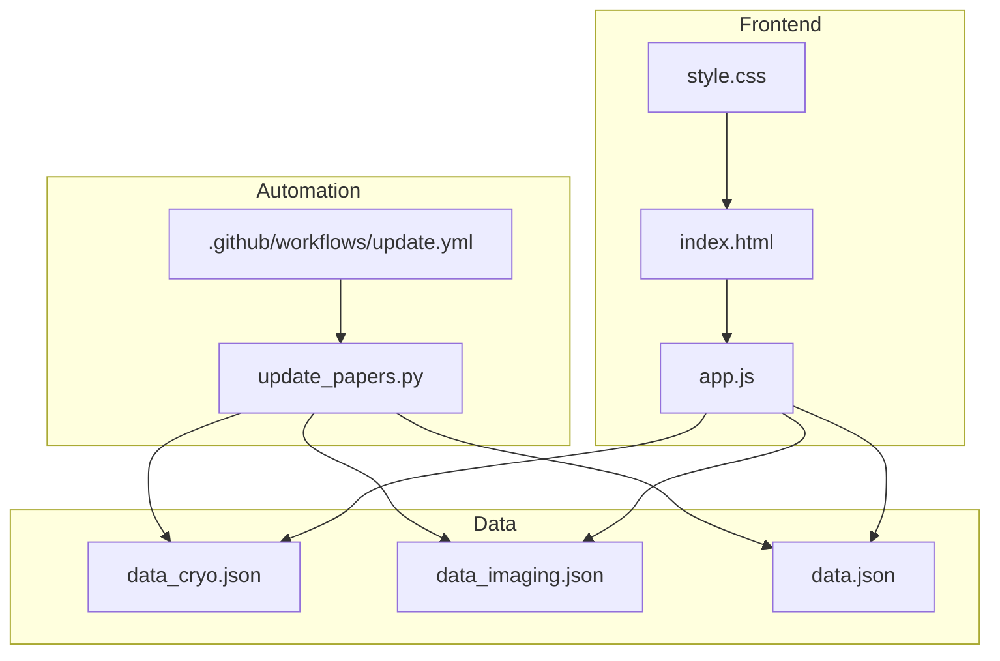

**Diagram sources**
- [update_papers.py:126-149](file://update_papers.py#L126-L149)
- [.github/workflows/update.yml:24-25](file://.github/workflows/update.yml#L24-L25)
- [index.html:1-50](file://index.html#L1-L50)
- [app.js:42-71](file://app.js#L42-L71)
- [data_cryo.json:1-5](file://data_cryo.json#L1-L5)
- [data_imaging.json:1-5](file://data_imaging.json#L1-L5)

**Section sources**
- [README.md:33-40](file://README.md#L33-L40)
- [requirements.txt:1-7](file://requirements.txt#L1-L7)

## Core Components
- Topic configuration: Defines six topics, each with a Chinese name, keyword list, and output JSON filename.
- Journal filter: A curated list of high-impact journals used to constrain CrossRef results.
- Abstract cleaning: Removes XML tags and common prefixes from raw abstracts.
- Translation service: Uses Google Translate API via deep-translator to translate abstracts into Simplified Chinese.
- API integrations:
  - arXiv: Searches by keyword OR logic, sorted by submission date descending.
  - CrossRef: Filters by journal list and article type, sorted by publication date descending.
- Date range calculation: Computes a weekly window (last 7 days) and formats a human-readable range string.
- Sorting and output: Sorts results by publication year/date, then writes JSON with metadata.

Key implementation references:
- Topic configuration and journal list: [update_papers.py:14-52](file://update_papers.py#L14-L52)
- Abstract cleaning: [update_papers.py:54-61](file://update_papers.py#L54-L61)
- Translation wrapper: [update_papers.py:63-70](file://update_papers.py#L63-L70)
- CrossRef search: [update_papers.py:72-102](file://update_papers.py#L72-L102)
- arXiv search: [update_papers.py:104-124](file://update_papers.py#L104-L124)
- Date range and JSON write: [update_papers.py:129-148](file://update_papers.py#L129-L148)

**Section sources**
- [update_papers.py:14-52](file://update_papers.py#L14-L52)
- [update_papers.py:54-70](file://update_papers.py#L54-L70)
- [update_papers.py:72-124](file://update_papers.py#L72-L124)
- [update_papers.py:129-148](file://update_papers.py#L129-L148)

## Architecture Overview
The engine follows a straightforward pipeline:
- Initialize topic list and journal filter.
- For each topic:
  - Query arXiv and CrossRef.
  - Merge results.
  - Clean and translate abstracts.
  - Sort by publication date.
  - Write JSON file with metadata.

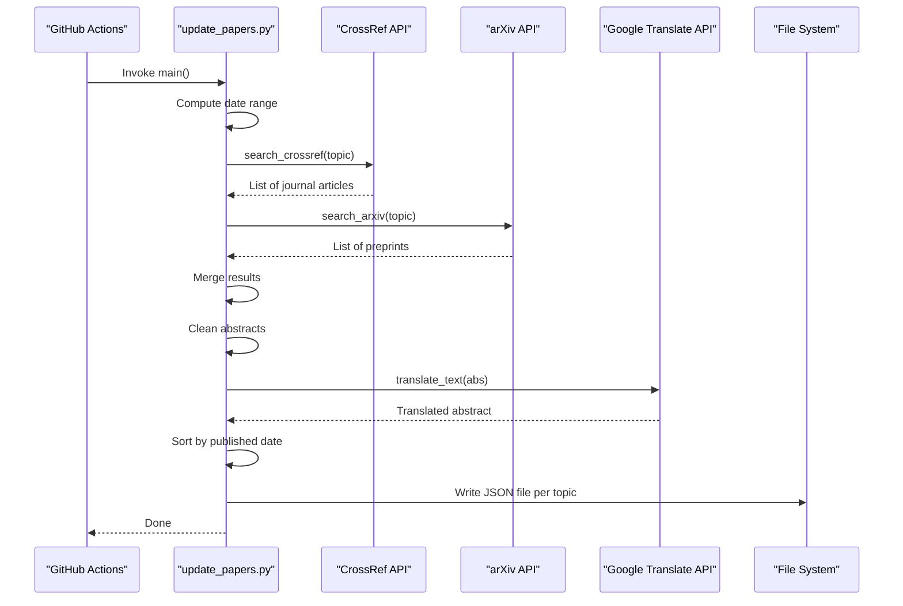

**Diagram sources**
- [.github/workflows/update.yml:24-25](file://.github/workflows/update.yml#L24-L25)
- [update_papers.py:72-124](file://update_papers.py#L72-L124)
- [update_papers.py:63-70](file://update_papers.py#L63-L70)
- [update_papers.py:129-148](file://update_papers.py#L129-L148)

## Detailed Component Analysis

### Topic Configuration Structure
Each topic defines:
- Chinese name for display.
- Keyword list used for both arXiv and CrossRef searches.
- Output JSON filename.

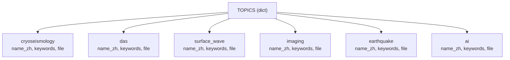

**Diagram sources**
- [update_papers.py:14-45](file://update_papers.py#L14-L45)

**Section sources**
- [update_papers.py:14-45](file://update_papers.py#L14-L45)

### Journal Filtering Mechanism
The journal list constrains CrossRef results to high-quality venues. The search builds a filter string combining container titles and article type.

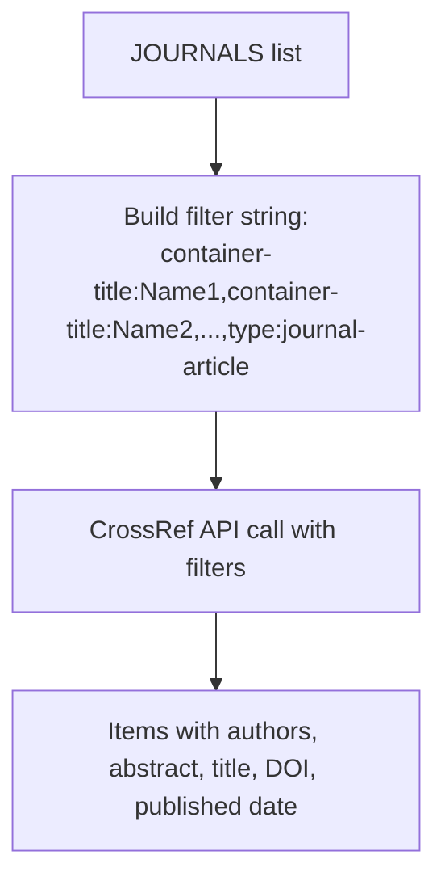

**Diagram sources**
- [update_papers.py:47-52](file://update_papers.py#L47-L52)
- [update_papers.py:75-76](file://update_papers.py#L75-L76)

**Section sources**
- [update_papers.py:47-52](file://update_papers.py#L47-L52)
- [update_papers.py:75-76](file://update_papers.py#L75-L76)

### Abstract Cleaning Algorithm
Removes XML tags and common prefixes (“Abstract”, “摘要”, “抽象的”。, “抽象的”) to normalize raw text before translation.

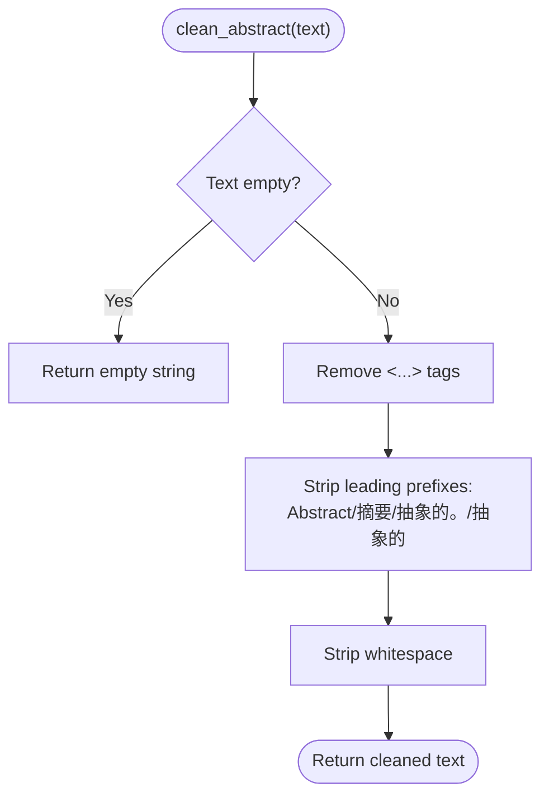

**Diagram sources**
- [update_papers.py:54-61](file://update_papers.py#L54-L61)

**Section sources**
- [update_papers.py:54-61](file://update_papers.py#L54-L61)

### Translation Service Integration
Uses deep-translator GoogleTranslator to translate abstracts. Implements a safety guard for short texts and handles exceptions by returning a fallback message.

**Diagram sources**
- [update_papers.py:63-70](file://update_papers.py#L63-L70)

**Section sources**
- [update_papers.py:63-70](file://update_papers.py#L63-L70)

### API Integration Details

#### CrossRef Search
- Constructs a query from topic keywords.
- Applies journal filters and article type filter.
- Sorts by published date descending.
- Extracts author, affiliation, title, DOI, URL, and abstract; translates abstract; records source and published year.

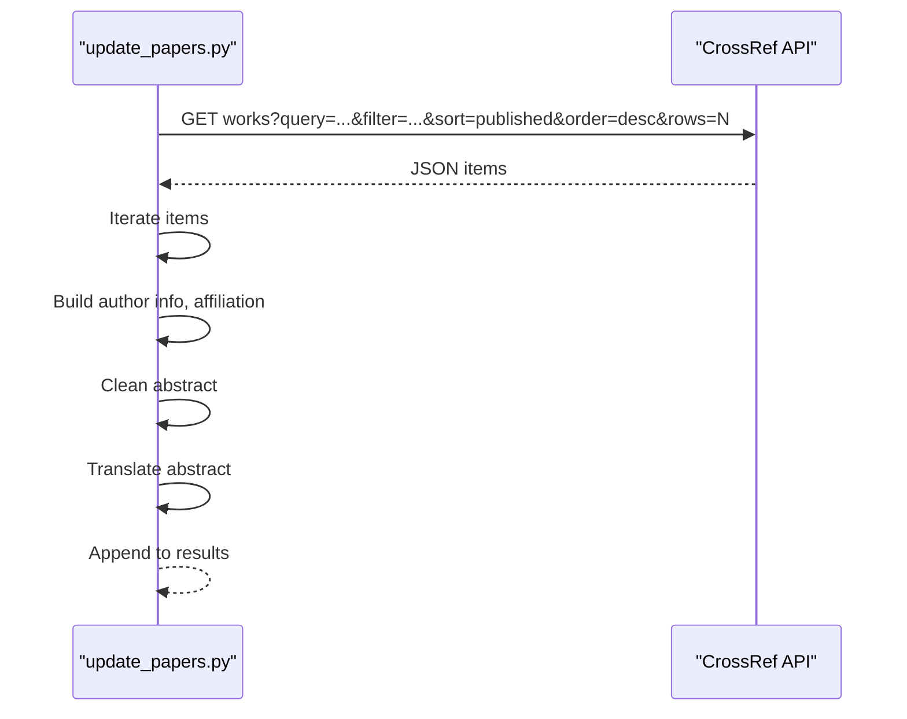

**Diagram sources**
- [update_papers.py:72-102](file://update_papers.py#L72-L102)

**Section sources**
- [update_papers.py:72-102](file://update_papers.py#L72-L102)

#### arXiv Search
- Builds a search query using OR logic across keywords.
- Sorts by submittedDate descending.
- Extracts ID, title, URL, first author, affiliation, and abstract; translates abstract; marks source as arXiv.

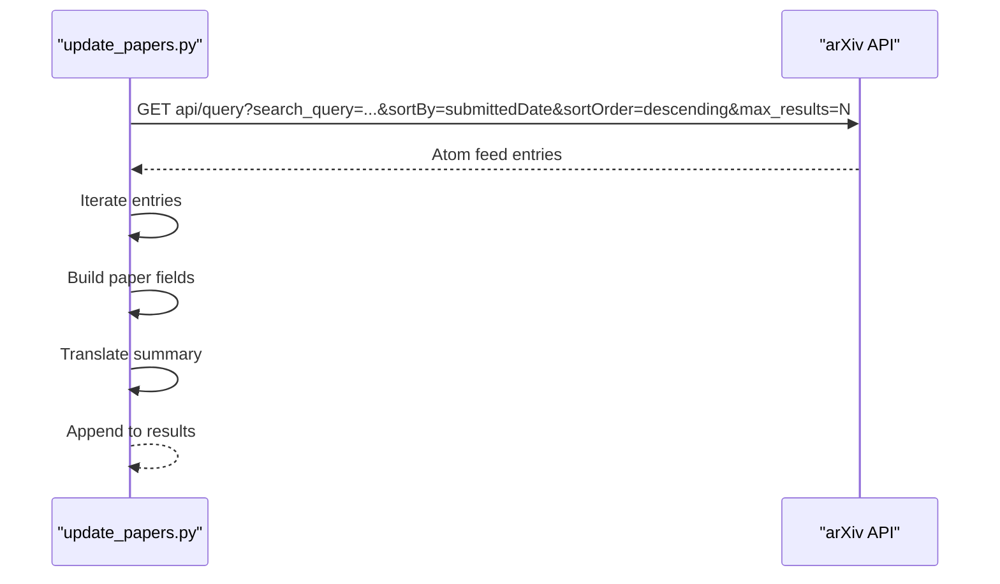

**Diagram sources**
- [update_papers.py:104-124](file://update_papers.py#L104-L124)

**Section sources**
- [update_papers.py:104-124](file://update_papers.py#L104-L124)

### Data Processing Pipeline
- Merge results from both APIs.
- Sort by published date (descending).
- Write JSON with metadata: last_update, topic_name, and papers array.

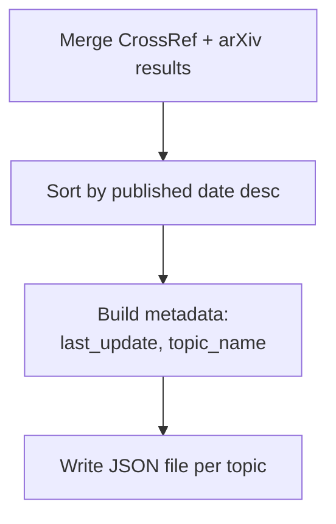

**Diagram sources**
- [update_papers.py:138-148](file://update_papers.py#L138-L148)

**Section sources**
- [update_papers.py:138-148](file://update_papers.py#L138-L148)

### Date Range Calculation and Result Sorting
- Calculates a 7-day window centered on the current date.
- Formats a human-readable range string and appends current time.
- Sorts results by published year/date string in descending order.

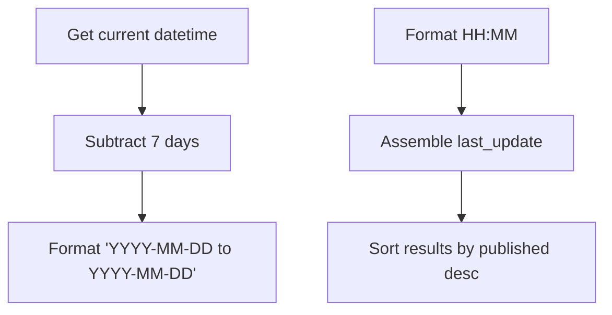

**Diagram sources**
- [update_papers.py:129-139](file://update_papers.py#L129-L139)

**Section sources**
- [update_papers.py:129-139](file://update_papers.py#L129-L139)

### JSON File Generation Process
- Writes a JSON object per topic containing:
  - last_update: formatted date/time range
  - topic_name: Chinese topic name
  - papers: list of paper dictionaries with keys: id, title, url, first_author, corr_author, affiliation, abs_zh, source, published

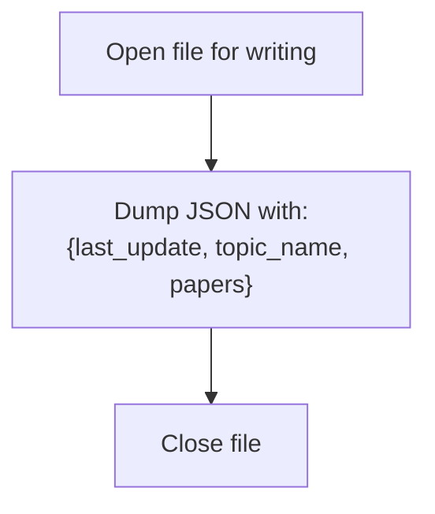

**Diagram sources**
- [update_papers.py:141-146](file://update_papers.py#L141-L146)

**Section sources**
- [update_papers.py:141-146](file://update_papers.py#L141-L146)

### Frontend Consumption of JSON
- The frontend loads data_cryo.json, data_imaging.json, and others based on the selected topic.
- Displays last_update and topic_name, renders a list of papers, and opens a modal with translated abstract and links.

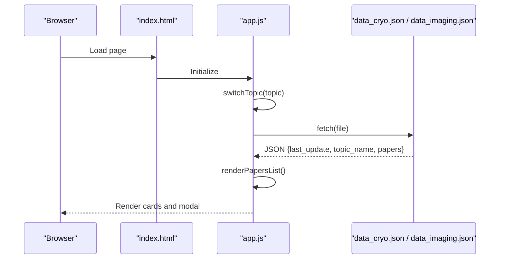

**Diagram sources**
- [index.html:16-27](file://index.html#L16-L27)
- [app.js:42-71](file://app.js#L42-L71)
- [data_cryo.json:1-5](file://data_cryo.json#L1-L5)
- [data_imaging.json:1-5](file://data_imaging.json#L1-L5)

**Section sources**
- [index.html:16-27](file://index.html#L16-L27)
- [app.js:42-71](file://app.js#L42-L71)
- [data_cryo.json:1-5](file://data_cryo.json#L1-L5)
- [data_imaging.json:1-5](file://data_imaging.json#L1-L5)

## Dependency Analysis
External libraries used:
- requests: HTTP client for API calls.
- feedparser: Parses arXiv Atom feeds.
- deep-translator: Google Translate integration.
- datetime, timedelta: Date/time utilities.
- re: Regular expressions for abstract cleaning.

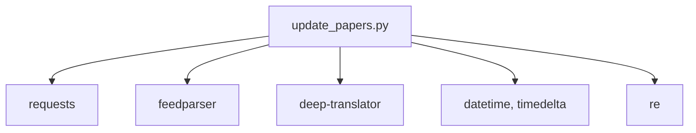

**Diagram sources**
- [requirements.txt:1-7](file://requirements.txt#L1-L7)
- [update_papers.py:1-10](file://update_papers.py#L1-L10)

**Section sources**
- [requirements.txt:1-7](file://requirements.txt#L1-L7)
- [update_papers.py:1-10](file://update_papers.py#L1-L10)

## Performance Considerations
- API rate limits: arXiv and CrossRef impose rate limits. Consider adding delays between requests or retry logic with exponential backoff.
- Timeout handling: Current requests use a 30-second timeout; adjust based on network conditions.
- Translation limits: Google Translate has quotas; monitor usage and consider batching or caching translations.
- Sorting complexity: Sorting is O(n log n) per topic; acceptable for typical result sizes.
- I/O overhead: Writing JSON per topic; ensure filesystem performance is adequate for frequent updates.

[No sources needed since this section provides general guidance]

## Troubleshooting Guide

Common issues and remedies:
- API rate limits or throttling:
  - Add retry logic with exponential backoff for both arXiv and CrossRef.
  - Reduce concurrent requests or stagger calls.
- Network timeouts:
  - Increase timeout values cautiously.
  - Wrap API calls in try/except and log errors.
- Translation failures:
  - The translation function returns a fallback message on exceptions.
  - Consider caching translated results to reduce repeated calls.
- Empty or missing data:
  - Verify topic keywords and journal filters.
  - Ensure JSON files are written and readable by the frontend.
- Frontend loading errors:
  - Confirm file paths match topic mapping in the frontend.
  - Check CORS and file serving configuration if hosted externally.

**Section sources**
- [update_papers.py:63-70](file://update_papers.py#L63-L70)
- [update_papers.py:79-101](file://update_papers.py#L79-L101)
- [update_papers.py:109-123](file://update_papers.py#L109-L123)
- [app.js:42-71](file://app.js#L42-L71)

## Conclusion
The paper collection engine automates weekly discovery of relevant papers across six specialized topics by integrating arXiv and CrossRef, translating abstracts, filtering journals, and publishing JSON consumed by a lightweight frontend. The modular design allows easy extension of topics, keywords, and filters. With minor enhancements—such as retry/backoff, translation caching, and robust error logging—the system can become more resilient and production-ready.

[No sources needed since this section summarizes without analyzing specific files]

## Appendices

### Execution Flow Reference
- Main entry point and loop over topics: [update_papers.py:126-148](file://update_papers.py#L126-L148)
- Weekly scheduling via GitHub Actions: [.github/workflows/update.yml:4-6](file://.github/workflows/update.yml#L4-L6)
- Manual trigger support: [.github/workflows/update.yml:6](file://.github/workflows/update.yml#L6)

**Section sources**
- [update_papers.py:126-148](file://update_papers.py#L126-L148)
- [.github/workflows/update.yml:4-6](file://.github/workflows/update.yml#L4-L6)