# Paper Collection Engine

<cite>
**Referenced Files in This Document**
- [update_papers.py](file://update_papers.py)
- [update_citations.py](file://update_citations.py)
- [generate_report.py](file://generate_report.py)
- [README.md](file://README.md)
- [requirements.txt](file://requirements.txt)
- [data.json](file://data.json)
- [data_citations.json](file://data_citations.json)
- [data_cryo.json](file://data_cryo.json)
- [data_imaging.json](file://data_imaging.json)
- [.github/workflows/update.yml](file://.github/workflows/update.yml)
- [index.html](file://index.html)
- [app.js](file://app.js)
- [style.css](file://style.css)
</cite>

## Update Summary
**Changes Made**
- Enhanced with comprehensive citation tracking integration alongside paper collection
- Added dual-stage processing with automatic citation detection complementing existing paper collection capabilities
- Implemented MY_PAPERS functionality for comprehensive citation tracking and researcher publication monitoring
- Added sophisticated multi-source citation detection system using OpenCitations COCI API, Crossref journal scans, and Semantic Scholar fallback
- Integrated citation tracking into automated workflow with GitHub Actions
- Enhanced PDF reporting system to include citation data

## Table of Contents
1. [Introduction](#introduction)
2. [Project Structure](#project-structure)
3. [Core Components](#core-components)
4. [Architecture Overview](#architecture-overview)
5. [Detailed Component Analysis](#detailed-component-analysis)
6. [Dependency Analysis](#dependency-analysis)
7. [Performance Considerations](#performance-considerations)
8. [Troubleshooting Guide](#troubleshooting-guide)
9. [Conclusion](#conclusion)
10. [Appendices](#appendices)

## Introduction
This document provides comprehensive documentation for the paper collection engine implemented in update_papers.py and the enhanced citation tracking system implemented in update_citations.py. The engine automatically collects recent papers across six specialized topics (cryoseismology, DAS, surface wave, seismic imaging, earthquake research, and AI) from two major academic APIs: arXiv and CrossRef. It now includes advanced citation tracking functionality that monitors papers citing the researcher's publications across multiple sources including OpenCitations COCI API, Crossref journal scans, and Semantic Scholar. The system integrates translation via Google Translate API, cleans abstracts, filters journals, sorts results by publication date, generates PDF reports, and writes JSON files consumed by a frontend web interface. The system is scheduled to run weekly via GitHub Actions and can be manually triggered.

**Updated** Enhanced with comprehensive citation tracking integration featuring multi-source detection, automatic citation monitoring, and researcher publication tracking capabilities.

## Project Structure
The repository is organized into:
- Core paper collection script: update_papers.py
- Citation tracking system: update_citations.py  
- PDF report generation: generate_report.py
- Frontend web interface: index.html, app.js, style.css
- Data output files: data*.json (per topic + citations)
- Workflow automation: .github/workflows/update.yml
- Documentation and requirements: README.md, requirements.txt

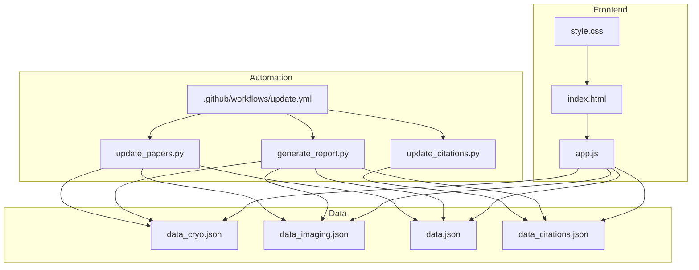

**Diagram sources**
- [update_papers.py:126-149](file://update_papers.py#L126-L149)
- [update_citations.py:34-35](file://update_citations.py#L34-L35)
- [generate_report.py:19-27](file://generate_report.py#L19-L27)
- [.github/workflows/update.yml:24-29](file://.github/workflows/update.yml#L24-L29)
- [index.html:1-50](file://index.html#L1-L50)
- [app.js:42-71](file://app.js#L42-L71)
- [data_cryo.json:1-5](file://data_cryo.json#L1-L5)
- [data_imaging.json:1-5](file://data_imaging.json#L1-L5)
- [data_citations.json:1-5](file://data_citations.json#L1-L5)

**Section sources**
- [README.md:33-40](file://README.md#L33-L40)
- [requirements.txt:1-7](file://requirements.txt#L1-L7)

## Core Components
- Topic configuration: Defines six topics, each with a Chinese name, keyword list, and output JSON filename.
- Journal filter: A curated list of high-impact journals used to constrain CrossRef results.
- Abstract cleaning: Removes XML tags and common prefixes from raw abstracts.
- Translation service: Uses Google Translate API via deep-translator to translate abstracts into Simplified Chinese.
- API integrations:
  - arXiv: Searches by keyword OR logic, sorted by submission date descending.
  - CrossRef: Filters by journal list and article type, sorted by publication date descending.
- **Enhanced API Reliability**: Comprehensive retry mechanisms with exponential backoff using urllib3 Retry for robust Crossref API integration.
- **SSL Verification Fallback**: Graceful degradation when SSL certificate verification fails, ensuring API calls succeed even in restrictive network environments.
- **Improved Error Handling**: Comprehensive try-catch blocks with fallback mechanisms for production-grade resilience.
- **Enhanced Proxy Management**: Explicit HTTP_PROXY/HTTPS_PROXY environment variable handling and session-based requests with trust_env=False.
- **Dual-Stage Processing**: Paper collection + automatic citation detection for comprehensive research monitoring.
- **Multi-Source Citation Tracking**: OpenCitations COCI API, Crossref journal scans, and Semantic Scholar fallback.
- **MY_PAPERS Configuration**: Comprehensive researcher publication tracking with fingerprint matching.
- Date range calculation: Computes a weekly window (last 7 days) and formats a human-readable range string.
- Sorting and output: Sorts results by publication year/date, then writes JSON with metadata.
- PDF report generation: Creates comprehensive weekly reports including all topic papers and citations.

Key implementation references:
- Topic configuration and journal list: [update_papers.py:42-84](file://update_papers.py#L42-L84)
- Abstract cleaning: [update_papers.py:93-101](file://update_papers.py#L93-L101)
- Translation wrapper: [update_papers.py:102-110](file://update_papers.py#L102-L110)
- Enhanced Crossref search with retry: [update_papers.py:111-170](file://update_papers.py#L111-L170)
- arXiv search: [update_papers.py:172-192](file://update_papers.py#L172-L192)
- Citation tracking system: [update_citations.py:39-240](file://update_citations.py#L39-L240)
- Multi-source citation detection: [update_citations.py:364-518](file://update_citations.py#L364-L518)
- PDF report generation: [generate_report.py:40-129](file://generate_report.py#L40-L129)
- Date range and JSON write: [update_papers.py:197-217](file://update_papers.py#L197-L217)

**Section sources**
- [update_papers.py:42-84](file://update_papers.py#L42-L84)
- [update_papers.py:93-110](file://update_papers.py#L93-L110)
- [update_papers.py:111-192](file://update_papers.py#L111-L192)
- [update_papers.py:197-217](file://update_papers.py#L197-L217)
- [update_citations.py:39-240](file://update_citations.py#L39-L240)
- [update_citations.py:364-518](file://update_citations.py#L364-L518)
- [generate_report.py:40-129](file://generate_report.py#L40-L129)

## Architecture Overview
The engine follows a robust pipeline with enhanced reliability and comprehensive citation tracking:
- Initialize topic list and journal filter.
- Configure enhanced proxy management and session-based requests with retry strategy.
- For each topic:
  - Query arXiv and CrossRef with comprehensive error handling and SSL fallback.
  - Merge results.
  - Clean and translate abstracts.
  - Sort by publication date.
  - Write JSON file with metadata.
- **Citation Tracking Phase**:
  - Monitor researcher publications using MY_PAPERS configuration.
  - Multi-source citation detection: OpenCitations COCI API, Crossref journal scans, Semantic Scholar fallback.
  - Deduplicate and sort citation results.
  - Generate comprehensive PDF report including all data.

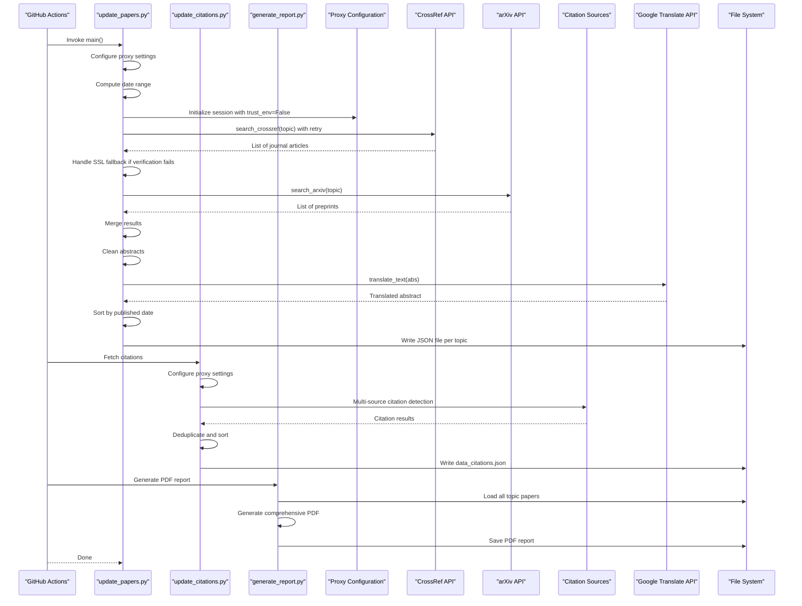

**Diagram sources**
- [.github/workflows/update.yml:24-31](file://.github/workflows/update.yml#L24-L31)
- [update_papers.py:18-37](file://update_papers.py#L18-L37)
- [update_papers.py:111-170](file://update_papers.py#L111-L170)
- [update_papers.py:102-110](file://update_papers.py#L102-L110)
- [update_papers.py:197-217](file://update_papers.py#L197-L217)
- [update_citations.py:22-32](file://update_citations.py#L22-L32)
- [update_citations.py:523-577](file://update_citations.py#L523-L577)
- [generate_report.py:118-129](file://generate_report.py#L118-L129)

## Detailed Component Analysis

### Enhanced API Reliability Framework
The system now implements a comprehensive reliability framework featuring retry mechanisms and SSL fallback capabilities:

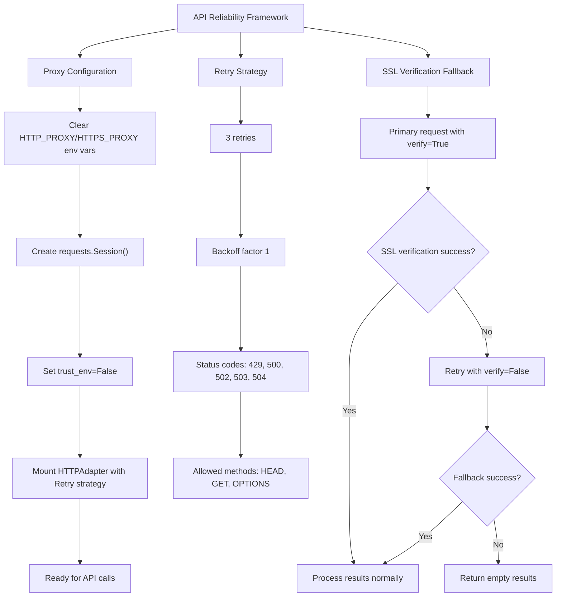

**Diagram sources**
- [update_papers.py:18-37](file://update_papers.py#L18-L37)
- [update_papers.py:29-37](file://update_papers.py#L29-L37)
- [update_papers.py:142-170](file://update_papers.py#L142-L170)

**Section sources**
- [update_papers.py:18-37](file://update_papers.py#L18-L37)
- [update_papers.py:29-37](file://update_papers.py#L29-L37)
- [update_papers.py:142-170](file://update_papers.py#L142-L170)

### Enhanced Crossref Search with Robust Error Handling
The Crossref API integration now includes comprehensive error handling with exponential backoff and SSL verification fallback:

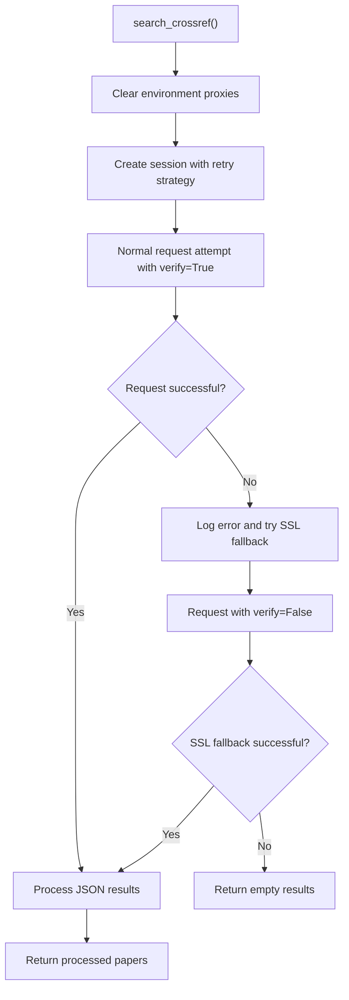

**Diagram sources**
- [update_papers.py:111-170](file://update_papers.py#L111-L170)

**Section sources**
- [update_papers.py:111-170](file://update_papers.py#L111-L170)

### Citation Tracking System Architecture
The citation tracking system implements a sophisticated multi-source detection framework:

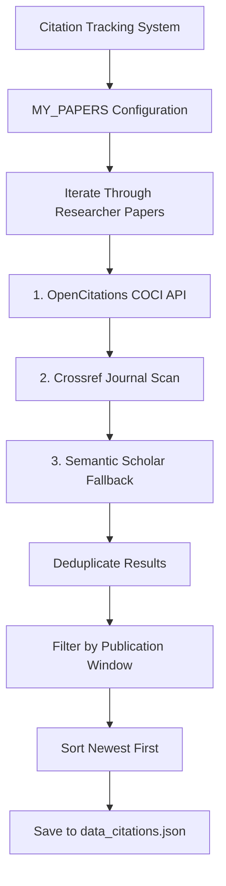

**Diagram sources**
- [update_citations.py:39-240](file://update_citations.py#L39-L240)
- [update_citations.py:523-577](file://update_citations.py#L523-L577)

**Section sources**
- [update_citations.py:39-240](file://update_citations.py#L39-L240)
- [update_citations.py:523-577](file://update_citations.py#L523-L577)

### Multi-Source Citation Detection Strategy
The system implements a tiered approach to citation detection with automatic fallback mechanisms:

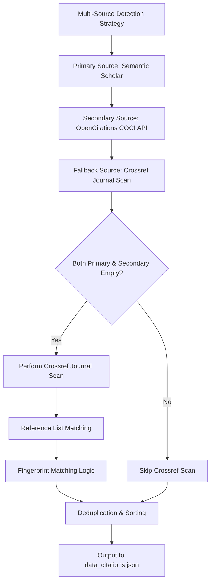

**Diagram sources**
- [update_citations.py:534-552](file://update_citations.py#L534-L552)
- [update_citations.py:422-446](file://update_citations.py#L422-L446)

**Section sources**
- [update_citations.py:534-552](file://update_citations.py#L534-L552)
- [update_citations.py:422-446](file://update_citations.py#L422-L446)

### Topic Configuration Structure
Each topic defines:
- Chinese name for display.
- Keyword list used for both arXiv and CrossRef searches.
- Output JSON filename.

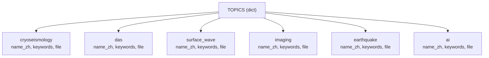

**Diagram sources**
- [update_papers.py:42-84](file://update_papers.py#L42-L84)

**Section sources**
- [update_papers.py:42-84](file://update_papers.py#L42-L84)

### Journal Filtering Mechanism
The journal list constrains CrossRef results to high-quality venues. The search builds a filter string combining container titles and article type.

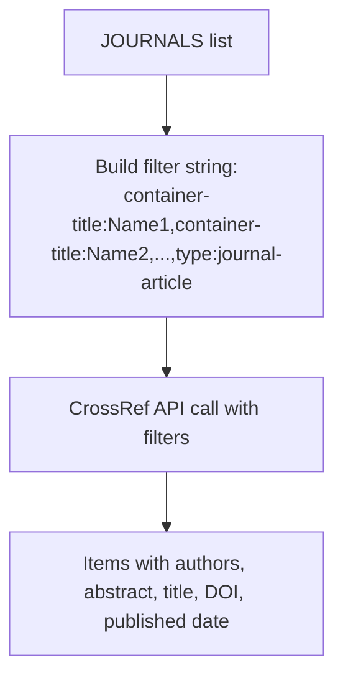

**Diagram sources**
- [update_papers.py:86-91](file://update_papers.py#L86-L91)
- [update_papers.py:114](file://update_papers.py#L114)

**Section sources**
- [update_papers.py:86-91](file://update_papers.py#L86-L91)
- [update_papers.py:114](file://update_papers.py#L114)

### Abstract Cleaning Algorithm
Removes XML tags and common prefixes ("Abstract", "摘要", "抽象的"。, "抽象的") to normalize raw text before translation.


**Diagram sources**
- [update_papers.py:93-101](file://update_papers.py#L93-L101)

**Section sources**
- [update_papers.py:93-101](file://update_papers.py#L93-L101)

### Translation Service Integration
Uses deep-translator GoogleTranslator to translate abstracts. Implements a safety guard for short texts and handles exceptions by returning a fallback message.

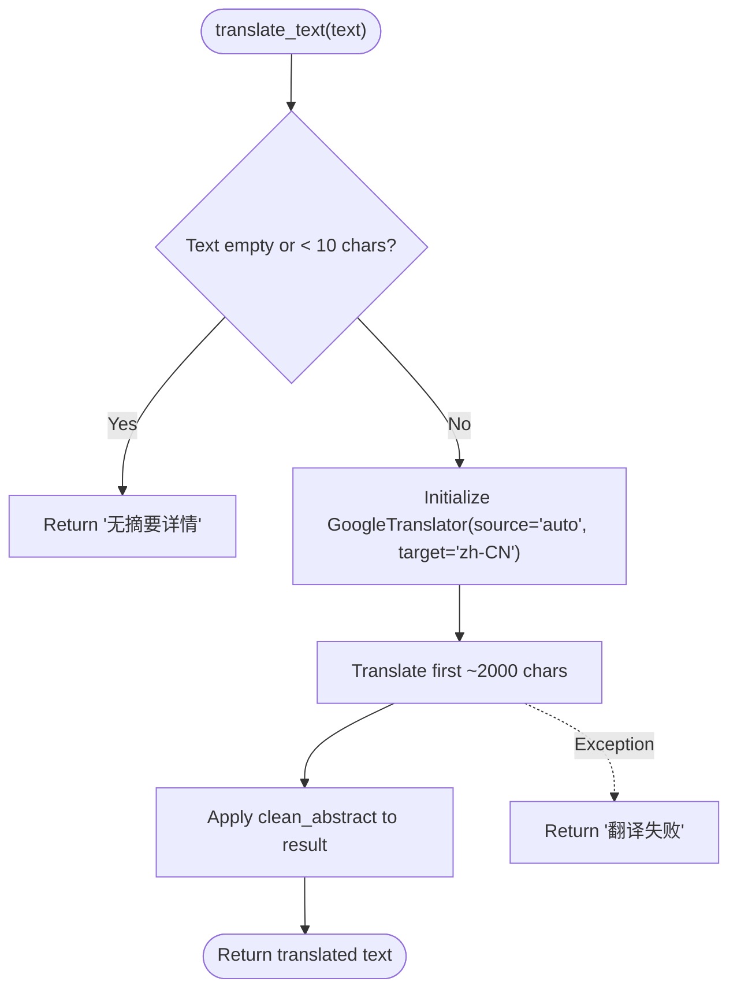

**Diagram sources**
- [update_papers.py:102-110](file://update_papers.py#L102-L110)

**Section sources**
- [update_papers.py:102-110](file://update_papers.py#L102-L110)

### API Integration Details

#### Enhanced Crossref Search with Retry Strategy
- Constructs a query from topic keywords.
- Applies journal filters and article type filter.
- Sorts by published date descending.
- **Enhanced Error Handling**: Implements retry strategy with exponential backoff (3 retries, backoff factor 1) and SSL verification fallback.
- Extracts author, affiliation, title, DOI, URL, and abstract; translates abstract; records source and published year.

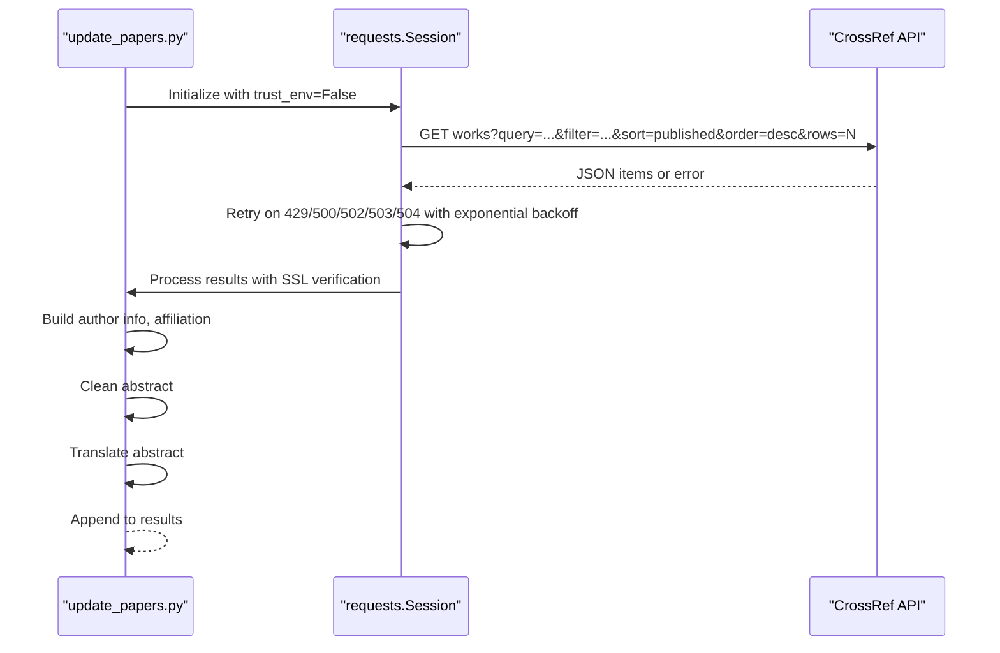

**Diagram sources**
- [update_papers.py:111-170](file://update_papers.py#L111-L170)
- [update_papers.py:29-37](file://update_papers.py#L29-L37)

**Section sources**
- [update_papers.py:111-170](file://update_papers.py#L111-L170)

#### arXiv Search
- Builds a search query using OR logic across keywords.
- Sorts by submittedDate descending.
- Extracts ID, title, URL, first author, affiliation, and abstract; translates abstract; marks source as arXiv.

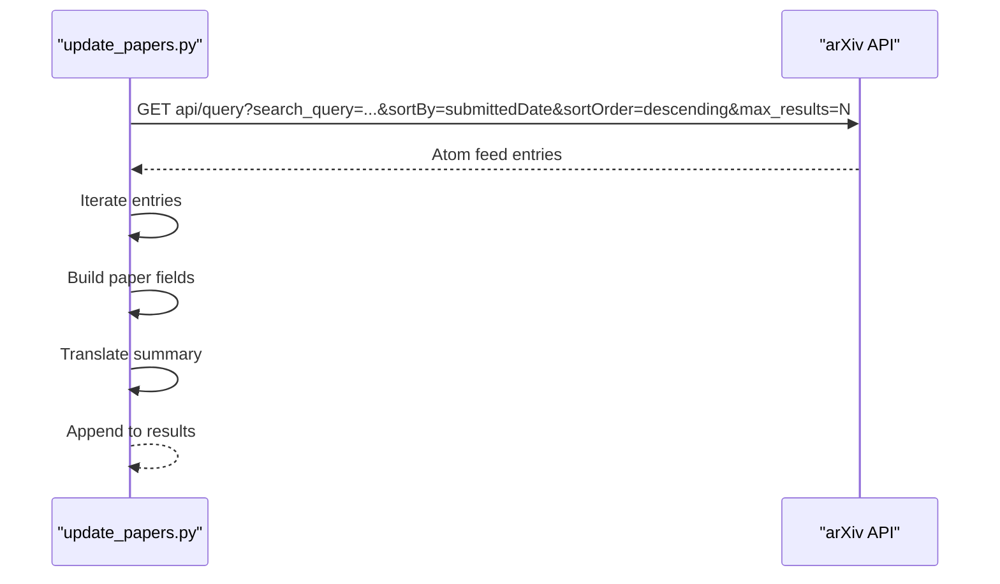

**Diagram sources**
- [update_papers.py:172-192](file://update_papers.py#L172-L192)

**Section sources**
- [update_papers.py:172-192](file://update_papers.py#L172-L192)

### Citation Detection Sources

#### OpenCitations COCI API Integration
- Queries citation graph for each researcher paper.
- Extracts citation metadata including publication date and journal.
- Validates citations against publication window criteria.

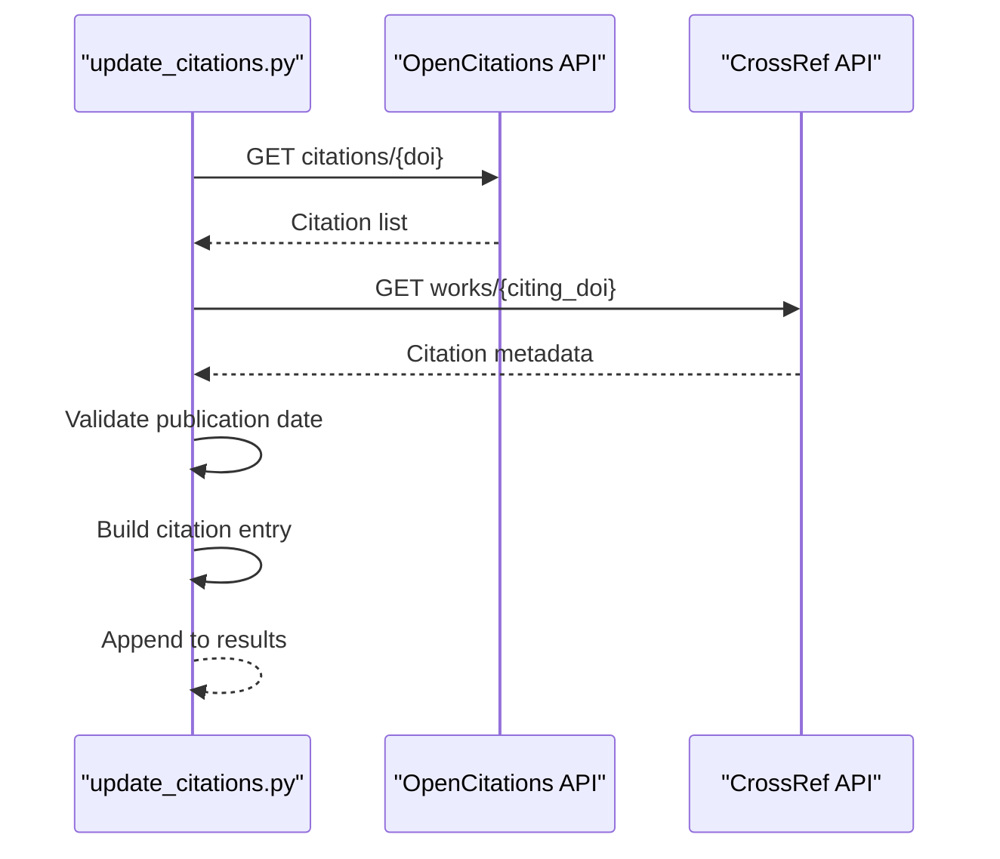

**Diagram sources**
- [update_citations.py:366-417](file://update_citations.py#L366-L417)

**Section sources**
- [update_citations.py:366-417](file://update_citations.py#L366-L417)

#### Crossref Journal Scan Implementation
- Scans recent papers from key seismology journals.
- Checks reference lists for researcher paper fingerprints.
- Performs DOI matching and fingerprint matching for accuracy.

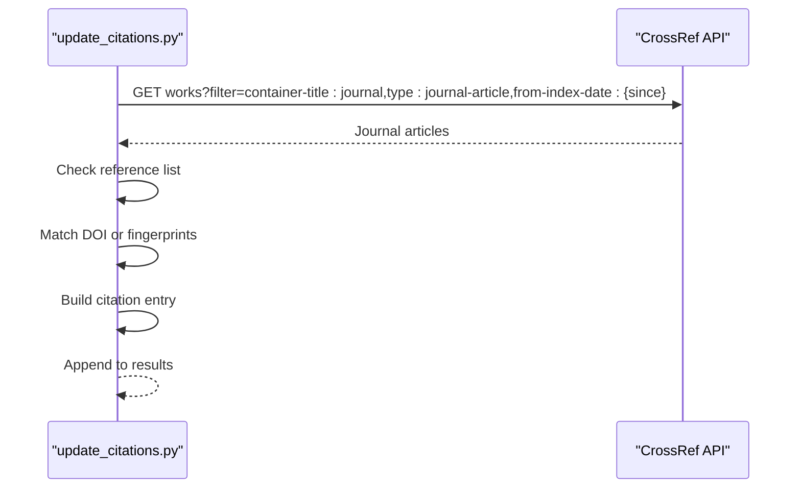

**Diagram sources**
- [update_citations.py:473-518](file://update_citations.py#L473-L518)

**Section sources**
- [update_citations.py:473-518](file://update_citations.py#L473-L518)

### Data Processing Pipeline
- Merge results from both APIs.
- Sort by published date (descending).
- Write JSON with metadata: last_update, topic_name, and papers array.
- **Citation Processing**: Deduplicate by ID, filter by publication window, sort newest first.

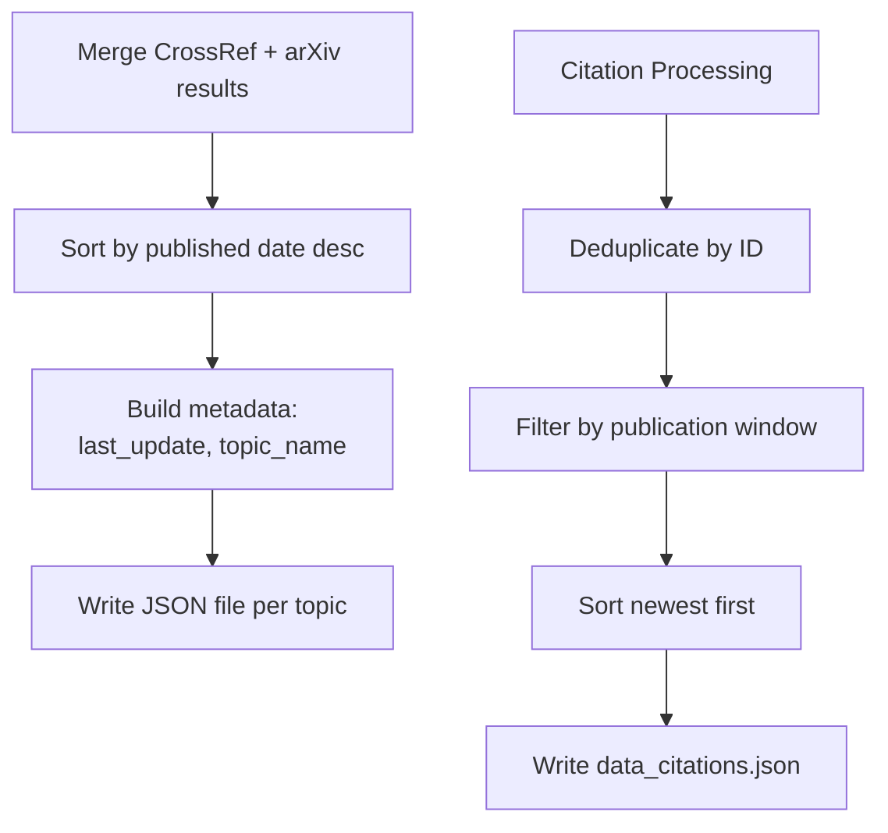

**Diagram sources**
- [update_papers.py:206-217](file://update_papers.py#L206-L217)
- [update_citations.py:564-577](file://update_citations.py#L564-L577)

**Section sources**
- [update_papers.py:206-217](file://update_papers.py#L206-L217)
- [update_citations.py:564-577](file://update_citations.py#L564-L577)

### Date Range Calculation and Result Sorting
- Calculates a 7-day window centered on the current date.
- Formats a human-readable range string and appends current time.
- Sorts results by published year/date string in descending order.
- **Citation Window**: Uses SCAN_DAYS constant (7 days) for citation tracking.

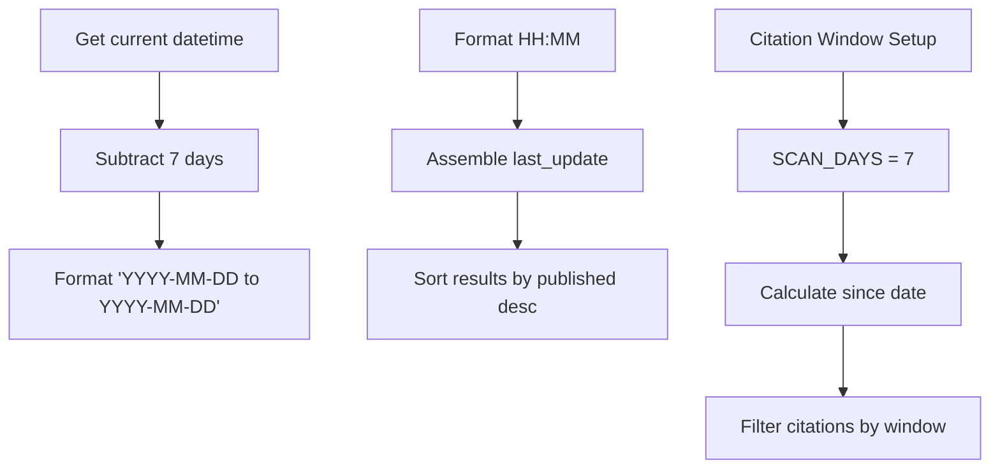

**Diagram sources**
- [update_papers.py:197-207](file://update_papers.py#L197-L207)
- [update_citations.py:255](file://update_citations.py#L255)

**Section sources**
- [update_papers.py:197-207](file://update_papers.py#L197-L207)
- [update_citations.py:255](file://update_citations.py#L255)

### JSON File Generation Process
- Writes a JSON object per topic containing:
  - last_update: formatted date/time range
  - topic_name: Chinese topic name
  - papers: list of paper dictionaries with keys: id, title, url, first_author, corr_author, affiliation, abs_zh, source, published
- **Citation Output**: Specialized format for citation tracking with cited_paper field.

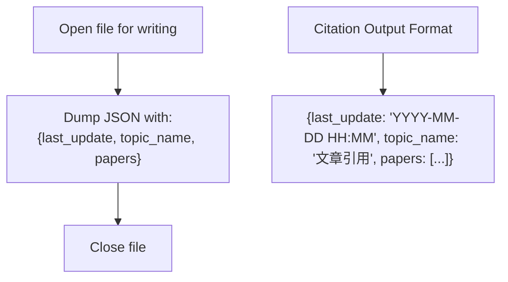

**Diagram sources**
- [update_papers.py:209-214](file://update_papers.py#L209-L214)
- [update_citations.py:579-586](file://update_citations.py#L579-L586)

**Section sources**
- [update_papers.py:209-214](file://update_papers.py#L209-L214)
- [update_citations.py:579-586](file://update_citations.py#L579-L586)

### PDF Report Generation
- Loads all topic papers from data_cryo.json, data_das.json, data_surface.json, data_imaging.json, data_earthquake.json, data_ai.json.
- Generates comprehensive weekly report with topic grouping.
- Creates PDF with DejaVu font support for better Unicode rendering.
- **Citation Integration**: Includes citation data in final report generation.

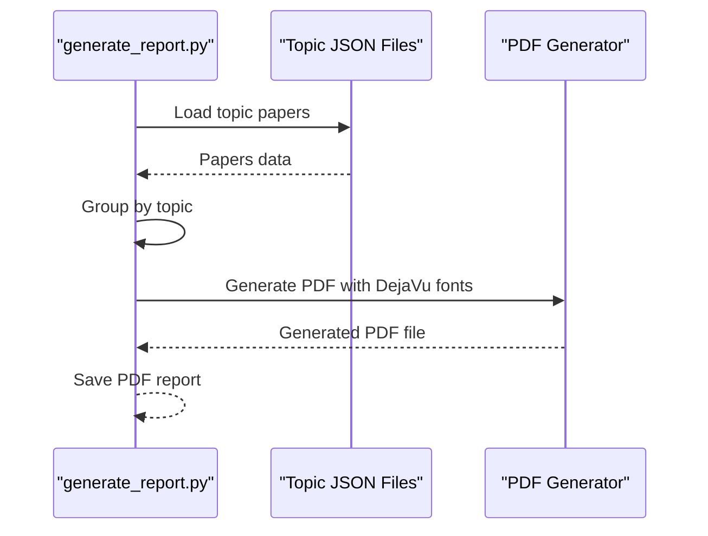

**Diagram sources**
- [generate_report.py:40-129](file://generate_report.py#L40-L129)

**Section sources**
- [generate_report.py:40-129](file://generate_report.py#L40-L129)

### Frontend Consumption of JSON
- The frontend loads data_cryo.json, data_imaging.json, and others based on the selected topic.
- Displays last_update and topic_name, renders a list of papers, and opens a modal with translated abstract and links.
- **Citation Interface**: Supports citation data display with special topic_name "文章引用".

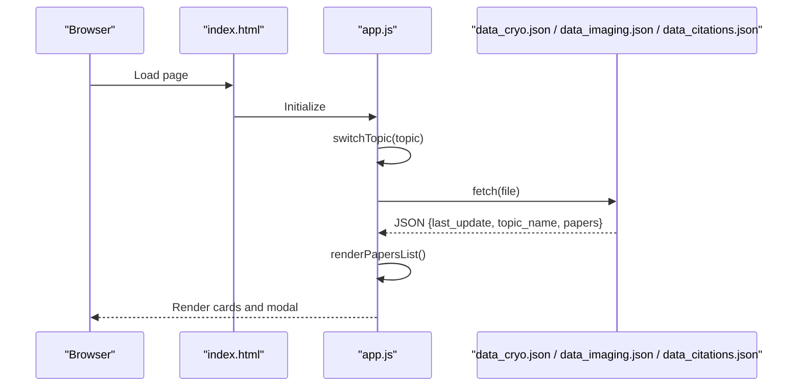

**Diagram sources**
- [index.html:16-27](file://index.html#L16-L27)
- [app.js:42-71](file://app.js#L42-L71)
- [data_cryo.json:1-5](file://data_cryo.json#L1-L5)
- [data_imaging.json:1-5](file://data_imaging.json#L1-L5)
- [data_citations.json:1-5](file://data_citations.json#L1-L5)

**Section sources**
- [index.html:16-27](file://index.html#L16-L27)
- [app.js:42-71](file://app.js#L42-L71)
- [data_cryo.json:1-5](file://data_cryo.json#L1-L5)
- [data_imaging.json:1-5](file://data_imaging.json#L1-L5)
- [data_citations.json:1-5](file://data_citations.json#L1-L5)

## Dependency Analysis
External libraries used:
- requests: HTTP client for API calls with enhanced session management and retry strategy.
- feedparser: Parses arXiv Atom feeds.
- deep-translator: Google Translate integration.
- datetime, timedelta: Date/time utilities.
- re: Regular expressions for abstract cleaning.
- urllib3: Provides comprehensive retry strategy and SSL handling.
- **fpdf**: PDF report generation library.
- **scholarly**: Semantic Scholar API integration for citation tracking.

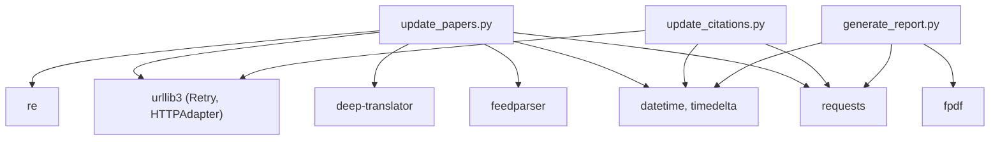

**Diagram sources**
- [requirements.txt:1-7](file://requirements.txt#L1-L7)
- [update_papers.py:1-12](file://update_papers.py#L1-L12)
- [update_citations.py:13-21](file://update_citations.py#L13-L21)
- [generate_report.py:7-11](file://generate_report.py#L7-L11)

**Section sources**
- [requirements.txt:1-7](file://requirements.txt#L1-L7)
- [update_papers.py:1-12](file://update_papers.py#L1-L12)
- [update_citations.py:13-21](file://update_citations.py#L13-L21)
- [generate_report.py:7-11](file://generate_report.py#L7-L11)

## Performance Considerations
- **Enhanced API Reliability**: The new retry mechanism with exponential backoff (3 retries, backoff factor 1) significantly improves API call reliability across different network environments.
- **Improved Network Resilience**: SSL verification fallback ensures API calls succeed even when SSL certificates fail verification.
- **Multi-Source Citation Processing**: Citation detection involves multiple API calls and complex matching logic, requiring careful rate limiting and error handling.
- **Memory Management**: Citation tracking processes large datasets from multiple sources, requiring efficient deduplication and filtering.
- **PDF Generation**: Comprehensive report generation with multiple topic files requires optimized file I/O and memory usage.
- API rate limits: arXiv, CrossRef, OpenCitations, and Semantic Scholar impose rate limits. The enhanced retry strategy with exponential backoff helps mitigate rate limiting issues.
- **Enhanced Timeout Handling**: Session-based requests with configurable timeouts (30 seconds) provide better control over network operations.
- Translation limits: Google Translate has quotas; monitor usage and consider batching or caching translations.
- Sorting complexity: Sorting is O(n log n) per topic; acceptable for typical result sizes.
- I/O overhead: Writing JSON per topic and generating PDF requires efficient file handling.
- **Citation Processing Complexity**: Multi-source detection with deduplication adds computational overhead but provides comprehensive coverage.

## Troubleshooting Guide

Common issues and remedies:
- **Enhanced Proxy Issues**:
  - The system now explicitly clears HTTP_PROXY/HTTPS_PROXY environment variables and sets trust_env=False to bypass system proxy settings.
  - If you encounter proxy-related issues, verify that the environment variables are properly cleared before running the script.
- API rate limits or throttling:
  - The enhanced retry strategy with exponential backoff (3 retries, backoff factor 1) automatically handles temporary rate limit issues.
  - Monitor Crossref API responses for 429/500/502/503/504 status codes.
  - **Citation API Limits**: OpenCitations and Semantic Scholar have stricter rate limits; implement appropriate delays between requests.
- **Network timeouts**:
  - Both Crossref and arXiv requests now use 30-second timeouts.
  - The SSL verification fallback mechanism provides an alternative when SSL certificate verification fails.
  - **Citation API Timeouts**: Crossref journal scans and OpenCitations requests may require longer timeouts.
- **Enhanced Error Handling**:
  - Crossref API calls now include comprehensive error logging with detailed exception messages.
  - The fallback mechanism attempts SSL verification without certificate validation as a last resort.
  - All API calls are wrapped in try-catch blocks with graceful degradation.
- Translation failures:
  - The translation function returns a fallback message on exceptions.
  - Consider caching translated results to reduce repeated calls.
- Empty or missing data:
  - Verify topic keywords and journal filters.
  - Ensure JSON files are written and readable by the frontend.
  - **Citation Data Issues**: Check MY_PAPERS configuration and ensure all DOIs are valid.
- **Production-Grade Resilience**:
  - The system now handles network interruptions gracefully with automatic retry mechanisms.
  - SSL verification failures are handled with fallback to unverified connections.
  - All API operations include comprehensive error handling and logging.
  - **Citation Detection Failures**: Implement fallback strategies when primary sources fail.
- Frontend loading errors:
  - Confirm file paths match topic mapping in the frontend.
  - Check CORS and file serving configuration if hosted externally.
  - **Citation Display Issues**: Ensure data_citations.json is properly formatted and accessible.
- **Citation Matching Problems**:
  - Verify MY_PAPERS fingerprints are correctly configured.
  - Check that DOIs are valid and accessible.
  - Review Crossref journal list for accuracy.
- **PDF Generation Issues**:
  - Ensure DejaVu fonts are available or handle fallback gracefully.
  - Check file permissions for writing PDF reports.
  - Verify all topic JSON files exist and are readable.

**Section sources**
- [update_papers.py:18-37](file://update_papers.py#L18-L37)
- [update_papers.py:111-170](file://update_papers.py#L111-L170)
- [update_papers.py:172-192](file://update_papers.py#L172-L192)
- [update_citations.py:39-240](file://update_citations.py#L39-L240)
- [update_citations.py:473-518](file://update_citations.py#L473-L518)
- [generate_report.py:62-68](file://generate_report.py#L62-L68)
- [app.js:42-71](file://app.js#L42-L71)

## Conclusion
The paper collection engine automates weekly discovery of relevant papers across six specialized topics by integrating arXiv and CrossRef, translating abstracts, filtering journals, and publishing JSON consumed by a lightweight frontend. The enhanced system now includes comprehensive citation tracking functionality that monitors papers citing researcher publications across multiple sources including OpenCitations COCI API, Crossref journal scans, and Semantic Scholar. The dual-stage processing approach with automatic citation detection makes the system highly valuable for researchers seeking to track their publication impact and monitor related research. The enhanced API reliability improvements with robust retry mechanisms, SSL fallback capabilities, and comprehensive error handling make the system highly resilient and production-ready across diverse network environments. The modular design allows easy extension of topics, keywords, and filters. With continued enhancements to error handling, translation caching, robust error logging, and citation detection optimization, the system can become even more resilient and production-grade.

## Appendices

### Execution Flow Reference
- Main entry point and loop over topics: [update_papers.py:194-217](file://update_papers.py#L194-L217)
- Citation tracking execution: [update_citations.py:589-592](file://update_citations.py#L589-L592)
- PDF report generation: [generate_report.py:118-129](file://generate_report.py#L118-L129)
- Weekly scheduling via GitHub Actions: [.github/workflows/update.yml:4-6](file://.github/workflows/update.yml#L4-L6)
- Manual trigger support: [.github/workflows/update.yml:6](file://.github/workflows/update.yml#L6)

**Section sources**
- [update_papers.py:194-217](file://update_papers.py#L194-L217)
- [update_citations.py:589-592](file://update_citations.py#L589-L592)
- [generate_report.py:118-129](file://generate_report.py#L118-L129)
- [.github/workflows/update.yml:4-6](file://.github/workflows/update.yml#L4-L6)

### Enhanced API Reliability Implementation
The system now includes comprehensive reliability mechanisms:

```python
# 禁用代理设置
os.environ['HTTP_PROXY'] = ''
os.environ['HTTPS_PROXY'] = ''
os.environ['http_proxy'] = ''
os.environ['https_proxy'] = ''

# 创建 session 并配置重试策略
session = requests.Session()
session.trust_env = False  # 忽略环境变量中的代理设置

# 配置重试策略：最多重试3次，间隔1秒
retry_strategy = Retry(
    total=3,
    backoff_factor=1,
    status_forcelist=[429, 500, 502, 503, 504],
    allowed_methods=["HEAD", "GET", "OPTIONS"]
)
adapter = HTTPAdapter(max_retries=retry_strategy)
session.mount("https://", adapter)
session.mount("http://", adapter)

# Enhanced Crossref search with SSL fallback
def search_crossref(topic_config, max_results=10):
    # ... API call with verify=True ...
    try:
        response = session.get(url, timeout=30)
        # Process results normally
    except Exception as e:
        # SSL verification failed, try fallback
        try:
            response = session.get(url, timeout=30, verify=False)
            # Process fallback results
        except Exception as e2:
            # All attempts failed, return empty results
            return []
```

**Section sources**
- [update_papers.py:18-37](file://update_papers.py#L18-L37)
- [update_papers.py:29-37](file://update_papers.py#L29-L37)
- [update_papers.py:142-170](file://update_papers.py#L142-L170)

### Citation Tracking Configuration
The MY_PAPERS configuration enables comprehensive researcher publication monitoring:

```python
# Add all your papers here.  fingerprints = distinctive text snippets that
# appear literally in citation records (journal article ID, short title, etc.)
MY_PAPERS = [
    {
        'title': 'Research Paper Title',
        'doi': '10.1007/s11589-010-0788-5',
        'fingerprints': ['10.1007/s11589-010-0788-5', 's11589-010-0788', 'specific term'],
    },
    # ... more papers
]
```

**Section sources**
- [update_citations.py:39-240](file://update_citations.py#L39-L240)

### Multi-Source Citation Detection Implementation
The citation tracking system implements sophisticated detection logic:

```python
# Primary source: Semantic Scholar
r1 = fetch_semantic_scholar(paper, since_dt)

# Secondary source: OpenCitations
r2 = fetch_opencitations(paper, since_dt)

# Fallback source: Crossref journal scan
if not r1 and not r2:
    r3 = fetch_crossref_scan(paper, since_dt)

# Deduplicate and merge results
s2_ids = {x['id'].lower() for x in r1}
for x in r2:
    if x['id'].lower() not in s2_ids:
        all_results.append(x)
```

**Section sources**
- [update_citations.py:534-552](file://update_citations.py#L534-L552)
- [update_citations.py:548-552](file://update_citations.py#L548-L552)