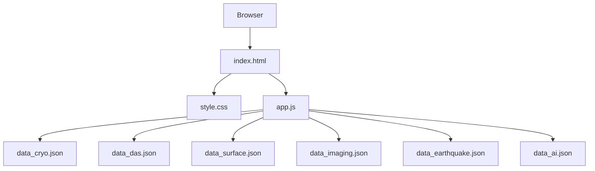
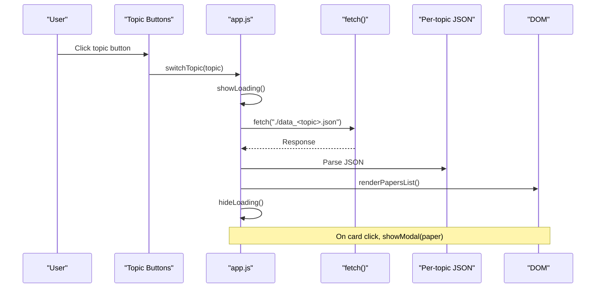
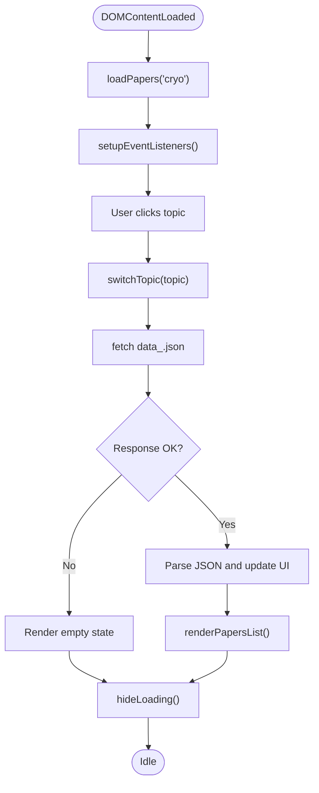
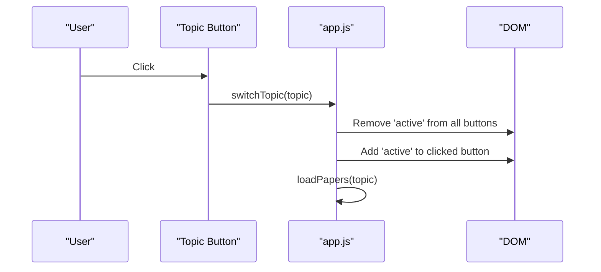
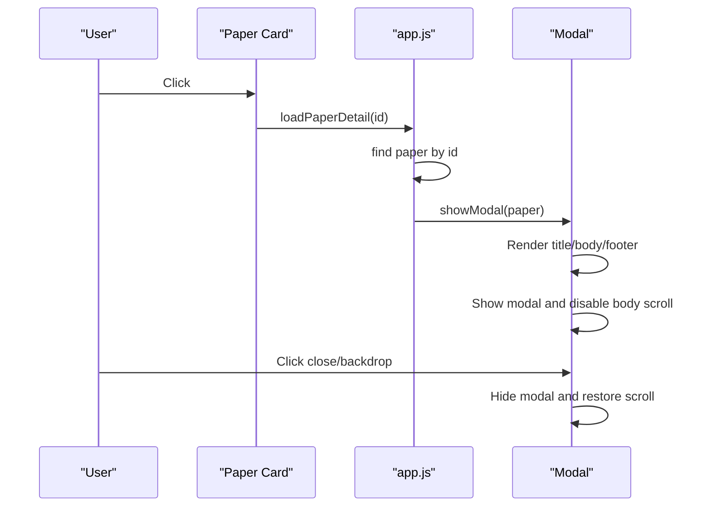
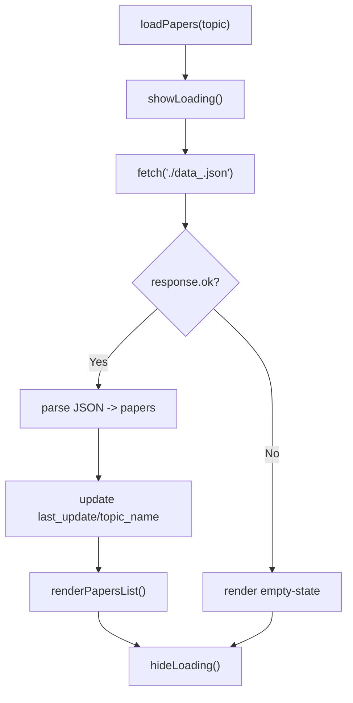
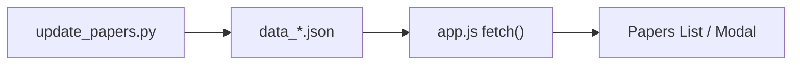
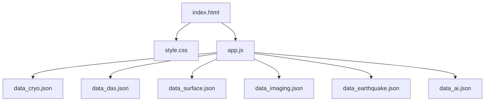

# Web Frontend

<cite>
**Referenced Files in This Document**
- [index.html](file://index.html)
- [style.css](file://style.css)
- [app.js](file://app.js)
- [data.json](file://data.json)
- [data_cryo.json](file://data_cryo.json)
- [data_das.json](file://data_das.json)
- [data_surface.json](file://data_surface.json)
- [data_imaging.json](file://data_imaging.json)
- [data_earthquake.json](file://data_earthquake.json)
- [data_ai.json](file://data_ai.json)
- [backend/app.py](file://backend/app.py)
- [update_papers.py](file://update_papers.py)
- [README.md](file://README.md)
</cite>

## Table of Contents
1. [Introduction](#introduction)
2. [Project Structure](#project-structure)
3. [Core Components](#core-components)
4. [Architecture Overview](#architecture-overview)
5. [Detailed Component Analysis](#detailed-component-analysis)
6. [Dependency Analysis](#dependency-analysis)
7. [Performance Considerations](#performance-considerations)
8. [Troubleshooting Guide](#troubleshooting-guide)
9. [Conclusion](#conclusion)
10. [Appendices](#appendices)

## Introduction
This document explains the web frontend components that present weekly seismology research across multiple topics. It covers the HTML structure, JavaScript functionality, and CSS styling, and details how the frontend loads data asynchronously from JSON files, renders lists of papers, and displays modal-based paper details. It also documents responsive design principles, topic navigation, and the integration with backend data generation scripts that produce the JSON files consumed by the frontend.

## Project Structure
The frontend consists of a single-page application with:
- index.html: Page skeleton, navigation buttons, loading indicator, list container, and modal container
- style.css: Responsive styles, topic navigation, paper cards, modal layout, and loading spinner
- app.js: Event listeners, topic switching, asynchronous data loading, DOM rendering, and modal presentation

Data is served as separate JSON files per topic, generated by the backend pipeline.

**Diagram sources**
- [index.html:10-45](file://index.html#L10-L45)
- [style.css:17-179](file://style.css#L17-L179)
- [app.js:42-71](file://app.js#L42-L71)
- [data_cryo.json:1-5](file://data_cryo.json#L1-L5)
- [data_das.json:1-5](file://data_das.json#L1-L5)
- [data_surface.json:1-5](file://data_surface.json#L1-L5)
- [data_imaging.json:1-5](file://data_imaging.json#L1-L5)
- [data_earthquake.json:1-5](file://data_earthquake.json#L1-L5)
- [data_ai.json:1-5](file://data_ai.json#L1-L5)

**Section sources**
- [index.html:1-50](file://index.html#L1-L50)
- [style.css:1-179](file://style.css#L1-L179)
- [app.js:1-148](file://app.js#L1-L148)

## Core Components
- Topic Navigation: Buttons switch between topics and update the active state
- Papers List: Dynamically rendered cards with title, author, affiliation, and abstract preview
- Modal: Full-screen overlay displaying detailed author and translation information
- Loading Indicator: Spinner shown during data fetches
- Data Files: Per-topic JSON files produced by the backend pipeline

Key behaviors:
- Asynchronous fetch of JSON files by topic
- DOM rendering of paper cards and modal body
- Escape-hatch for XSS-safe HTML insertion
- Error handling for missing or empty topic data

**Section sources**
- [index.html:16-44](file://index.html#L16-L44)
- [style.css:30-179](file://style.css#L30-L179)
- [app.js:18-148](file://app.js#L18-L148)

## Architecture Overview
The frontend is a static SPA that consumes JSON files. The backend pipeline (Python scripts) generates these JSON files periodically and stores them in the repository root. The frontend loads the appropriate file based on the selected topic.

**Diagram sources**
- [app.js:27-71](file://app.js#L27-L71)
- [app.js:73-92](file://app.js#L73-L92)
- [app.js:94-132](file://app.js#L94-L132)

## Detailed Component Analysis

### HTML Structure
- Container and header provide branding and description
- Topic navigation buttons trigger topic switching via inline onclick handlers
- Search section shows current topic name and last update time
- Loading indicator is toggled during fetches
- Papers list container holds rendered cards
- Modal overlay contains title, close button, and body content

Responsive viewport and language attributes are set at the document level.

**Section sources**
- [index.html:10-45](file://index.html#L10-L45)

### CSS Styling and Responsive Design
- Root variables define theme colors and backgrounds
- Container centers content with a max width and padding
- Flexbox-based topic navigation wraps on small screens
- Paper cards include hover elevation and subtle shadows
- Modal overlay uses fixed positioning and centered content with max-width and scrollable body
- Loading spinner uses a CSS animation
- Hidden class toggles visibility

Mobile responsiveness:
- Flex wrap on topic buttons ensures they fit within the viewport
- Max widths on modal content prevent overflow
- Relative font sizes and line heights improve readability

**Section sources**
- [style.css:1-179](file://style.css#L1-L179)

### JavaScript Functionality
- Global state: current topic and loaded papers
- Topic-to-file mapping enables dynamic file selection
- Event listeners:
  - Close button and backdrop click to close modal
  - Topic buttons to switch topics and reload data
- Asynchronous data loading:
  - fetch per topic JSON
  - Error handling with empty-state message
  - Update last update and topic name
- Rendering:
  - Cards with clickable handler to open modal
  - Modal grid with author info and translated abstract
- Utilities:
  - escapeHtml to sanitize text before insertion
  - show/hide loading helpers

**Diagram sources**
- [app.js:13-16](file://app.js#L13-L16)
- [app.js:18-25](file://app.js#L18-L25)
- [app.js:27-40](file://app.js#L27-L40)
- [app.js:42-71](file://app.js#L42-L71)
- [app.js:73-92](file://app.js#L73-L92)

**Section sources**
- [app.js:1-148](file://app.js#L1-L148)

### Topic Navigation System
- Buttons call switchTopic with a topic key
- Active state is updated by inspecting the button’s onclick attribute
- The current topic is stored globally and used to select the correct JSON file

**Diagram sources**
- [index.html:17-22](file://index.html#L17-L22)
- [app.js:27-40](file://app.js#L27-L40)

**Section sources**
- [index.html:16-23](file://index.html#L16-L23)
- [app.js:27-40](file://app.js#L27-L40)

### Modal-Based Paper Detail Presentation
- Clicking a paper card triggers loadPaperDetail, which opens showModal
- showModal builds a grid layout with author information and translated abstract
- Footer contains a link to the original resource
- Modal can be closed via close button or clicking the backdrop

**Diagram sources**
- [app.js:94-132](file://app.js#L94-L132)
- [index.html:36-44](file://index.html#L36-L44)

**Section sources**
- [app.js:94-132](file://app.js#L94-L132)
- [index.html:36-44](file://index.html#L36-L44)

### Asynchronous Data Loading Mechanism
- loadPapers uses fetch to retrieve the per-topic JSON file
- On success, updates last_update and topic_name, then renders the list
- On failure, displays an empty-state message instructing to run the update script
- Loading indicator is shown/hidden around the fetch operation

**Diagram sources**
- [app.js:42-71](file://app.js#L42-L71)

**Section sources**
- [app.js:42-71](file://app.js#L42-L71)

### DOM Manipulation Patterns and Security
- Dynamic innerHTML is used to render cards and modal content
- escapeHtml sanitizes text to prevent XSS before insertion
- Modal visibility is toggled via a hidden class on the overlay element

**Section sources**
- [app.js:73-92](file://app.js#L73-L92)
- [app.js:101-127](file://app.js#L101-L127)
- [app.js:142-147](file://app.js#L142-L147)

### Backend Data Generation and Integration
- The backend pipeline (Python) generates per-topic JSON files with last_update, topic_name, and papers arrays
- The frontend reads these files directly via fetch
- The README describes how the pipeline runs and where the files are placed

**Diagram sources**
- [update_papers.py:126-149](file://update_papers.py#L126-L149)
- [app.js:42-71](file://app.js#L42-L71)

**Section sources**
- [update_papers.py:126-149](file://update_papers.py#L126-L149)
- [README.md:33-36](file://README.md#L33-L36)

## Dependency Analysis
- index.html depends on style.css for visuals and app.js for interactivity
- app.js depends on:
  - topic-to-file mapping for selecting JSON
  - DOM APIs for rendering and modal control
  - fetch for asynchronous data loading
- Per-topic JSON files are independent and interchangeable

**Diagram sources**
- [index.html:7,47](file://index.html#L7,L47)
- [style.css:1](file://style.css#L1)
- [app.js:4-11](file://app.js#L4-L11)

**Section sources**
- [index.html:7,47](file://index.html#L7,L47)
- [app.js:4-11](file://app.js#L4-L11)

## Performance Considerations
- JSON parsing and DOM rendering are lightweight; performance is dominated by network latency
- Consider caching headers on JSON files if hosting on a server
- Debounce or throttle topic switches if users rapidly toggle buttons
- Lazy-load modal content only when opened to reduce initial DOM size
- Avoid frequent reflows by batching DOM updates (already handled implicitly by innerHTML assignment)

## Troubleshooting Guide
Common issues and remedies:
- No data displayed for a topic:
  - Ensure the corresponding data_<topic>.json exists and is valid JSON
  - Confirm the filename matches the mapping in the frontend
- Modal does not open:
  - Verify the paper id exists in the loaded papers array
  - Check that the modal overlay and close button are present in the DOM
- Loading spinner stuck:
  - Inspect network tab for failed fetches
  - Ensure CORS is not blocking local file access in development
- Empty-state message appears:
  - Run the backend update script to regenerate JSON files
  - Confirm the script writes files to the repository root

**Section sources**
- [app.js:42-71](file://app.js#L42-L71)
- [app.js:94-132](file://app.js#L94-L132)

## Conclusion
The frontend is a straightforward, statically hosted SPA that presents seismology research across multiple topics. It relies on per-topic JSON files generated by the backend pipeline. The design emphasizes simplicity, responsiveness, and clarity, with a clean separation between structure (HTML), presentation (CSS), and behavior (JavaScript).

## Appendices

### Data Model for Papers
Each JSON file contains:
- last_update: Human-readable date range and time
- topic_name: Chinese topic label
- papers: Array of paper objects with fields such as id, title, url, first_author, corr_author, affiliation, abs_zh, source, published

**Section sources**
- [data_cryo.json:1-5](file://data_cryo.json#L1-L5)
- [data_das.json:1-5](file://data_das.json#L1-L5)
- [data_surface.json:1-5](file://data_surface.json#L1-L5)
- [data_imaging.json:1-5](file://data_imaging.json#L1-L5)
- [data_earthquake.json:1-5](file://data_earthquake.json#L1-L5)
- [data_ai.json:1-5](file://data_ai.json#L1-L5)

### Example Paths for Key Functionality
- Topic switching and rendering:
  - [switchTopic:27-40](file://app.js#L27-L40)
  - [renderPapersList:73-92](file://app.js#L73-L92)
- Modal presentation:
  - [showModal:101-127](file://app.js#L101-L127)
  - [closeModal:129-132](file://app.js#L129-L132)
- Asynchronous loading:
  - [loadPapers:42-71](file://app.js#L42-L71)
- Sanitization:
  - [escapeHtml:142-147](file://app.js#L142-L147)

### Customization and Extension Guidance
- Theming:
  - Adjust CSS variables in :root to change primary colors and backgrounds
- Layout:
  - Modify container max-width and padding for different breakpoints
  - Extend modal grid to include additional sections (e.g., methods, innovation)
- Interactions:
  - Add keyboard shortcuts to close modal
  - Introduce pagination or infinite scroll for large paper lists
- Accessibility:
  - Add ARIA attributes to modal and buttons
  - Ensure focus management when opening/closing modal
- Backend integration:
  - If moving to a server, expose endpoints that serve the same JSON structure
  - Add caching headers and consider gzip compression for JSON files