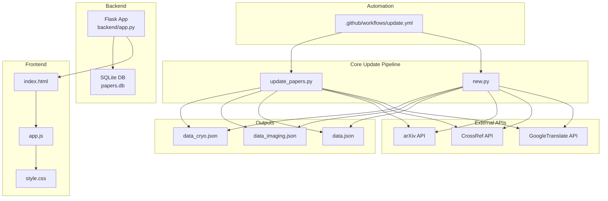
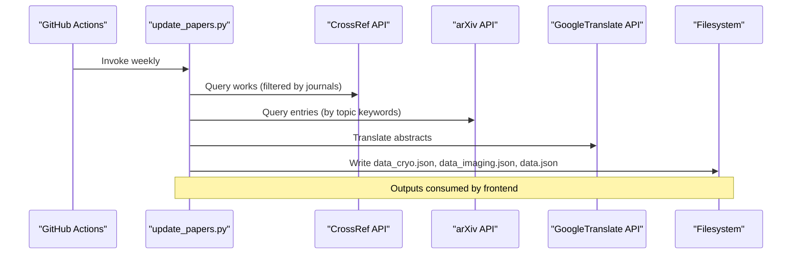
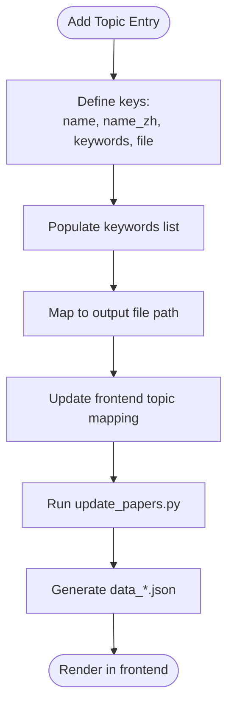
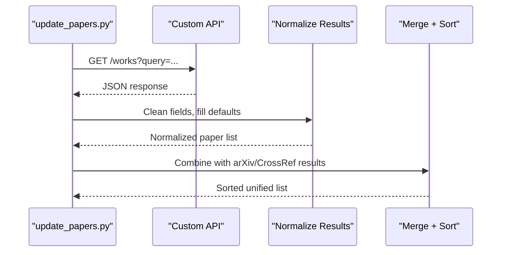
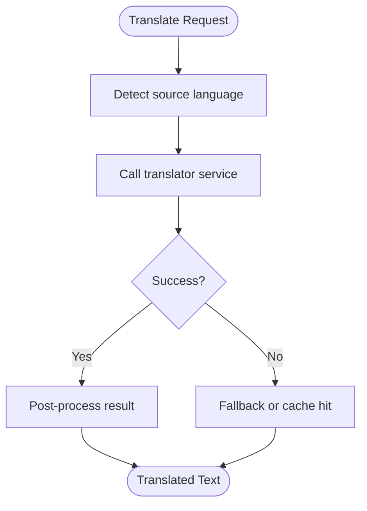
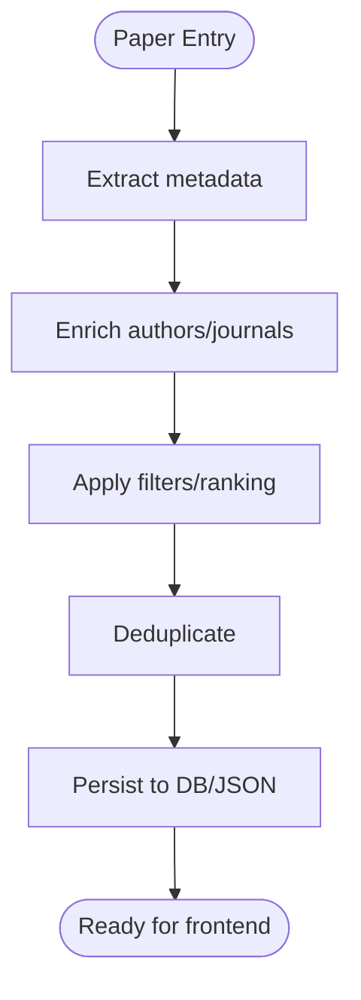
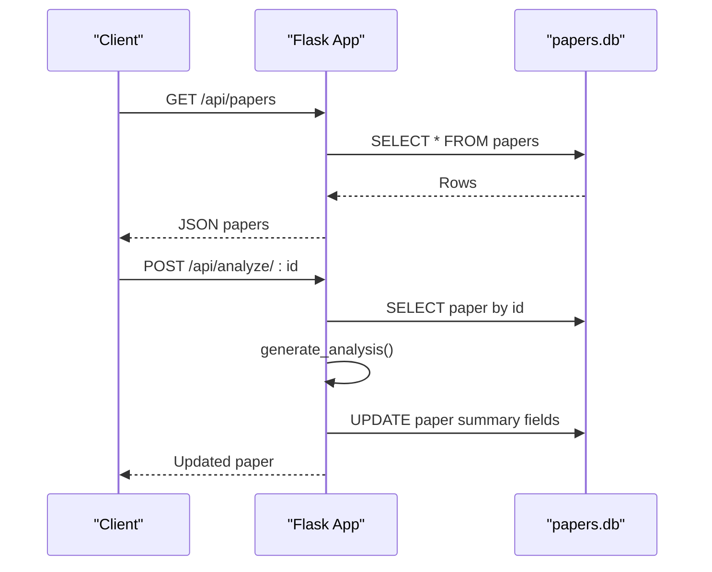
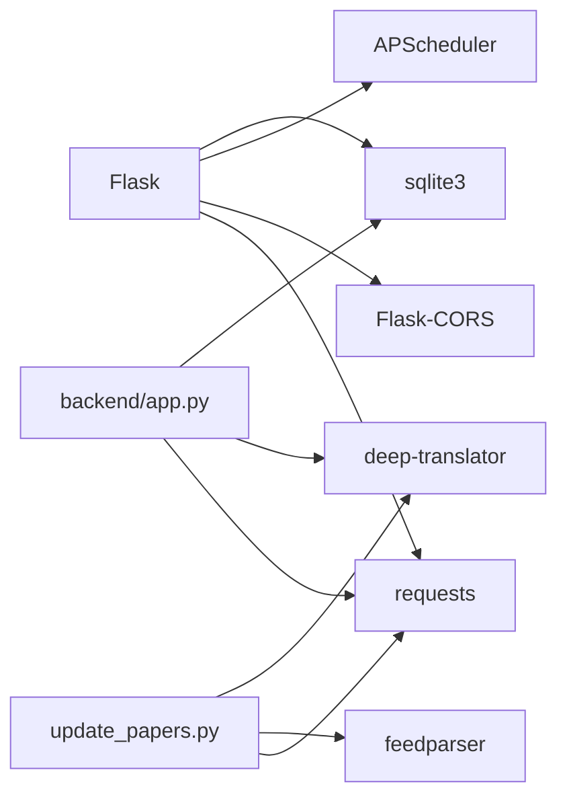

# Backend Extension

<cite>
**Referenced Files in This Document**
- [backend/app.py](file://backend/app.py)
- [update_papers.py](file://update_papers.py)
- [new.py](file://new.py)
- [requirements.txt](file://requirements.txt)
- [index.html](file://index.html)
- [app.js](file://app.js)
- [style.css](file://style.css)
- [.github/workflows/update.yml](file://.github/workflows/update.yml)
- [test_mail.py](file://test_mail.py)
- [data.json](file://data.json)
- [data_cryo.json](file://data_cryo.json)
- [data_imaging.json](file://data_imaging.json)
</cite>

## Table of Contents
1. [Introduction](#introduction)
2. [Project Structure](#project-structure)
3. [Core Components](#core-components)
4. [Architecture Overview](#architecture-overview)
5. [Detailed Component Analysis](#detailed-component-analysis)
6. [Dependency Analysis](#dependency-analysis)
7. [Performance Considerations](#performance-considerations)
8. [Troubleshooting Guide](#troubleshooting-guide)
9. [Conclusion](#conclusion)
10. [Appendices](#appendices)

## Introduction
This document provides comprehensive backend extension guidance for the paper_weekly system. It focuses on:
- Adding new seismology topics by extending the TOPICS configuration dictionary with keyword sets and output file mappings
- Integrating additional API sources beyond arXiv and CrossRef, including authentication, rate limiting, and error handling strategies
- Customizing the translation workflow by modifying GoogleTranslator settings, implementing alternative translation services, or adding multilingual support
- Extending the paper processing pipeline, adding new metadata extraction capabilities, and implementing custom filtering or ranking algorithms
- Best practices for maintaining backward compatibility, graceful failure handling, and optimizing performance for larger datasets

## Project Structure
The system consists of:
- A Python backend Flask service that exposes APIs for fetching and analyzing papers
- A Python update script that scrapes and aggregates papers from external APIs and writes JSON outputs per topic
- A frontend web app that renders topic-specific paper lists and details
- GitHub Actions workflow to automate weekly updates and notifications

**Diagram sources**
- [backend/app.py:175-236](file://backend/app.py#L175-L236)
- [update_papers.py:14-45](file://update_papers.py#L14-L45)
- [new.py:13-49](file://new.py#L13-L49)
- [index.html:1-50](file://index.html#L1-L50)
- [app.js:1-148](file://app.js#L1-L148)
- [style.css:1-179](file://style.css#L1-L179)
- [.github/workflows/update.yml:1-48](file://.github/workflows/update.yml#L1-L48)

**Section sources**
- [backend/app.py:175-236](file://backend/app.py#L175-L236)
- [update_papers.py:14-45](file://update_papers.py#L14-L45)
- [new.py:13-49](file://new.py#L13-L49)
- [index.html:1-50](file://index.html#L1-L50)
- [app.js:1-148](file://app.js#L1-L148)
- [style.css:1-179](file://style.css#L1-L179)
- [.github/workflows/update.yml:1-48](file://.github/workflows/update.yml#L1-L48)

## Core Components
- Flask API service: Provides endpoints to search, list, and analyze papers; manages SQLite persistence; integrates translation
- Update scripts: Define TOPICS, query external APIs, translate, and write topic-specific JSON outputs
- Frontend: Renders topic navigation, lists, and modal details; loads JSON outputs produced by the update scripts
- GitHub Actions: Automates periodic updates and email notifications

Key implementation references:
- Flask routes and database operations: [backend/app.py:175-236](file://backend/app.py#L175-L236)
- Topic configuration and API queries: [update_papers.py:14-45](file://update_papers.py#L14-L45), [new.py:13-49](file://new.py#L13-L49)
- Translation utilities: [update_papers.py:63-71](file://update_papers.py#L63-L71), [backend/app.py:142-147](file://backend/app.py#L142-L147)
- Frontend topic mapping and rendering: [app.js:4-11](file://app.js#L4-L11), [index.html:16-23](file://index.html#L16-L23)

**Section sources**
- [backend/app.py:175-236](file://backend/app.py#L175-L236)
- [update_papers.py:14-45](file://update_papers.py#L14-L45)
- [new.py:13-49](file://new.py#L13-L49)
- [app.js:4-11](file://app.js#L4-L11)
- [index.html:16-23](file://index.html#L16-L23)

## Architecture Overview
The backend extension architecture supports:
- Extensible topic configuration with keyword sets and output file mappings
- Pluggable API integrations for arXiv and CrossRef plus custom providers
- Configurable translation pipeline with fallbacks and alternatives
- Modular processing pipeline for metadata extraction and ranking
- Graceful error handling and rate limiting strategies

**Diagram sources**
- [.github/workflows/update.yml:24-25](file://.github/workflows/update.yml#L24-L25)
- [update_papers.py:72-124](file://update_papers.py#L72-L124)
- [update_papers.py:104-124](file://update_papers.py#L104-L124)

## Detailed Component Analysis

### Extending Topics via TOPICS Configuration
- Purpose: Define new seismology topics with localized names, keyword sets, and output file targets
- Implementation pattern:
  - Add a new topic entry with keys: name, name_zh, keywords, file
  - Ensure the output file path exists and is writable by the update script
  - Extend the frontend topic mapping if adding a new tab/button
- Example references:
  - Topic definition structure: [update_papers.py:14-45](file://update_papers.py#L14-L45)
  - Topic button mapping in frontend: [index.html:16-23](file://index.html#L16-L23), [app.js:4-11](file://app.js#L4-L11)
- Backward compatibility:
  - Keep existing keys intact
  - Append new topic entries rather than renaming/removing old ones
  - Maintain consistent output schema across topic files

**Diagram sources**
- [update_papers.py:14-45](file://update_papers.py#L14-L45)
- [index.html:16-23](file://index.html#L16-L23)
- [app.js:4-11](file://app.js#L4-L11)

**Section sources**
- [update_papers.py:14-45](file://update_papers.py#L14-L45)
- [index.html:16-23](file://index.html#L16-L23)
- [app.js:4-11](file://app.js#L4-L11)

### Integrating Additional API Sources (Beyond arXiv and CrossRef)
- Authentication:
  - For APIs requiring tokens, define environment variables and load them in the script
  - Store secrets in CI/CD securely (e.g., GitHub Secrets) and pass to the runtime
- Rate limiting:
  - Introduce delays between requests (e.g., sleep) to avoid throttling
  - Use exponential backoff on 429/5xx responses
  - Respect robots.txt and API terms of service
- Error handling:
  - Wrap external calls in try-catch blocks
  - Log errors and continue with remaining jobs
  - Normalize missing or malformed fields to defaults
- Extensibility pattern:
  - Create a provider function similar to search_crossref and search_arxiv
  - Merge results into the unified list and sort by publication date
- Example references:
  - arXiv search: [update_papers.py:104-124](file://update_papers.py#L104-L124)
  - CrossRef search: [update_papers.py:72-102](file://update_papers.py#L72-L102)
  - Provider function signature and merging: [update_papers.py:136-146](file://update_papers.py#L136-L146)

**Diagram sources**
- [update_papers.py:72-124](file://update_papers.py#L72-L124)

**Section sources**
- [update_papers.py:72-124](file://update_papers.py#L72-L124)

### Customizing the Translation Workflow
- Current behavior:
  - Uses GoogleTranslator with automatic source language detection and target locale
  - Applies truncation and post-processing to clean translations
- Customization options:
  - Modify target locale or add fallback locales
  - Replace GoogleTranslator with another service (e.g., LibreTranslate, Azure Cognitive Services)
  - Implement caching to reduce repeated translations
  - Add retry logic and circuit breaker for unreliable endpoints
- Example references:
  - Translation wrapper: [update_papers.py:63-71](file://update_papers.py#L63-L71)
  - Translation in backend analysis: [backend/app.py:142-147](file://backend/app.py#L142-L147)

**Diagram sources**
- [update_papers.py:63-71](file://update_papers.py#L63-L71)
- [backend/app.py:142-147](file://backend/app.py#L142-L147)

**Section sources**
- [update_papers.py:63-71](file://update_papers.py#L63-L71)
- [backend/app.py:142-147](file://backend/app.py#L142-L147)

### Extending the Paper Processing Pipeline
- Metadata extraction enhancements:
  - Extract additional fields (e.g., funding, datasets, supplementary material links)
  - Enrich author profiles by querying author-centric APIs
- Filtering and ranking:
  - Implement relevance scoring based on keyword overlap, journal impact factor, or citations
  - Add deduplication by DOI/URL/title similarity thresholds
- Storage and persistence:
  - Extend the database schema to include new fields
  - Maintain backward-compatible migrations
- Example references:
  - Author enrichment and metadata shaping: [update_papers.py:82-101](file://update_papers.py#L82-L101), [update_papers.py:111-122](file://update_papers.py#L111-L122)
  - Backend analysis fields: [backend/app.py:149-173](file://backend/app.py#L149-L173)

**Diagram sources**
- [update_papers.py:82-124](file://update_papers.py#L82-L124)
- [backend/app.py:149-173](file://backend/app.py#L149-L173)

**Section sources**
- [update_papers.py:82-124](file://update_papers.py#L82-L124)
- [backend/app.py:149-173](file://backend/app.py#L149-L173)

### Backend API Extensions
- Adding new endpoints:
  - Define route handlers in the Flask app
  - Implement data retrieval and normalization consistent with existing patterns
- Database schema extensions:
  - Add columns to the papers table with safe defaults
  - Provide migration logic for existing deployments
- Example references:
  - Flask routes and DB operations: [backend/app.py:175-236](file://backend/app.py#L175-L236)

**Diagram sources**
- [backend/app.py:175-236](file://backend/app.py#L175-L236)

**Section sources**
- [backend/app.py:175-236](file://backend/app.py#L175-L236)

## Dependency Analysis
External libraries and their roles:
- Flask: Web framework for backend API
- Flask-CORS: Enable cross-origin requests
- requests: HTTP client for API calls
- feedparser: Parse arXiv Atom feeds
- APScheduler: Background job scheduling
- deep-translator: Text translation service

**Diagram sources**
- [requirements.txt:1-7](file://requirements.txt#L1-L7)
- [backend/app.py:1-13](file://backend/app.py#L1-L13)
- [update_papers.py:1-10](file://update_papers.py#L1-L10)

**Section sources**
- [requirements.txt:1-7](file://requirements.txt#L1-L7)
- [backend/app.py:1-13](file://backend/app.py#L1-L13)
- [update_papers.py:1-10](file://update_papers.py#L1-L10)

## Performance Considerations
- API call batching and delays:
  - Introduce per-request delays and batch sizes to respect rate limits
  - Use exponential backoff on retries
- Caching:
  - Cache translation results and author work lists to reduce repeated calls
- Database writes:
  - Batch INSERT/UPDATE operations to minimize disk I/O
- Frontend rendering:
  - Paginate or lazy-load large lists
  - Debounce search/filter operations
- Scalability:
  - Offload heavy processing to background workers or separate microservices
  - Use async I/O for concurrent API calls

[No sources needed since this section provides general guidance]

## Troubleshooting Guide
- Translation failures:
  - Wrap translator calls with try-catch and log exceptions
  - Provide fallback messages and retry logic
- API errors:
  - Catch network timeouts and HTTP errors
  - Implement circuit breaker patterns and backoff
- Email delivery issues:
  - Validate credentials and app password configuration
  - Test SMTP connectivity locally before automation
- Frontend data loading:
  - Ensure JSON files are generated and served with correct MIME types
  - Verify CORS configuration for API endpoints

**Section sources**
- [backend/app.py:142-147](file://backend/app.py#L142-L147)
- [update_papers.py:63-71](file://update_papers.py#L63-L71)
- [test_mail.py:12-33](file://test_mail.py#L12-L33)
- [app.js:42-71](file://app.js#L42-L71)

## Conclusion
The paper_weekly system offers a clear extension surface for adding new seismology topics, integrating additional API sources, customizing translation workflows, and enhancing the paper processing pipeline. By following the established patterns for configuration, API integration, error handling, and performance, you can maintain backward compatibility while scaling to larger datasets and more complex workflows.

[No sources needed since this section summarizes without analyzing specific files]

## Appendices

### A. Adding a New Topic
Steps:
- Extend TOPICS with a new entry containing name, name_zh, keywords, and file
- Ensure the frontend maps the new topic to a data file
- Run the update script to generate the output JSON
- Verify rendering in the browser

References:
- [update_papers.py:14-45](file://update_papers.py#L14-L45)
- [index.html:16-23](file://index.html#L16-L23)
- [app.js:4-11](file://app.js#L4-L11)

### B. Adding a New API Provider
Steps:
- Implement a provider function similar to search_crossref/search_arxiv
- Add authentication and rate limiting
- Merge results into the unified list and sort by date
- Update GitHub Actions to include the new provider

References:
- [update_papers.py:72-124](file://update_papers.py#L72-L124)

### C. Customizing Translation
Options:
- Change target locale or add fallbacks
- Replace GoogleTranslator with an alternative service
- Add caching and retry logic

References:
- [update_papers.py:63-71](file://update_papers.py#L63-L71)
- [backend/app.py:142-147](file://backend/app.py#L142-L147)

### D. Backend API Enhancements
Guidelines:
- Add new routes following existing patterns
- Extend database schema with migrations
- Ensure backward compatibility for clients

References:
- [backend/app.py:175-236](file://backend/app.py#L175-L236)