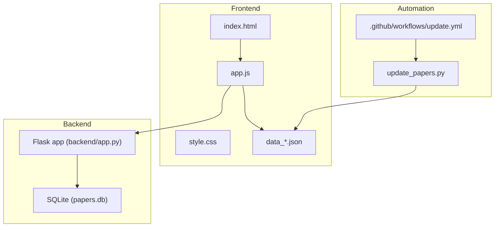
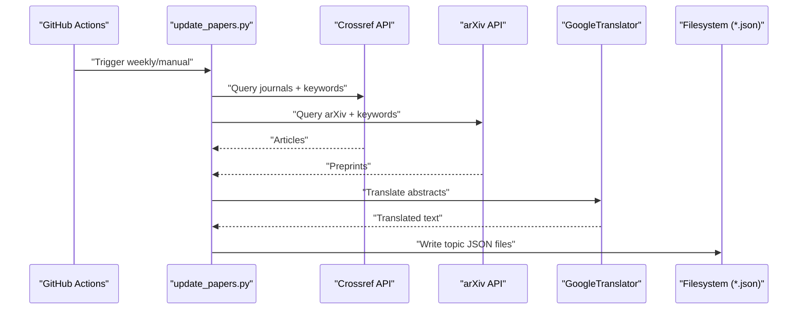
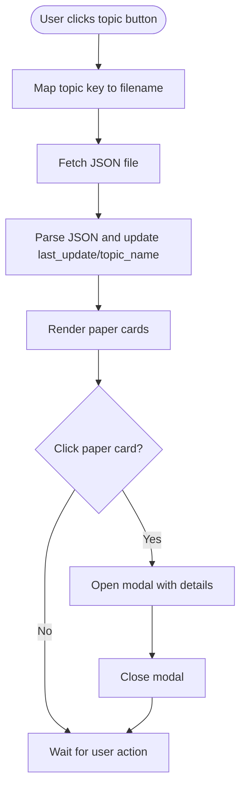
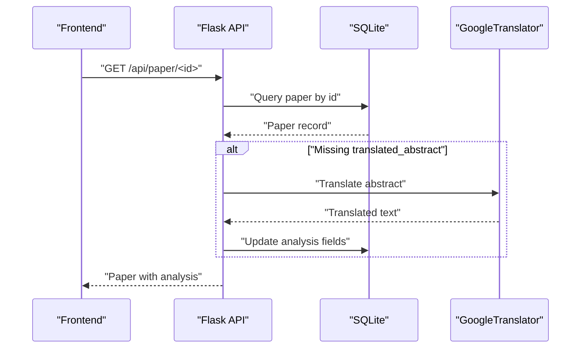
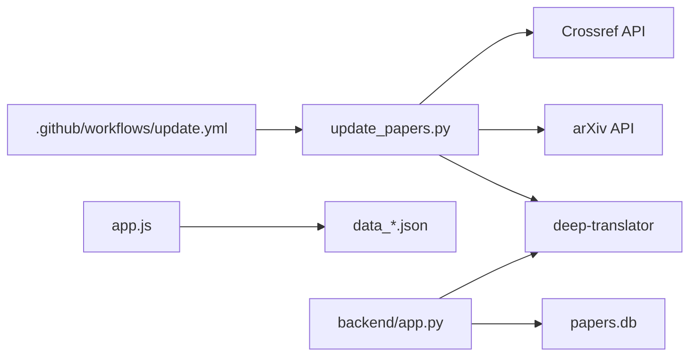

# Customization & Extension

<cite>
**Referenced Files in This Document**
- [README.md](file://README.md)
- [backend/app.py](file://backend/app.py)
- [app.js](file://app.js)
- [index.html](file://index.html)
- [style.css](file://style.css)
- [data.json](file://data.json)
- [data_cryo.json](file://data_cryo.json)
- [data_imaging.json](file://data_imaging.json)
- [update_papers.py](file://update_papers.py)
- [new.py](file://new.py)
- [deploy.sh](file://deploy.sh)
- [.github/workflows/update.yml](file://.github/workflows/update.yml)
- [requirements.txt](file://requirements.txt)
</cite>

## Table of Contents
1. [Introduction](#introduction)
2. [Project Structure](#project-structure)
3. [Core Components](#core-components)
4. [Architecture Overview](#architecture-overview)
5. [Detailed Component Analysis](#detailed-component-analysis)
6. [Dependency Analysis](#dependency-analysis)
7. [Performance Considerations](#performance-considerations)
8. [Troubleshooting Guide](#troubleshooting-guide)
9. [Conclusion](#conclusion)
10. [Appendices](#appendices)

## Introduction
This document provides comprehensive customization and extension guidance for the paper_weekly system. It explains how to:
- Add new seismology topics by modifying topic configuration and extending the API integration logic
- Customize the frontend (theme, layout, and styling)
- Add new API sources and integrate additional presentation features
- Extend the Python backend with new functionality
- Adapt the system for different academic contexts
- Maintain compatibility during extensions

The goal is to enable safe, incremental enhancements while preserving the existing data flow and user experience.

## Project Structure
The system consists of:
- A Python backend (Flask) that serves the frontend and exposes APIs for fetching and analyzing papers
- A static frontend (HTML/CSS/JS) that renders topic-specific JSON datasets
- A periodic update pipeline that pulls from Crossref and arXiv, translates, and writes JSON files
- GitHub Actions automation for weekly updates and notifications

**Diagram sources**
- [backend/app.py:12-236](file://backend/app.py#L12-L236)
- [app.js:1-148](file://app.js#L1-L148)
- [index.html:1-50](file://index.html#L1-L50)
- [style.css:1-179](file://style.css#L1-L179)
- [data_cryo.json:1-5](file://data_cryo.json#L1-L5)
- [data_imaging.json:1-171](file://data_imaging.json#L1-L171)
- [.github/workflows/update.yml:1-48](file://.github/workflows/update.yml#L1-L48)
- [update_papers.py:1-149](file://update_papers.py#L1-L149)

**Section sources**
- [README.md:33-40](file://README.md#L33-L40)
- [backend/app.py:12-236](file://backend/app.py#L12-L236)
- [app.js:1-148](file://app.js#L1-L148)
- [index.html:1-50](file://index.html#L1-L50)
- [style.css:1-179](file://style.css#L1-L179)
- [data_cryo.json:1-5](file://data_cryo.json#L1-L5)
- [data_imaging.json:1-171](file://data_imaging.json#L1-L171)
- [.github/workflows/update.yml:1-48](file://.github/workflows/update.yml#L1-L48)
- [update_papers.py:1-149](file://update_papers.py#L1-L149)

## Core Components
- Topic configuration and data pipeline
  - The update scripts define topic mappings, keywords, and output files. They query Crossref and arXiv, translate abstracts, and write topic JSON files consumed by the frontend.
- Frontend rendering
  - The HTML page defines topic buttons and containers. The JavaScript loads topic-specific JSON files and renders cards with metadata and previews. Modal dialogs show detailed analysis and links.
- Backend API
  - The Flask app initializes a SQLite database, exposes endpoints to search, list, and analyze papers, and integrates translation and analysis logic.
- Automation
  - GitHub Actions runs the update script weekly and on demand, commits and pushes changes, and sends email notifications.

Key customization entry points:
- Topic configuration and keywords
- Data schema and JSON structure
- Frontend topic navigation and rendering
- Backend endpoints and data persistence
- Translation and analysis logic
- Automation triggers and secrets

**Section sources**
- [update_papers.py:14-45](file://update_papers.py#L14-L45)
- [app.js:27-71](file://app.js#L27-L71)
- [backend/app.py:175-218](file://backend/app.py#L175-L218)
- [.github/workflows/update.yml:1-48](file://.github/workflows/update.yml#L1-L48)

## Architecture Overview
The system follows a simple, layered architecture:
- Data ingestion and processing (Python scripts) -> JSON datasets -> Static frontend -> User interaction
- Optional backend API for dynamic analysis and persistence

**Diagram sources**
- [.github/workflows/update.yml:24-25](file://.github/workflows/update.yml#L24-L25)
- [update_papers.py:72-124](file://update_papers.py#L72-L124)

**Section sources**
- [.github/workflows/update.yml:1-48](file://.github/workflows/update.yml#L1-L48)
- [update_papers.py:1-149](file://update_papers.py#L1-L149)

## Detailed Component Analysis

### Topic Configuration and Data Pipeline
- Topic definition
  - Topics are defined with human-readable names, Chinese names, keyword lists, and output filenames. Extending topics involves adding entries to the topic dictionary and ensuring the frontend maps to the new filename.
- Data schema
  - Each topic JSON file includes a last update timestamp, topic name, and a list of papers. Each paper includes identifiers, titles, URLs, author metadata, affiliations, translated abstracts, source, and publication date.
- Translation and analysis
  - The scripts translate abstracts and can attach analysis fields. The backend can also generate analysis on-demand for missing records.

Customization steps:
- Add a new topic entry with keywords and output filename
- Ensure the frontend maps the new topic to the correct JSON file
- Optionally adjust analysis and translation logic

**Section sources**
- [update_papers.py:14-45](file://update_papers.py#L14-L45)
- [data_cryo.json:1-5](file://data_cryo.json#L1-L5)
- [data_imaging.json:1-171](file://data_imaging.json#L1-L171)
- [backend/app.py:142-173](file://backend/app.py#L142-L173)

### Frontend Rendering and Navigation
- Topic switching
  - The frontend maintains a mapping from topic keys to JSON filenames. Switching topics loads the corresponding file and updates the UI.
- Card rendering
  - Papers are rendered as cards with title, author, affiliation, and a preview of the translated abstract. Clicking a card opens a modal with detailed information and a link to the original resource.
- Styling and themes
  - CSS variables define primary colors and backgrounds. Layout uses flexbox and responsive spacing. Modals and loading states are styled for clarity.

Customization steps:
- Add a new button in the HTML nav and update the mapping in JavaScript
- Adjust CSS variables and selectors to change theme and layout
- Extend modal content to include additional fields from the dataset

**Diagram sources**
- [index.html:16-23](file://index.html#L16-L23)
- [app.js:42-92](file://app.js#L42-L92)
- [style.css:30-179](file://style.css#L30-L179)

**Section sources**
- [index.html:16-23](file://index.html#L16-L23)
- [app.js:27-92](file://app.js#L27-L92)
- [style.css:30-179](file://style.css#L30-L179)

### Backend API and Data Persistence
- Database initialization and schema
  - The backend initializes a SQLite table for papers with fields for identifiers, titles, abstracts, authors, categories, and analysis fields.
- Endpoints
  - Search endpoint queries arXiv with configurable keywords and saves results to the database
  - List endpoint returns stored papers
  - Detail endpoint retrieves a paper and, if missing analysis, generates and persists analysis
  - Analyze endpoint forces regeneration of analysis for a given paper
- Translation and analysis
  - Translation uses a translator library; analysis fields are populated with defaults and can be extended

Customization steps:
- Add new endpoints for additional features
- Extend analysis logic to incorporate new fields
- Integrate additional sources by adding new search functions and routes

**Diagram sources**
- [backend/app.py:175-218](file://backend/app.py#L175-L218)
- [backend/app.py:142-173](file://backend/app.py#L142-L173)

**Section sources**
- [backend/app.py:17-27](file://backend/app.py#L17-L27)
- [backend/app.py:175-218](file://backend/app.py#L175-L218)
- [backend/app.py:142-173](file://backend/app.py#L142-L173)

### Automation and Deployment
- Workflow scheduling
  - The workflow runs weekly and on manual dispatch, installs dependencies, executes the update script, sends email notifications, and pushes changes.
- Deployment script
  - A shell script automates committing and pushing changes with a prompt for commit messages and safe rebase handling.

Customization steps:
- Modify cron schedule or add manual triggers
- Add new notification channels or attachments
- Extend the deployment script for additional environments

**Section sources**
- [.github/workflows/update.yml:1-48](file://.github/workflows/update.yml#L1-L48)
- [deploy.sh:1-34](file://deploy.sh#L1-L34)

## Dependency Analysis
External libraries and services:
- Python backend
  - Flask, Flask-CORS, APScheduler, requests, feedparser, deep-translator
- Frontend
  - Static HTML/CSS/JS; no external runtime dependencies
- Automation
  - GitHub Actions runner and mail action

**Diagram sources**
- [requirements.txt:1-7](file://requirements.txt#L1-L7)
- [update_papers.py:9,72-124](file://update_papers.py#L9,L72-L124)
- [app.js:42-71](file://app.js#L42-L71)
- [backend/app.py:10,142-173](file://backend/app.py#L10,L142-L173)

**Section sources**
- [requirements.txt:1-7](file://requirements.txt#L1-L7)
- [update_papers.py:1-149](file://update_papers.py#L1-L149)
- [app.js:1-148](file://app.js#L1-L148)
- [backend/app.py:1-236](file://backend/app.py#L1-L236)

## Performance Considerations
- API rate limits
  - Crossref and arXiv impose rate limits; the scripts already include delays and pagination. When adding new sources, ensure similar safeguards.
- Translation costs and timeouts
  - Translation is performed per abstract; consider batching or caching to reduce repeated translations.
- Database writes
  - Batch writes and indexing can improve performance for frequent updates.
- Frontend rendering
  - Large datasets can impact rendering performance; consider pagination or virtualization for very large topic sets.

[No sources needed since this section provides general guidance]

## Troubleshooting Guide
- Translation failures
  - The translation function catches exceptions and returns a failure message. Verify credentials and network connectivity if translations fail.
- Missing data files
  - The frontend displays an empty state when a topic file is unavailable. Ensure the update script runs and writes the expected JSON files.
- Backend errors
  - The backend logs scheduled searches and handles keyboard interrupts gracefully. Check logs for database initialization and endpoint errors.
- Email delivery issues
  - Follow the documented steps for Gmail SMTP configuration and app passwords.

**Section sources**
- [backend/app.py:142-147](file://backend/app.py#L142-L147)
- [app.js:59-70](file://app.js#L59-L70)
- [backend/app.py:219-235](file://backend/app.py#L219-L235)
- [README.md:26-31](file://README.md#L26-L31)

## Conclusion
The paper_weekly system is designed for extensibility:
- Add new topics by updating topic configuration and ensuring frontend mapping
- Extend the backend with new endpoints and analysis logic
- Customize the frontend with theme variables, layouts, and modal content
- Integrate additional APIs by adding new search functions and data schemas
- Maintain compatibility by preserving existing data structures and API contracts

[No sources needed since this section summarizes without analyzing specific files]

## Appendices

### A. Adding a New Seismology Topic
Steps:
- Define the topic in the topic configuration with a unique key, Chinese name, keywords, and output filename
- Ensure the frontend maps the topic key to the new JSON filename
- Run the update script to generate the new dataset
- Verify the frontend renders the new topic and cards

Best practices:
- Keep keywords precise and aligned with the topic scope
- Preserve the JSON schema for compatibility
- Test translation and analysis logic for the new dataset

**Section sources**
- [update_papers.py:14-45](file://update_papers.py#L14-L45)
- [app.js:4-11](file://app.js#L4-L11)
- [index.html:16-23](file://index.html#L16-L23)

### B. Extending the Python Backend
Examples of extensions:
- Add new endpoints for filtering or aggregating papers
- Integrate additional sources by adding new search functions and routes
- Extend analysis logic to include new fields or external LLMs
- Persist additional metadata in the database schema

Guidelines:
- Maintain backward-compatible API responses
- Wrap external calls with timeouts and retries
- Log and handle errors gracefully

**Section sources**
- [backend/app.py:175-218](file://backend/app.py#L175-L218)
- [backend/app.py:29-49](file://backend/app.py#L29-L49)

### C. Frontend Customization Options
Theme modifications:
- Adjust CSS variables for primary colors and backgrounds
- Modify layout classes and spacing for responsiveness

Layout changes:
- Add new topic buttons and update the mapping in JavaScript
- Extend modal content to display additional fields from the dataset

Additional styling:
- Use CSS animations and transitions sparingly for better performance
- Ensure accessibility by keeping sufficient contrast and readable fonts

**Section sources**
- [style.css:1-179](file://style.css#L1-L179)
- [index.html:16-23](file://index.html#L16-L23)
- [app.js:27-127](file://app.js#L27-L127)

### D. Integrating Additional Presentation Features
Options:
- Add sorting and filtering controls in the frontend
- Implement pagination or infinite scroll for large datasets
- Enhance the modal with tabs for authors, analysis, and related works
- Add export features (CSV/PDF) using client-side or backend integrations

Implementation tips:
- Keep DOM manipulation minimal and reactive
- Defer heavy operations until after initial render
- Validate and sanitize any user-provided content

**Section sources**
- [app.js:73-127](file://app.js#L73-L127)
- [data_imaging.json:1-171](file://data_imaging.json#L1-L171)

### E. Adapting for Different Academic Contexts
- Journal filters
  - Adjust the journal list to match target disciplines or institutions
- Keyword sets
  - Tailor keywords to regional or institutional preferences
- Output formats
  - Extend the update scripts to support additional output formats or destinations

**Section sources**
- [update_papers.py:47-52](file://update_papers.py#L47-L52)
- [update_papers.py:14-45](file://update_papers.py#L14-L45)

### F. Maintaining Compatibility During Extensions
- Preserve data schemas
  - Ensure new fields are optional and backward-compatible
- Version control
  - Use semantic versioning for API changes and document breaking changes
- Testing
  - Add tests for new endpoints and data transformations
- Documentation
  - Update README and inline comments for new features

**Section sources**
- [data_cryo.json:1-5](file://data_cryo.json#L1-L5)
- [data_imaging.json:1-171](file://data_imaging.json#L1-L171)
- [backend/app.py:17-27](file://backend/app.py#L17-L27)