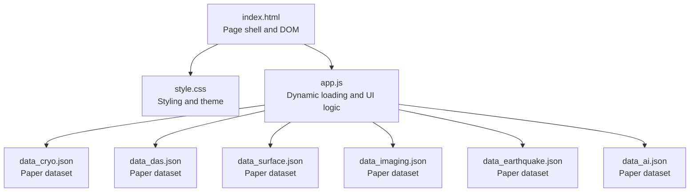
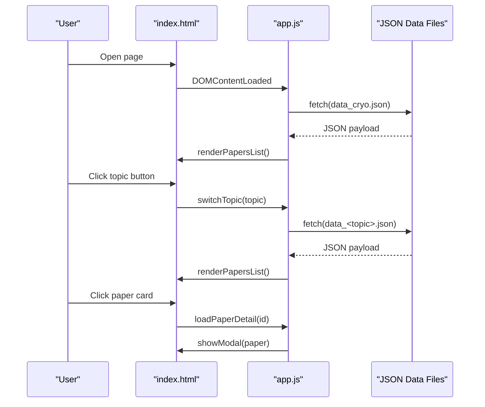
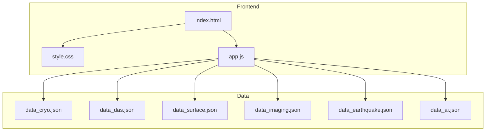
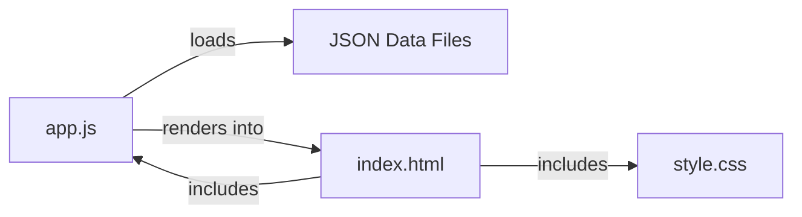

# Frontend Customization

<cite>
**Referenced Files in This Document**
- [index.html](file://index.html)
- [style.css](file://style.css)
- [app.js](file://app.js)
- [README.md](file://README.md)
- [update_papers.py](file://update_papers.py)
- [deploy.sh](file://deploy.sh)
- [data_cryo.json](file://data_cryo.json)
</cite>

## Table of Contents
1. [Introduction](#introduction)
2. [Project Structure](#project-structure)
3. [Core Components](#core-components)
4. [Architecture Overview](#architecture-overview)
5. [Detailed Component Analysis](#detailed-component-analysis)
6. [Dependency Analysis](#dependency-analysis)
7. [Performance Considerations](#performance-considerations)
8. [Troubleshooting Guide](#troubleshooting-guide)
9. [Conclusion](#conclusion)
10. [Appendices](#appendices)

## Introduction
This document provides comprehensive frontend customization guidance for the paper_weekly web interface. It explains how to modify visual appearance via CSS customization (color schemes, typography, spacing, responsive design), adjust layouts for topic navigation, paper cards, and modal presentations, and enhance user interactions through JavaScript customization. It also covers extending the paper display format, adding new UI components, and implementing additional filtering or sorting capabilities. Finally, it addresses browser compatibility and performance optimization techniques for frontend customizations.

## Project Structure
The frontend consists of a minimal HTML page, a single stylesheet, and a single client-side script. Data is loaded dynamically from JSON files generated by the backend pipeline.

**Diagram sources**
- [index.html:1-50](file://index.html#L1-L50)
- [style.css:1-179](file://style.css#L1-L179)
- [app.js:1-148](file://app.js#L1-L148)
- [data_cryo.json:1-5](file://data_cryo.json#L1-L5)

**Section sources**
- [index.html:1-50](file://index.html#L1-L50)
- [style.css:1-179](file://style.css#L1-L179)
- [app.js:1-148](file://app.js#L1-L148)

## Core Components
- Page shell and layout: Header, topic navigation bar, search metadata, loading indicator, paper list container, and modal overlay.
- Styling system: CSS custom properties for theme tokens, component-specific styles for buttons, cards, modals, and loading spinner.
- Dynamic content: Topic switching, asynchronous data fetching, rendering of paper cards, and modal presentation with escaped HTML.

Key customization touchpoints:
- CSS custom properties for global theming.
- Component classes for navigation, cards, and modal.
- JavaScript event handlers and rendering functions.

**Section sources**
- [index.html:10-45](file://index.html#L10-L45)
- [style.css:1-179](file://style.css#L1-L179)
- [app.js:13-148](file://app.js#L13-L148)

## Architecture Overview
The frontend follows a simple static HTML page with embedded CSS and a small JavaScript runtime. Data is fetched asynchronously from topic-specific JSON files and rendered into the DOM.

**Diagram sources**
- [index.html:13-45](file://index.html#L13-L45)
- [app.js:42-132](file://app.js#L42-L132)

## Detailed Component Analysis

### CSS Theming and Layout
- Global tokens: CSS custom properties define primary color, background, text color, and card background. These can be overridden to change the entire theme.
- Typography and spacing: Body font stack, line height, and container padding define baseline typographic rhythm and spacing.
- Navigation: Flexbox-based topic navigation with active state styling and hover effects.
- Cards: Paper cards with hover elevation, rounded corners, and abstract preview truncation.
- Modal: Fullscreen overlay with centered content, close button, and scrollable body.
- Loading: Spinner animation and hidden state toggling.

Customization tips:
- Override CSS custom properties to switch themes without touching component classes.
- Adjust container max-width and padding for responsive breakpoints.
- Modify card shadows and transitions for different visual weight.
- Extend modal grid and footer areas for richer content.

**Section sources**
- [style.css:1-179](file://style.css#L1-L179)

### JavaScript Interaction and Rendering
- Event listeners: Close modal on close button click and backdrop click.
- Topic switching: Updates active button state and loads the selected topic’s JSON.
- Data loading: Fetches JSON, updates last update and topic name, renders paper list.
- Rendering: Builds paper cards with escaped HTML and preview text.
- Modal: Populates author info, abstract translation, and external link; manages visibility and body scroll locking.

Extensibility points:
- Add new topic buttons and map them to new JSON files.
- Introduce filtering/sorting logic before rendering.
- Enhance modal with tabs, citations, or download actions.
- Add keyboard shortcuts and accessibility enhancements.

**Section sources**
- [app.js:13-148](file://app.js#L13-L148)

### HTML Structure and Accessibility
- Semantic header and paragraph for branding and metadata.
- Navigation buttons with explicit topic assignments.
- Loading and empty states for robust UX.
- Modal with accessible header and close button.

Accessibility considerations:
- Ensure sufficient color contrast against themed backgrounds.
- Provide focus indicators for interactive elements.
- Use ARIA attributes if adding dynamic content updates.

**Section sources**
- [index.html:10-45](file://index.html#L10-L45)

### Data Model and Rendering
- Data shape: Each JSON file contains a last update timestamp, topic name, and a list of papers.
- Paper fields: id, title, url, first author, corr author, affiliation, abs_zh, source, published.
- Rendering pipeline: Escape HTML to prevent XSS, truncate abstract previews, and build cards.

Customization ideas:
- Add new fields to the paper model and render them in cards or modal.
- Implement client-side search and filtering.
- Add sorting controls (by date, source, or author).

**Section sources**
- [data_cryo.json:1-5](file://data_cryo.json#L1-L5)
- [app.js:81-127](file://app.js#L81-L127)

## Architecture Overview

**Diagram sources**
- [index.html:1-50](file://index.html#L1-L50)
- [style.css:1-179](file://style.css#L1-L179)
- [app.js:4-11](file://app.js#L4-L11)
- [data_cryo.json:1-5](file://data_cryo.json#L1-L5)

## Detailed Component Analysis

### Topic Navigation Customization
- Current implementation: Buttons with inline onclick handlers and active state management.
- Customization options:
  - Add new topic buttons and extend the topic-to-file mapping.
  - Replace buttons with dropdown or pill-style navigation.
  - Add icons or badges for unread counts or freshness.

Implementation pointers:
- Extend the topic button list in the HTML.
- Add a new entry in the topic-to-file mapping in JavaScript.
- Optionally add CSS for new button variants.

**Section sources**
- [index.html:16-23](file://index.html#L16-L23)
- [app.js:4-11](file://app.js#L4-L11)
- [app.js:27-40](file://app.js#L27-L40)

### Paper Card Layout and Interactions
- Current layout: Title, author/affiliation meta, truncated abstract preview, and a “view detail” indicator.
- Customization options:
  - Add publication year badge, source tag styling, or star/favorite action.
  - Implement expandable abstracts or inline preview toggle.
  - Add sorting controls (date, source, author) and filter chips.

Implementation pointers:
- Modify the card template in the rendering function.
- Add CSS classes for new badges and interactions.
- Introduce client-side sorting/filtering before rendering.

**Section sources**
- [app.js:73-92](file://app.js#L73-L92)
- [style.css:64-104](file://style.css#L64-L104)

### Modal Presentation Enhancement
- Current modal: Title, author info, abstract translation, and external link.
- Customization options:
  - Add tabs for abstract/figures/citations.
  - Include share/download actions.
  - Add keyboard navigation and focus trapping.

Implementation pointers:
- Extend the modal body template in the modal function.
- Add CSS for modal grid and sections.
- Enhance event handling for new controls.

**Section sources**
- [app.js:101-127](file://app.js#L101-L127)
- [style.css:106-149](file://style.css#L106-L149)

### Dynamic Content Loading Behavior
- Current behavior: Fetch JSON, update metadata, render list, handle errors, and toggle loading indicator.
- Customization options:
  - Add caching headers and local storage fallback.
  - Implement pagination or infinite scroll.
  - Add debounced search and live filtering.

Implementation pointers:
- Modify the fetch and render logic.
- Add UI for pagination or “Load More.”
- Integrate search input and filter pipeline.

**Section sources**
- [app.js:42-71](file://app.js#L42-L71)
- [app.js:134-140](file://app.js#L134-L140)

### Responsive Design Adjustments
- Current responsive hooks:
  - Container max-width and centered layout.
  - Flex-wrapping topic navigation.
  - Modal max-width and viewport constraints.
- Customization options:
  - Add media queries for narrower screens.
  - Adjust card grid and spacing for mobile.
  - Improve modal readability on small screens.

Implementation pointers:
- Use CSS custom properties for breakpoints.
- Adjust flex layouts and font sizes for smaller viewports.

**Section sources**
- [style.css:17-21](file://style.css#L17-L21)
- [style.css:31-37](file://style.css#L31-L37)
- [style.css:122-131](file://style.css#L122-L131)

### Browser Compatibility Considerations
- Modern APIs: fetch, arrow functions, template literals, and CSS custom properties are widely supported in modern browsers.
- Legacy support: If targeting older browsers, polyfill fetch and add transpilation for ES6+ features.
- Accessibility: Ensure focus management and keyboard navigation for modal and cards.

**Section sources**
- [app.js:42-71](file://app.js#L42-L71)
- [style.css:1-6](file://style.css#L1-L6)

## Dependency Analysis

**Diagram sources**
- [app.js:42-92](file://app.js#L42-L92)
- [index.html:7,47](file://index.html#L7,L47)
- [style.css:1-179](file://style.css#L1-L179)

**Section sources**
- [app.js:42-92](file://app.js#L42-L92)
- [index.html:7,47](file://index.html#L7,L47)

## Performance Considerations
- Minimize DOM updates: Batch rendering and reuse containers.
- Lazy loading: Defer non-critical assets; consider virtualized lists for large datasets.
- Efficient CSS: Prefer custom properties and avoid expensive animations on low-end devices.
- Network: Cache JSON responses and add ETags or Last-Modified checks.
- Memory: Avoid retaining references to removed nodes; clear modal content on close.

[No sources needed since this section provides general guidance]

## Troubleshooting Guide
- Data loading failures: The renderer displays an empty state message when a topic file fails to load. Verify the JSON file exists and is valid.
- Modal not closing: Ensure the close button and backdrop click handlers are attached.
- Topic switching not updating: Confirm the topic button’s onclick attribute matches the mapping and that the corresponding JSON file exists.
- Escaped HTML: The renderer escapes HTML to prevent XSS; confirm that intended HTML is not being escaped unintentionally.

**Section sources**
- [app.js:59-68](file://app.js#L59-L68)
- [app.js:18-25](file://app.js#L18-L25)
- [app.js:27-40](file://app.js#L27-L40)
- [app.js:142-147](file://app.js#L142-L147)

## Conclusion
The paper_weekly frontend offers a straightforward foundation for customization. By leveraging CSS custom properties, extending component classes, and augmenting the JavaScript rendering pipeline, you can tailor the visual design, interactions, and content presentation to meet diverse needs while maintaining performance and accessibility.

[No sources needed since this section summarizes without analyzing specific files]

## Appendices

### A. Adding a New Topic
Steps:
- Add a new topic button in the HTML navigation.
- Extend the topic-to-file mapping in JavaScript.
- Create a new JSON file with the expected structure.
- Optionally add CSS for new button states or badges.

**Section sources**
- [index.html:16-23](file://index.html#L16-L23)
- [app.js:4-11](file://app.js#L4-L11)
- [data_cryo.json:1-5](file://data_cryo.json#L1-L5)

### B. Extending the Paper Display Format
Options:
- Add new fields to the paper model and render them in cards or modal.
- Implement client-side search and filtering.
- Add sorting controls and persistent preferences.

**Section sources**
- [app.js:81-127](file://app.js#L81-L127)
- [update_papers.py:90-100](file://update_papers.py#L90-L100)

### C. Deployment Notes
- The repository includes a deployment script for pushing changes to the main branch.
- The README describes site integration and automation workflows.

**Section sources**
- [deploy.sh:1-34](file://deploy.sh#L1-L34)
- [README.md:7-12](file://README.md#L7-L12)