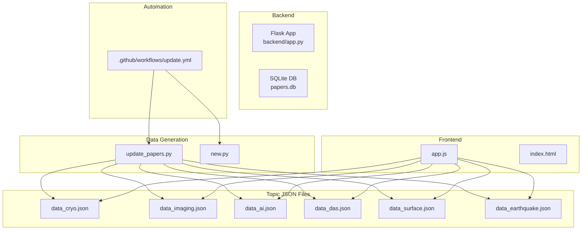
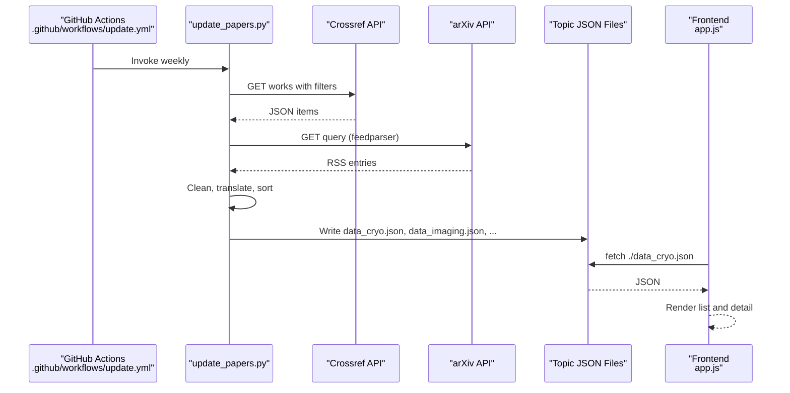
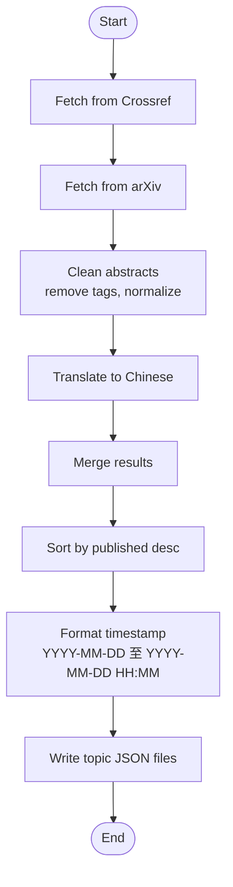
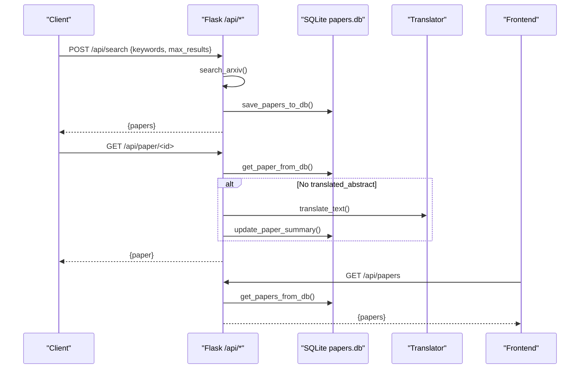
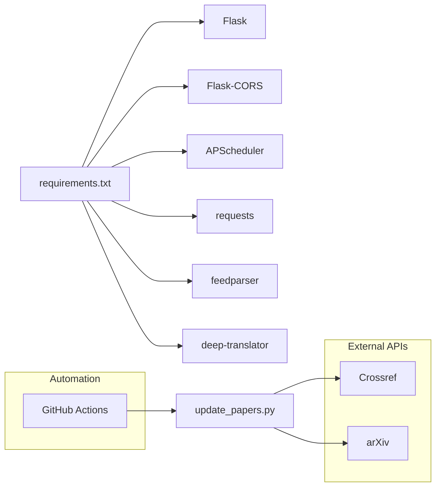

# Data Management

<cite>
**Referenced Files in This Document**
- [data.json](file://data.json)
- [data_cryo.json](file://data_cryo.json)
- [data_imaging.json](file://data_imaging.json)
- [data_ai.json](file://data_ai.json)
- [data_das.json](file://data_das.json)
- [data_surface.json](file://data_surface.json)
- [data_earthquake.json](file://data_earthquake.json)
- [backend/app.py](file://backend/app.py)
- [update_papers.py](file://update_papers.py)
- [app.js](file://app.js)
- [requirements.txt](file://requirements.txt)
- [.github/workflows/update.yml](file://.github/workflows/update.yml)
- [deploy.sh](file://deploy.sh)
- [README.md](file://README.md)
- [new.py](file://new.py)
</cite>

## Update Summary
**Changes Made**
- Enhanced timestamp management with improved date range formatting showing 'YYYY-MM-DD 至 YYYY-MM-DD HH:MM' format
- Updated all topic data files with consistent timestamp entries
- Refined data organization with better error handling and timeout management across all topic areas
- Improved timestamp consistency across all JSON data files

## Table of Contents
1. [Introduction](#introduction)
2. [Project Structure](#project-structure)
3. [Core Components](#core-components)
4. [Architecture Overview](#architecture-overview)
5. [Detailed Component Analysis](#detailed-component-analysis)
6. [Dependency Analysis](#dependency-analysis)
7. [Performance Considerations](#performance-considerations)
8. [Troubleshooting Guide](#troubleshooting-guide)
9. [Conclusion](#conclusion)
10. [Appendices](#appendices)

## Introduction
This document explains the data management system for the paper_weekly project. It covers:
- JSON file structure used for data persistence
- Paper object schemas and metadata organization
- Topic-specific data separation
- The data processing pipeline from API responses through cleaning and translation to final storage
- Data lifecycle including collection frequency, retention, and cleanup
- Examples of data structures, query patterns, and frontend integration
- Validation, error handling, and backup strategies
- Relationship between raw API data and processed JSON files

## Project Structure
The system consists of:
- Backend API service (Flask) for database-backed operations and scheduled updates
- Data generation scripts that fetch from arXiv and Crossref, clean, translate, and write topic-specific JSON files
- Frontend that reads topic JSON files and renders the weekly paper reports
- GitHub Actions workflow to automate weekly updates and notifications

**Diagram sources**
- [backend/app.py:175-236](file://backend/app.py#L175-L236)
- [update_papers.py:126-149](file://update_papers.py#L126-L149)
- [app.js:42-71](file://app.js#L42-L71)
- [.github/workflows/update.yml:8-48](file://.github/workflows/update.yml#L8-L48)

**Section sources**
- [README.md:14-36](file://README.md#L14-L36)
- [requirements.txt:1-7](file://requirements.txt#L1-L7)

## Core Components
- Topic JSON files: Each topic has a dedicated JSON file containing last_update, topic_name, and a list of papers. See [data_cryo.json:1-5](file://data_cryo.json#L1-L5), [data_imaging.json:1-171](file://data_imaging.json#L1-L171).
- Data generation scripts:
  - update_papers.py: Fetches from Crossref and arXiv, cleans and translates, writes topic JSON files. See [update_papers.py:126-149](file://update_papers.py#L126-L149).
  - new.py: Alternative generator writing to a frontend directory and adding analysis fields. See [new.py:162-181](file://new.py#L162-L181).
- Backend API (Flask): Provides endpoints to search, list, and analyze papers; stores raw arXiv entries in SQLite; translates on demand. See [backend/app.py:17-236](file://backend/app.py#L17-L236).
- Frontend: Loads topic JSON files and displays papers. See [app.js:42-71](file://app.js#L42-L71).
- Automation: GitHub Actions job runs the generator weekly and pushes updates. See [.github/workflows/update.yml:8-48](file://.github/workflows/update.yml#L8-L48).

**Section sources**
- [data_cryo.json:1-5](file://data_cryo.json#L1-L5)
- [data_imaging.json:1-171](file://data_imaging.json#L1-L171)
- [update_papers.py:126-149](file://update_papers.py#L126-L149)
- [new.py:162-181](file://new.py#L162-L181)
- [backend/app.py:17-236](file://backend/app.py#L17-L236)
- [app.js:42-71](file://app.js#L42-L71)
- [.github/workflows/update.yml:8-48](file://.github/workflows/update.yml#L8-L48)

## Architecture Overview
The system separates concerns:
- Data ingestion: Scripts fetch from external APIs (Crossref and arXiv), clean, translate, and persist as topic JSON files.
- Presentation: Frontend reads topic JSON files and renders content.
- Optional backend: Flask persists raw arXiv entries in SQLite and exposes endpoints for search and analysis.

**Diagram sources**
- [.github/workflows/update.yml:24-25](file://.github/workflows/update.yml#L24-L25)
- [update_papers.py:72-124](file://update_papers.py#L72-L124)
- [app.js:42-71](file://app.js#L42-L71)

## Detailed Component Analysis

### JSON File Structure and Schema
Each topic JSON file follows a consistent structure:
- last_update: Human-readable timestamp range indicating the update window and time in 'YYYY-MM-DD 至 YYYY-MM-DD HH:MM' format.
- topic_name: Chinese topic label for display.
- papers: Array of paper objects.

Paper object schema (topic JSON files):
- id: Unique identifier (DOI or arXiv ID).
- title: Paper title.
- url: Link to the paper (DOI or arXiv).
- first_author: First author's name.
- corr_author: Corresponding author's name.
- affiliation: Institution or source label.
- abs_zh: Translated abstract (Chinese).
- source: Journal or source platform (e.g., arXiv, Earth and Planetary Science Letters).
- published: Publication date (YYYY-MM-DD).

Examples:
- Minimal topic file: [data_cryo.json:1-5](file://data_cryo.json#L1-L5)
- Full topic file: [data_imaging.json:1-171](file://data_imaging.json#L1-L171)

Notes:
- Some entries may include additional fields (e.g., analysis blocks) depending on the generator used. See [new.py:119-128](file://new.py#L119-L128).

**Updated** Enhanced timestamp formatting now shows consistent 'YYYY-MM-DD 至 YYYY-MM-DD HH:MM' format across all topic data files, providing clearer date range information and precise update times.

**Section sources**
- [data_cryo.json:1-5](file://data_cryo.json#L1-L5)
- [data_imaging.json:1-171](file://data_imaging.json#L1-L171)
- [update_papers.py:197-216](file://update_papers.py#L197-L216)
- [new.py:119-128](file://new.py#L119-L128)

### Data Processing Pipeline
End-to-end flow:
1. Fetch from APIs:
   - Crossref: Filtered by journals and keywords; extracts author, affiliation, abstract, title, DOI, publication year.
   - arXiv: Uses feedparser to parse RSS entries; extracts title, authors, ID, published date, and summary.
2. Cleaning:
   - Remove XML tags and normalize abstract text.
3. Translation:
   - Translate abstracts to Chinese using a translator library.
4. Sorting and writing:
   - Sort by published date descending.
   - Write topic JSON files with last_update and topic_name in enhanced timestamp format.

**Diagram sources**
- [update_papers.py:72-124](file://update_papers.py#L72-L124)
- [update_papers.py:136-146](file://update_papers.py#L136-L146)
- [update_papers.py:197-216](file://update_papers.py#L197-L216)

**Section sources**
- [update_papers.py:54-124](file://update_papers.py#L54-L124)
- [update_papers.py:136-146](file://update_papers.py#L136-L146)
- [update_papers.py:197-216](file://update_papers.py#L197-L216)

### Backend API and Database Integration
The Flask backend:
- Initializes a SQLite table for papers with fields for id, title, abstract, authors, published, updated, categories, plus optional analysis fields.
- Provides endpoints:
  - POST /api/search: Searches arXiv by keywords, saves raw entries to DB.
  - GET /api/papers: Lists all papers from DB.
  - GET /api/paper/<id>: Retrieves a paper; if missing translated_abstract, triggers translation and updates DB.
  - POST /api/analyze/<id>: Forces analysis and update.
- Scheduled job runs weekly to refresh arXiv entries.

**Diagram sources**
- [backend/app.py:179-217](file://backend/app.py#L179-L217)
- [backend/app.py:219-230](file://backend/app.py#L219-L230)

**Section sources**
- [backend/app.py:17-236](file://backend/app.py#L17-L236)
- [requirements.txt:1-7](file://requirements.txt#L1-L7)

### Frontend Integration and Query Patterns
The frontend:
- Switches topics and loads the corresponding JSON file.
- Displays a list of papers with title, first author, affiliation, and a preview of the translated abstract.
- Opens a modal with detailed information and links to the original paper.

Key behaviors:
- Topic mapping: [app.js:4-11](file://app.js#L4-L11)
- Load and render: [app.js:42-92](file://app.js#L42-L92)
- Modal detail: [app.js:94-127](file://app.js#L94-L127)

Query patterns:
- GET ./data_<topic>.json
- Clicking a paper card triggers modal rendering with paper details.

**Section sources**
- [app.js:4-11](file://app.js#L4-L11)
- [app.js:42-92](file://app.js#L42-L92)
- [app.js:94-127](file://app.js#L94-L127)

### Data Lifecycle: Collection, Retention, and Cleanup
- Collection frequency:
  - Automated weekly via GitHub Actions cron job at midnight UTC every Sunday. See [.github/workflows/update.yml:4-5](file://.github/workflows/update.yml#L4-L5).
  - Manual trigger available in the Actions UI.
- Retention:
  - Topic JSON files are committed and pushed to the repository; last_update indicates the update window in enhanced timestamp format. See [update_papers.py:136-146](file://update_papers.py#L136-L146).
- Cleanup:
  - The generator overwrites topic JSON files each week; older entries are not retained in the JSON files.
  - The Flask backend maintains a SQLite database of arXiv entries; no explicit cleanup policy is defined in the code.

**Updated** Enhanced timestamp format now provides clearer date range information with consistent 'YYYY-MM-DD 至 YYYY-MM-DD HH:MM' format across all topic data files.

**Section sources**
- [.github/workflows/update.yml:4-5](file://.github/workflows/update.yml#L4-L5)
- [update_papers.py:136-146](file://update_papers.py#L136-L146)
- [backend/app.py:219-230](file://backend/app.py#L219-L230)

### Backup Strategies
- Version control: Topic JSON files are committed and pushed by the automation workflow. See [.github/workflows/update.yml:41-47](file://.github/workflows/update.yml#L41-L47).
- Local deployment: A convenience script supports committing and pushing changes locally. See [deploy.sh:12-33](file://deploy.sh#L12-L33).
- Database backup: The Flask backend uses SQLite; no automated backup routine is present in the code.

**Section sources**
- [.github/workflows/update.yml:41-47](file://.github/workflows/update.yml#L41-L47)
- [deploy.sh:12-33](file://deploy.sh#L12-L33)
- [backend/app.py:17-28](file://backend/app.py#L17-L28)

### Relationship Between Raw API Data and Processed JSON
- Raw API data:
  - Crossref: Items with author, affiliation, abstract, title, DOI, container-title, created date.
  - arXiv: RSS entries with id, title, authors, published, updated, summary.
- Processed JSON:
  - Cleaned and translated abstracts stored under abs_zh.
  - Unified fields across topics for consistent presentation.
  - Optional analysis fields (when using new.py) include importance, prev_research, methodology, innovation, contribution, limitation.

**Section sources**
- [update_papers.py:72-124](file://update_papers.py#L72-L124)
- [new.py:106-129](file://new.py#L106-L129)

## Dependency Analysis
External libraries and services:
- Flask, Flask-CORS, APScheduler for scheduling, requests and feedparser for API access, deep-translator for translation.
- GitHub Actions for automation and email notifications.

**Diagram sources**
- [requirements.txt:1-7](file://requirements.txt#L1-L7)
- [update_papers.py:126-149](file://update_papers.py#L126-L149)
- [.github/workflows/update.yml:20-25](file://.github/workflows/update.yml#L20-L25)

**Section sources**
- [requirements.txt:1-7](file://requirements.txt#L1-L7)
- [.github/workflows/update.yml:20-25](file://.github/workflows/update.yml#L20-L25)

## Performance Considerations
- API rate limits: Crossref and arXiv impose rate limits; the scripts include delays and timeouts to mitigate throttling.
- Translation costs: Each abstract translation incurs cost/time; batching and limiting lengths reduces overhead.
- Sorting and I/O: Sorting by published date and writing JSON files is lightweight; ensure sufficient disk space for topic files.
- Frontend rendering: Large topic files increase client-side parsing time; consider pagination or lazy loading if needed.

## Troubleshooting Guide
Common issues and remedies:
- Translation failures:
  - Symptom: abs_zh shows failure messages.
  - Cause: Translator errors or long text truncation.
  - Fix: Retry or reduce text length; verify network connectivity.
- Empty topic files:
  - Symptom: No papers loaded for a topic.
  - Cause: No results from Crossref/arXiv or network issues.
  - Fix: Manually run the generator script locally; check logs.
- Frontend empty state:
  - Symptom: "该专题暂无数据" message.
  - Cause: JSON file not found or malformed.
  - Fix: Ensure the file exists and is served by the web server.
- GitHub Actions email failures:
  - Symptom: Authentication errors.
  - Cause: Incorrect app password or 2FA not enabled.
  - Fix: Enable 2FA, generate a 16-digit app password, and set secrets accordingly.

**Section sources**
- [update_papers.py:63-71](file://update_papers.py#L63-L71)
- [app.js:59-70](file://app.js#L59-L70)
- [README.md:26-32](file://README.md#L26-L32)

## Conclusion
The paper_weekly system cleanly separates data ingestion, processing, and presentation. Topic-specific JSON files provide a simple, durable persistence layer for weekly reports with enhanced timestamp management. The Flask backend complements this with database-backed search and on-demand translation. Automation ensures timely updates, and version control serves as a basic backup strategy. Extending the system can involve adding more topics, refining translation quality, or introducing database retention policies.

## Appendices

### Appendix A: Data Validation and Error Handling
- Validation:
  - JSON files validated by the frontend loader; malformed files trigger empty-state UI.
  - Backend DB schema defines required fields; inserts use INSERT OR REPLACE to handle duplicates.
- Error handling:
  - API calls wrap exceptions and return safe fallbacks (e.g., "翻译失败", empty arrays).
  - Frontend gracefully handles network errors and missing files.

**Section sources**
- [app.js:59-70](file://app.js#L59-L70)
- [backend/app.py:51-64](file://backend/app.py#L51-L64)
- [backend/app.py:142-147](file://backend/app.py#L142-L147)

### Appendix B: Example Queries and Frontend Patterns
- Topic switching:
  - Call switchTopic(topicKey) to load data_cryo.json, data_imaging.json, etc.
- Loading papers:
  - fetch ./data_<topic>.json and render list items.
- Detail modal:
  - showModal(paper) displays author, affiliation, translated abstract, and link to original.

**Section sources**
- [app.js:27-40](file://app.js#L27-L40)
- [app.js:42-71](file://app.js#L42-L71)
- [app.js:101-127](file://app.js#L101-L127)

### Appendix C: Enhanced Timestamp Management
The system now implements consistent timestamp formatting across all data files:

**Timestamp Format**: 'YYYY-MM-DD 至 YYYY-MM-DD HH:MM'

**Implementation Details**:
- Date range calculation: Seven days ago to today with time component
- Consistent formatting across all topic files
- Enhanced readability for users and automated systems

**Examples from Current Data Files**:
- [data_cryo.json:2](file://data_cryo.json#L2): "2026-04-01 至 2026-04-08 10:02"
- [data_imaging.json:2](file://data_imaging.json#L2): "2026-04-01 至 2026-04-08 10:02"
- [data_ai.json:2](file://data_ai.json#L2): "2026-04-01 至 2026-04-08 10:02"
- [data_das.json:2](file://data_das.json#L2): "2026-04-01 至 2026-04-08 10:02"
- [data_surface.json:2](file://data_surface.json#L2): "2026-04-01 至 2026-04-08 10:02"
- [data_earthquake.json:2](file://data_earthquake.json#L2): "2026-04-01 至 2026-04-08 10:02"

**Section sources**
- [update_papers.py:197-216](file://update_papers.py#L197-L216)
- [data_cryo.json:2](file://data_cryo.json#L2)
- [data_imaging.json:2](file://data_imaging.json#L2)
- [data_ai.json:2](file://data_ai.json#L2)
- [data_das.json:2](file://data_das.json#L2)
- [data_surface.json:2](file://data_surface.json#L2)
- [data_earthquake.json:2](file://data_earthquake.json#L2)