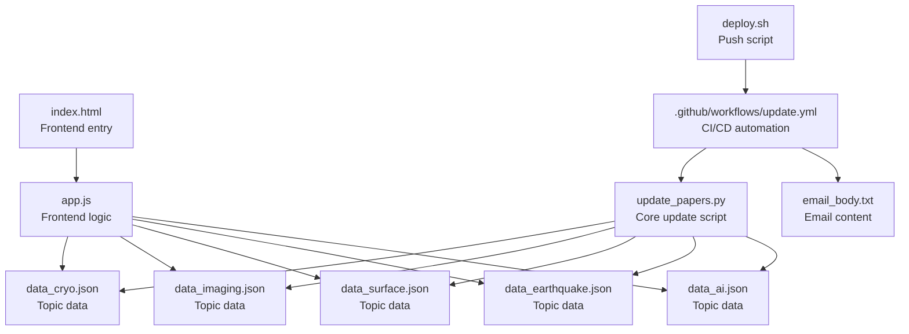

# Getting Started

<cite>
**Referenced Files in This Document**
- [README.md](file://README.md)
- [requirements.txt](file://requirements.txt)
- [deploy.sh](file://deploy.sh)
- [update_papers.py](file://update_papers.py)
- [test_mail.py](file://test_mail.py)
- [.github/workflows/update.yml](file://.github/workflows/update.yml)
- [backend/app.py](file://backend/app.py)
- [app.js](file://app.js)
- [index.html](file://index.html)
- [style.css](file://style.css)
- [email_body.txt](file://email_body.txt)
- [new.py](file://new.py)
</cite>

## Table of Contents
1. [Introduction](#introduction)
2. [Project Structure](#project-structure)
3. [Prerequisites](#prerequisites)
4. [Installation](#installation)
5. [Initial Configuration](#initial-configuration)
6. [GitHub Actions Secrets](#github-actions-secrets)
7. [Local Development Setup](#local-development-setup)
8. [Manual Execution](#manual-execution)
9. [Deployment](#deployment)
10. [Verification](#verification)
11. [Troubleshooting Guide](#troubleshooting-guide)
12. [Quick Reference](#quick-reference)

## Introduction
This guide helps you set up the paper_weekly project locally and on GitHub Actions, configure email notifications, and run the weekly paper update workflow. It covers prerequisites, installation, configuration, local development, manual execution, deployment, verification, and troubleshooting.

## Project Structure
The repository includes:
- Core update script for fetching, translating, and saving papers
- Frontend HTML/CSS/JS for displaying papers
- Backend service (Flask) for API and optional local development server
- GitHub Actions workflow for automated updates and email notifications
- Deployment script for pushing changes to GitHub
- Email template and testing utilities

**Diagram sources**
- [update_papers.py:126-149](file://update_papers.py#L126-L149)
- [index.html:1-50](file://index.html#L1-L50)
- [app.js:4-11](file://app.js#L4-L11)
- [.github/workflows/update.yml:24-47](file://.github/workflows/update.yml#L24-L47)
- [email_body.txt:1-74](file://email_body.txt#L1-L74)
- [deploy.sh:1-34](file://deploy.sh#L1-L34)

**Section sources**
- [README.md:33-36](file://README.md#L33-L36)

## Prerequisites
- Python 3.x installed locally and in CI
- Git for version control and deployment
- A GitHub account with access to the repository
- A Gmail account for sending notifications via SMTP (requires 2-step verification and an app-specific password)

**Section sources**
- [README.md:19-24](file://README.md#L19-L24)
- [requirements.txt:1-7](file://requirements.txt#L1-L7)

## Installation
1. Clone the repository to your local machine.
2. Install Python dependencies:
   - Use the provided requirements file to install packages required for the update script and optional backend service.
3. Optional: Install additional dependencies for the backend Flask app if you plan to run the local server.

Notes:
- The update script relies on several libraries for HTTP requests, RSS parsing, scheduling, translation, and JSON handling.
- The backend Flask app requires additional dependencies for database and scheduling.

**Section sources**
- [requirements.txt:1-7](file://requirements.txt#L1-L7)
- [backend/app.py:1-13](file://backend/app.py#L1-L13)

## Initial Configuration
Before running the update workflow, configure the following:
- GitHub Actions secrets: MAIL_USERNAME, MAIL_PASSWORD, MAIL_TO
- Workflow configuration: Ensure the workflow uses SMTP server address, port 465, and secure connection

Configuration details:
- Secrets are managed under Settings > Secrets and variables > Actions in your repository
- The workflow file defines the SMTP settings and uses the secrets for authentication

**Section sources**
- [README.md:19-24](file://README.md#L19-L24)
- [.github/workflows/update.yml:27-39](file://.github/workflows/update.yml#L27-L39)

## GitHub Actions Secrets
Set the following secrets in your GitHub repository:
- MAIL_USERNAME: Your Gmail address
- MAIL_PASSWORD: A 16-character app-specific password (no spaces)
- MAIL_TO: Recipient email address

Workflow configuration:
- The workflow uses SMTP server address, port 465, and secure TLS connection
- The email body is loaded from a text file and attached as a PDF

Troubleshooting:
- If you see a login failure, verify two-step verification is enabled and the app password is correct
- Ensure the YAML configuration matches the required SMTP settings

**Section sources**
- [README.md:26-31](file://README.md#L26-L31)
- [.github/workflows/update.yml:27-39](file://.github/workflows/update.yml#L27-L39)

## Local Development Setup
Optionally run the backend Flask server locally:
- Initialize the database schema
- Start the Flask app with a background scheduler for periodic updates
- Access the frontend at the root route

Key points:
- The backend initializes a SQLite database and exposes endpoints for searching and retrieving papers
- A scheduler periodically updates papers according to a weekly interval

**Section sources**
- [backend/app.py:17-27](file://backend/app.py#L17-L27)
- [backend/app.py:225-236](file://backend/app.py#L225-L236)

## Manual Execution
Run the update script locally to generate topic data files:
- The script fetches papers from Crossref and arXiv
- Translates abstracts and writes JSON files per topic
- Generates a last update timestamp and topic metadata

Expected behavior:
- New JSON files are created for each topic
- The frontend loads these files to display papers

**Section sources**
- [update_papers.py:126-149](file://update_papers.py#L126-L149)

## Deployment
Use the provided deployment script to push changes to GitHub:
- The script prompts for a commit message if none is provided
- It stages changes, commits (if any), rebases with remote changes, and pushes to origin/main
- Provides success or failure messages

Usage:
- Run the script after generating or updating data files
- Ensure your working directory contains the changes you want to deploy

**Section sources**
- [deploy.sh:1-34](file://deploy.sh#L1-L34)

## Verification
After running the workflow or script, verify:
- Data files exist for each topic (e.g., data_cryo.json, data_imaging.json, data_surface.json, data_earthquake.json, data_ai.json)
- The frontend loads and displays papers for each topic
- The email notification was sent with the configured recipient

Frontend verification:
- Open index.html in a browser
- Switch topics using the navigation buttons
- Confirm data loading and modal details

Email verification:
- Check the configured recipient inbox for the notification
- Ensure the email body matches the expected content

**Section sources**
- [index.html:16-23](file://index.html#L16-L23)
- [app.js:42-71](file://app.js#L42-L71)
- [.github/workflows/update.yml:27-39](file://.github/workflows/update.yml#L27-L39)

## Troubleshooting Guide
Common issues and resolutions:
- Email login failures:
  - Ensure two-step verification is enabled on the Gmail account
  - Use a 16-character app-specific password without spaces
  - Verify the workflow SMTP settings match the required configuration
- Network timeouts or rate limits:
  - The update script sets timeouts for external APIs; retry later if errors occur
- Missing data files:
  - Run the update script locally to generate JSON files
  - Confirm the frontend expects files with the correct names
- Deployment conflicts:
  - The deployment script performs a rebase; resolve any merge conflicts locally before pushing again

**Section sources**
- [README.md:26-31](file://README.md#L26-L31)
- [update_papers.py:76-102](file://update_papers.py#L76-L102)
- [app.js:42-71](file://app.js#L42-L71)
- [deploy.sh:20-26](file://deploy.sh#L20-L26)

## Quick Reference
- Required secrets: MAIL_USERNAME, MAIL_PASSWORD, MAIL_TO
- Workflow triggers: Scheduled (weekly) and manual dispatch
- Frontend topics: Cryoseismology, DAS, Surface Wave, Imaging, Earthquake, AI
- Data files: data_cryo.json, data_imaging.json, data_surface.json, data_earthquake.json, data_ai.json
- Deployment command: ./deploy.sh (with optional commit message)
- Email content source: email_body.txt

**Section sources**
- [README.md:14-17](file://README.md#L14-L17)
- [README.md:19-24](file://README.md#L19-L24)
- [index.html:16-23](file://index.html#L16-L23)
- [email_body.txt:1-74](file://email_body.txt#L1-L74)
- [deploy.sh:1-34](file://deploy.sh#L1-L34)