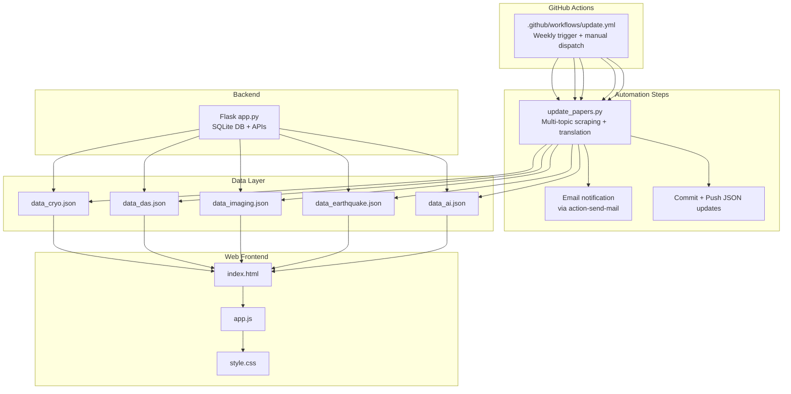
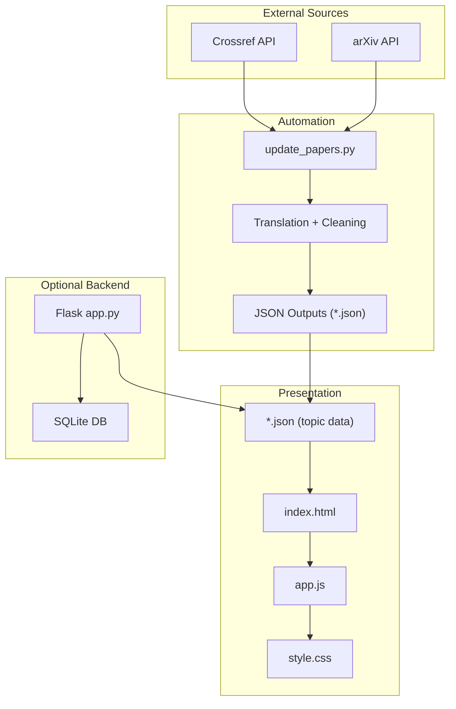
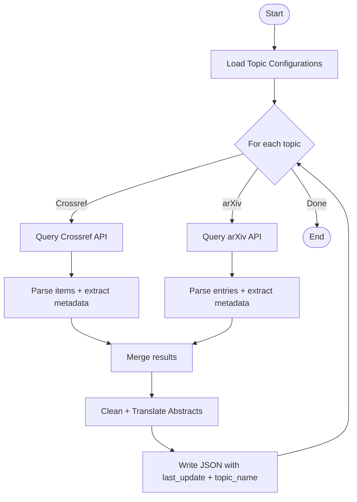
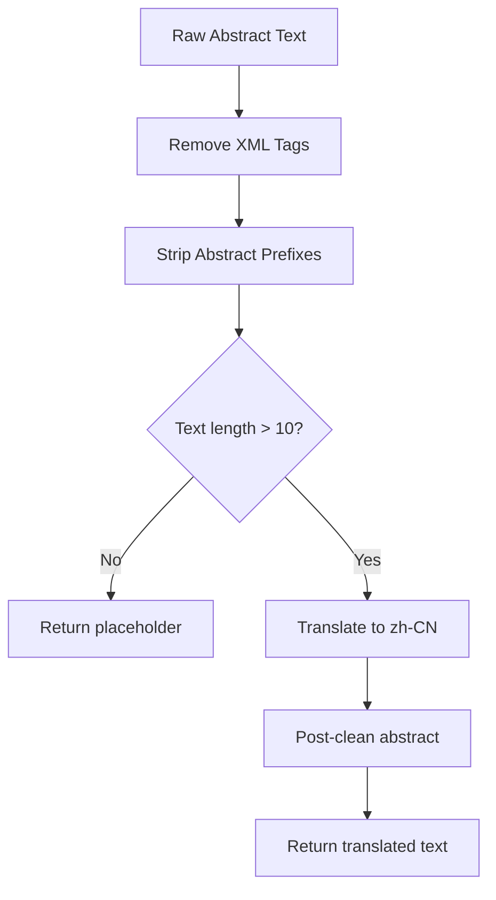
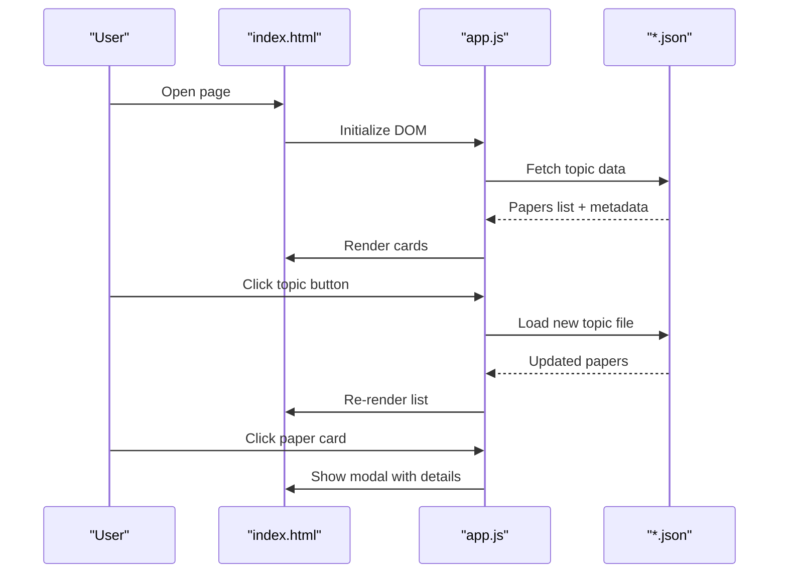
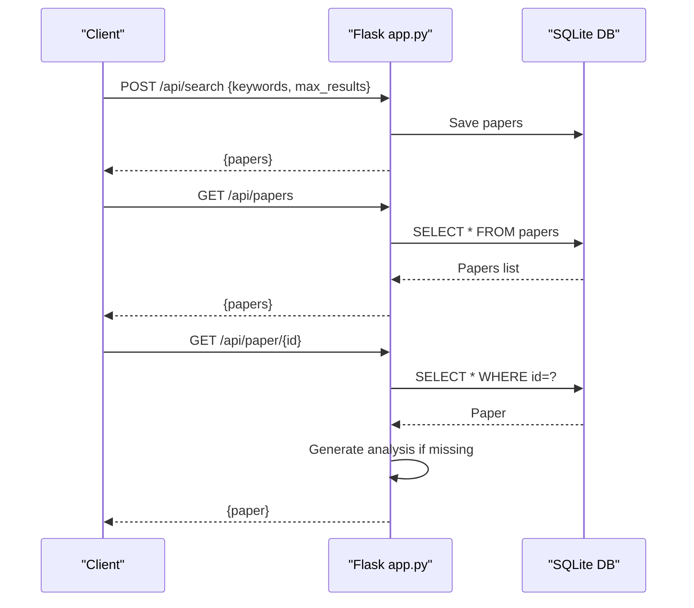
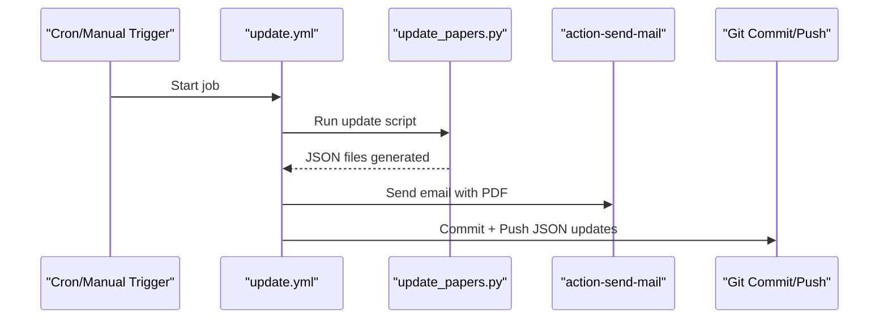
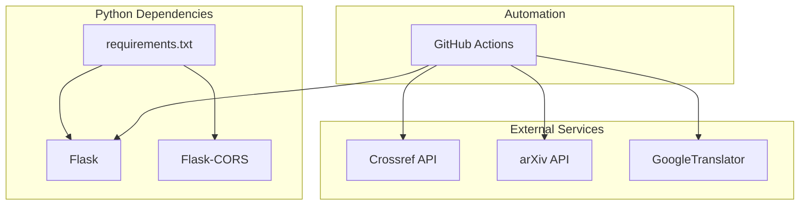

# Project Overview

<cite>
**Referenced Files in This Document**
- [README.md](file://README.md)
- [backend/app.py](file://backend/app.py)
- [app.js](file://app.js)
- [index.html](file://index.html)
- [update_papers.py](file://update_papers.py)
- [.github/workflows/update.yml](file://.github/workflows/update.yml)
- [requirements.txt](file://requirements.txt)
- [data_cryo.json](file://data_cryo.json)
- [data_das.json](file://data_das.json)
- [data_imaging.json](file://data_imaging.json)
- [style.css](file://style.css)
- [email_body.txt](file://email_body.txt)
</cite>

## Table of Contents
1. [Introduction](#introduction)
2. [Project Structure](#project-structure)
3. [Core Components](#core-components)
4. [Architecture Overview](#architecture-overview)
5. [Detailed Component Analysis](#detailed-component-analysis)
6. [Dependency Analysis](#dependency-analysis)
7. [Performance Considerations](#performance-considerations)
8. [Troubleshooting Guide](#troubleshooting-guide)
9. [Conclusion](#conclusion)

## Introduction
paper_weekly is an automated seismology research paper tracking and presentation system designed to streamline the discovery, aggregation, and consumption of cutting-edge research across multiple seismology domains. It continuously monitors preprint servers and scholarly journals, extracts relevant papers, translates abstracts into Chinese, and presents them through a responsive web interface. The system is integrated with GitHub Actions to run weekly updates, ensuring that researchers have timely access to the latest findings in glacial earthquakes, distributed acoustic sensing (DAS), surface waves, seismic imaging, earthquake research, and AI-enhanced geoscience.

Target audience:
- Seismologists actively following specialized topics
- Researchers compiling literature reviews and staying current
- Students and early-career scientists seeking curated summaries
- Academic teams integrating weekly insights into institutional blogs or newsletters

Key benefits:
- Automated weekly curation reduces manual effort in tracking diverse seismology topics
- Integrated translation improves accessibility for Chinese-speaking audiences
- Web-based presentation enables quick scanning and deep dives into selected papers
- Seamless GitHub Actions integration ensures consistent, hands-free operation

## Project Structure
The repository is organized into a clear separation of concerns:
- Backend: Python Flask service for API endpoints and local development
- Frontend: Static HTML/CSS/JavaScript for topic-based browsing and modal details
- Data: JSON files representing weekly topic collections
- Automation: GitHub Actions workflow orchestrating periodic updates and notifications
- Supporting files: Requirements, deployment scripts, and templates

**Diagram sources**
- [.github/workflows/update.yml:1-48](file://.github/workflows/update.yml#L1-L48)
- [update_papers.py:1-149](file://update_papers.py#L1-L149)
- [data_cryo.json:1-171](file://data_cryo.json#L1-L171)
- [data_das.json:1-171](file://data_das.json#L1-L171)
- [data_imaging.json:1-171](file://data_imaging.json#L1-L171)
- [index.html:1-50](file://index.html#L1-L50)
- [app.js:1-148](file://app.js#L1-L148)
- [style.css:1-179](file://style.css#L1-L179)
- [backend/app.py:1-236](file://backend/app.py#L1-L236)

**Section sources**
- [README.md:33-40](file://README.md#L33-L40)
- [.github/workflows/update.yml:1-48](file://.github/workflows/update.yml#L1-L48)
- [update_papers.py:14-45](file://update_papers.py#L14-L45)

## Core Components
- Multi-topic paper collection engine
  - Scans Crossref journals and arXiv for six specialized topics: cryoseismology, DAS, surface waves, seismic imaging, earthquake research, and AI
  - Aggregates metadata, authors, affiliations, publication year, and translated abstracts
  - Outputs topic-specific JSON files with last update timestamps and topic names

- Translation pipeline
  - Uses a translation library to convert English abstracts into simplified Chinese
  - Applies cleaning routines to remove extraneous markup and normalize translations

- Web presentation interface
  - Responsive HTML/CSS/JS interface with topic navigation and modal-based paper details
  - Loads pre-generated JSON data files for fast rendering
  - Provides a clean, mobile-friendly reading experience

- Backend API (optional)
  - Flask-based service exposing endpoints for search, listing, and paper detail retrieval
  - SQLite-backed persistence for paper metadata and analysis fields
  - Scheduled job support for periodic updates

- GitHub Actions automation
  - Weekly cron trigger and manual dispatch capability
  - Installs dependencies, runs the update script, sends email notifications, and pushes updated JSON files

**Section sources**
- [update_papers.py:14-45](file://update_papers.py#L14-L45)
- [update_papers.py:72-124](file://update_papers.py#L72-L124)
- [index.html:16-23](file://index.html#L16-L23)
- [app.js:4-11](file://app.js#L4-L11)
- [backend/app.py:29-49](file://backend/app.py#L29-L49)
- [backend/app.py:142-173](file://backend/app.py#L142-L173)
- [.github/workflows/update.yml:14-25](file://.github/workflows/update.yml#L14-L25)

## Architecture Overview
The system follows a data-first architecture:
- GitHub Actions orchestrates a weekly pipeline that generates topic JSON files
- The frontend consumes these JSON files directly for instant loading
- The backend complements the frontend with API endpoints and database persistence
- Translation and data cleaning occur during the automation step

**Diagram sources**
- [update_papers.py:72-124](file://update_papers.py#L72-L124)
- [index.html:1-50](file://index.html#L1-50)
- [app.js:1-148](file://app.js#L1-L148)
- [style.css:1-179](file://style.css#L1-L179)
- [backend/app.py:175-218](file://backend/app.py#L175-L218)

## Detailed Component Analysis

### Multi-Topic Paper Collection Engine
The engine defines six specialized topics, each with curated keywords and target output files. It performs two primary data collection steps:
- Crossref journal articles filtered by a set of high-impact journals
- arXiv preprints using combined search terms

After collecting entries, it cleans abstracts, translates them, and writes structured JSON with metadata and translated abstracts. The resulting files include a topic name, last update timestamp, and a sorted list of papers.

**Diagram sources**
- [update_papers.py:14-45](file://update_papers.py#L14-L45)
- [update_papers.py:72-124](file://update_papers.py#L72-L124)
- [update_papers.py:126-148](file://update_papers.py#L126-L148)

**Section sources**
- [update_papers.py:14-45](file://update_papers.py#L14-L45)
- [update_papers.py:72-124](file://update_papers.py#L72-L124)
- [update_papers.py:126-148](file://update_papers.py#L126-L148)

### Translation Pipeline
The translation pipeline applies cleaning to raw abstracts before translation and normalizes the results. It handles truncation limits and error conditions gracefully, ensuring robustness even when translation services are unavailable.

**Diagram sources**
- [update_papers.py:54-71](file://update_papers.py#L54-L71)
- [update_papers.py:63-70](file://update_papers.py#L63-L70)

**Section sources**
- [update_papers.py:54-71](file://update_papers.py#L54-L71)
- [update_papers.py:63-70](file://update_papers.py#L63-L70)

### Web Presentation Interface
The frontend provides a topic-switching interface with a loading state and modal-based paper details. It loads topic-specific JSON files and renders cards with author, affiliation, and a preview of the translated abstract. The design emphasizes readability and responsiveness.

**Diagram sources**
- [index.html:1-50](file://index.html#L1-L50)
- [app.js:42-92](file://app.js#L42-L92)
- [app.js:94-127](file://app.js#L94-L127)

**Section sources**
- [index.html:16-23](file://index.html#L16-L23)
- [app.js:4-11](file://app.js#L4-L11)
- [app.js:42-92](file://app.js#L42-L92)
- [app.js:94-127](file://app.js#L94-L127)
- [style.css:64-104](file://style.css#L64-L104)

### Backend API (Optional)
The Flask backend exposes endpoints for searching, listing, and retrieving paper details. It persists data in an SQLite database and can generate analyses on demand, including translated abstracts and metadata-derived summaries.

**Diagram sources**
- [backend/app.py:179-188](file://backend/app.py#L179-L188)
- [backend/app.py:190-193](file://backend/app.py#L190-L193)
- [backend/app.py:195-206](file://backend/app.py#L195-L206)
- [backend/app.py:208-217](file://backend/app.py#L208-L217)

**Section sources**
- [backend/app.py:179-188](file://backend/app.py#L179-L188)
- [backend/app.py:190-193](file://backend/app.py#L190-L193)
- [backend/app.py:195-206](file://backend/app.py#L195-L206)
- [backend/app.py:208-217](file://backend/app.py#L208-L217)

### GitHub Actions Automation
The workflow automates the entire pipeline: sets up Python, installs dependencies, runs the update script, sends an email notification with a PDF attachment, and commits/pushes updated JSON files.

**Diagram sources**
- [.github/workflows/update.yml:1-48](file://.github/workflows/update.yml#L1-L48)
- [email_body.txt:1-74](file://email_body.txt#L1-L74)

**Section sources**
- [.github/workflows/update.yml:1-48](file://.github/workflows/update.yml#L1-L48)
- [email_body.txt:1-74](file://email_body.txt#L1-L74)

## Dependency Analysis
The system relies on a small set of external libraries and services:
- Python runtime and packages for HTTP, parsing, scheduling, and translation
- External APIs for scientific article discovery and translation
- GitHub Actions for orchestration and notifications

**Diagram sources**
- [requirements.txt:1-7](file://requirements.txt#L1-L7)
- [.github/workflows/update.yml:20-25](file://.github/workflows/update.yml#L20-L25)

**Section sources**
- [requirements.txt:1-7](file://requirements.txt#L1-L7)
- [.github/workflows/update.yml:20-25](file://.github/workflows/update.yml#L20-L25)

## Performance Considerations
- Data generation is batched weekly, minimizing repeated network calls and reducing latency for end-users
- Frontend loads pre-generated JSON files, avoiding server-side rendering overhead
- Translation is performed once per update cycle; subsequent reads serve cached translations
- The Flask backend can be scaled independently if API traffic increases

## Troubleshooting Guide
Common issues and resolutions:
- Email delivery failures (authentication errors)
  - Ensure two-factor authentication is enabled and an application-specific password is used
  - Verify the workflow configuration specifies the correct SMTP port and secure flag
  - Confirm repository secrets are configured with the correct credentials

- Missing or empty topic data
  - Run the update script locally to regenerate JSON files
  - Check network connectivity to external APIs and rate limits
  - Validate that topic keywords remain relevant and not overly restrictive

- Frontend not displaying data
  - Confirm JSON files are present and readable
  - Inspect browser console for JavaScript errors
  - Verify file paths match the topic mapping in the frontend

**Section sources**
- [README.md:26-31](file://README.md#L26-L31)
- [app.js:42-71](file://app.js#L42-L71)

## Conclusion
paper_weekly provides a practical, automated solution for tracking and presenting seismology research across multiple specialized domains. By combining reliable data collection, translation, and a responsive web interface, it fits naturally into academic workflows—allowing researchers to stay current with minimal effort. The GitHub Actions integration ensures consistent, hands-free operation, while the optional backend offers extensibility for advanced use cases. Together, these components deliver a streamlined experience for seismologists, researchers, and students who need timely access to curated, translated insights.