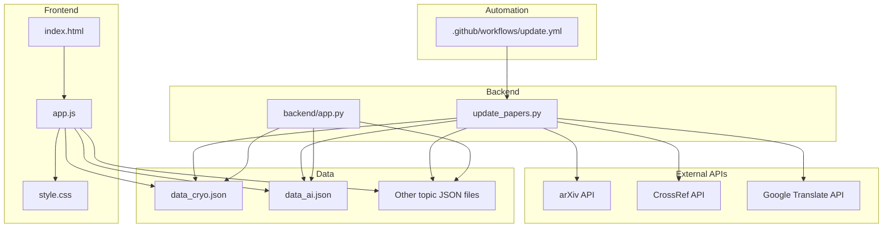
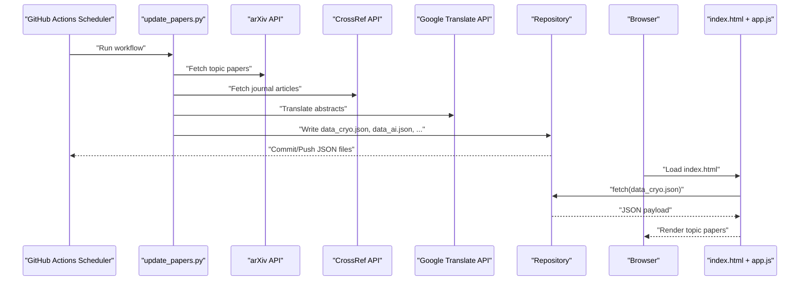
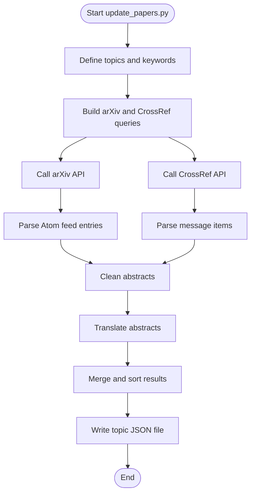
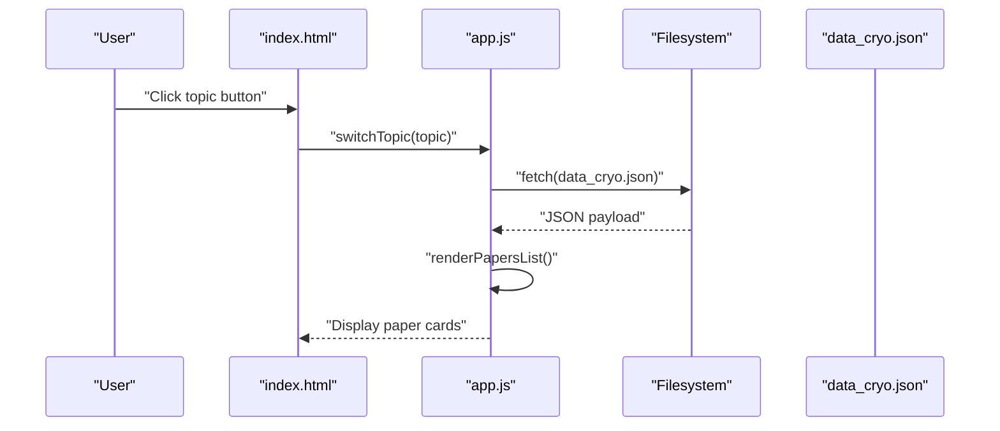
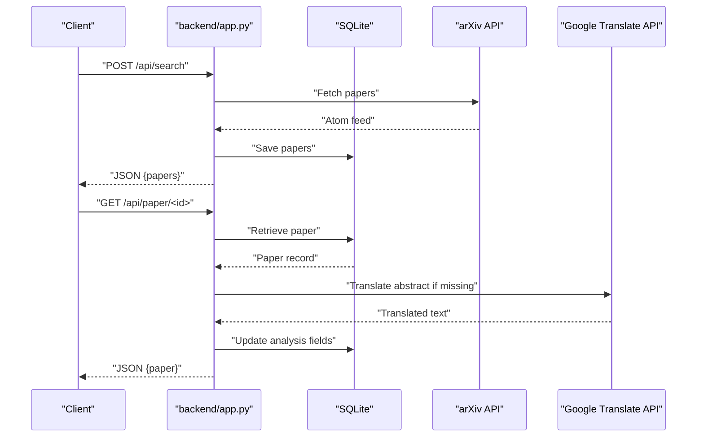
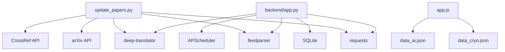
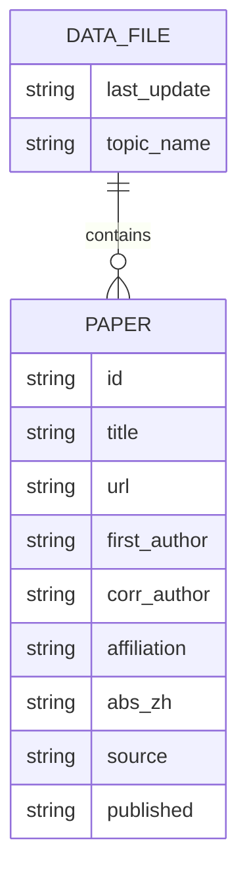

# System Architecture

<cite>
**Referenced Files in This Document**
- [README.md](file://README.md)
- [update_papers.py](file://update_papers.py)
- [.github/workflows/update.yml](file://.github/workflows/update.yml)
- [index.html](file://index.html)
- [app.js](file://app.js)
- [style.css](file://style.css)
- [data_cryo.json](file://data_cryo.json)
- [data_ai.json](file://data_ai.json)
- [backend/app.py](file://backend/app.py)
- [requirements.txt](file://requirements.txt)
- [deploy.sh](file://deploy.sh)
- [email_body.txt](file://email_body.txt)
</cite>

## Table of Contents
1. [Introduction](#introduction)
2. [Project Structure](#project-structure)
3. [Core Components](#core-components)
4. [Architecture Overview](#architecture-overview)
5. [Detailed Component Analysis](#detailed-component-analysis)
6. [Dependency Analysis](#dependency-analysis)
7. [Performance Considerations](#performance-considerations)
8. [Troubleshooting Guide](#troubleshooting-guide)
9. [Conclusion](#conclusion)
10. [Appendices](#appendices)

## Introduction
This document describes the architecture of the paper_weekly system, a static web application that aggregates, translates, and presents recent research papers in seismology across six specialized topics. The system integrates:
- A Python backend script that collects data from arXiv and CrossRef, translates abstracts, and writes JSON files.
- GitHub Actions automation that schedules weekly updates and emails notifications.
- A static web frontend that loads topic-specific JSON datasets and renders them for users.
- External APIs (arXiv, CrossRef, Google Translate) for data retrieval and translation.

The architecture emphasizes separation of concerns:
- Collection and processing: Python scripts and GitHub Actions orchestrate data fetching, cleaning, translation, and JSON generation.
- Presentation: Static HTML/CSS/JS serve the UI and load pre-generated JSON files.
- Persistence: JSON files act as the primary data store for each topic.

## Project Structure
The repository organizes code and assets into distinct layers:
- Automation: GitHub Actions workflow orchestrates periodic execution and notifications.
- Backend: Python scripts handle data collection and JSON generation.
- Frontend: Static HTML/CSS/JS for rendering and user interaction.
- Data: Topic-specific JSON files generated by the backend.
- Utilities: Deployment script and configuration files.

**Diagram sources**
- [.github/workflows/update.yml:1-48](file://.github/workflows/update.yml#L1-L48)
- [update_papers.py:1-149](file://update_papers.py#L1-L149)
- [backend/app.py:1-236](file://backend/app.py#L1-L236)
- [index.html:1-50](file://index.html#L1-L50)
- [app.js:1-148](file://app.js#L1-L148)
- [style.css:1-179](file://style.css#L1-L179)
- [data_cryo.json:1-171](file://data_cryo.json#L1-L171)
- [data_ai.json:1-5](file://data_ai.json#L1-L5)

**Section sources**
- [README.md:14-36](file://README.md#L14-L36)
- [.github/workflows/update.yml:1-48](file://.github/workflows/update.yml#L1-L48)
- [update_papers.py:14-45](file://update_papers.py#L14-L45)
- [index.html:16-23](file://index.html#L16-L23)
- [app.js:4-11](file://app.js#L4-L11)

## Core Components
- GitHub Actions Workflow: Schedules weekly execution, installs dependencies, runs the update script, sends email notifications, and commits/pushes JSON files.
- Python Update Script: Defines topic configurations, searches arXiv and CrossRef, cleans and translates abstracts, and writes JSON files.
- Static Web Frontend: Loads topic JSON files, renders lists, and displays paper details in a modal.
- Data Files: Topic-specific JSON files containing last update timestamp, topic name, and paper entries.
- Backend API (optional Flask service): Provides endpoints to search, list, and analyze papers; persists to SQLite; includes a scheduler for periodic updates.

Responsibilities:
- Automation: Orchestration and scheduling of data collection and notifications.
- Collection/Processing: Fetching, filtering, cleaning, translating, and persisting data to JSON.
- Presentation: Rendering UI and loading JSON data for display.

**Section sources**
- [.github/workflows/update.yml:8-48](file://.github/workflows/update.yml#L8-L48)
- [update_papers.py:126-149](file://update_papers.py#L126-L149)
- [index.html:16-44](file://index.html#L16-L44)
- [app.js:42-71](file://app.js#L42-L71)
- [backend/app.py:175-218](file://backend/app.py#L175-L218)

## Architecture Overview
The system follows a static site architecture with pre-generated data:
- Data collection occurs off-line via the Python script triggered by GitHub Actions.
- JSON files are committed to the repository and served statically by the browser.
- The frontend asynchronously loads the appropriate JSON file for the selected topic and renders the UI.

**Diagram sources**
- [.github/workflows/update.yml:4-25](file://.github/workflows/update.yml#L4-L25)
- [update_papers.py:104-124](file://update_papers.py#L104-L124)
- [update_papers.py:72-102](file://update_papers.py#L72-L102)
- [update_papers.py:141-146](file://update_papers.py#L141-L146)
- [index.html:16-44](file://index.html#L16-L44)
- [app.js:42-71](file://app.js#L42-L71)

## Detailed Component Analysis

### GitHub Actions Automation
- Schedule: Weekly at midnight UTC (Sunday) and manual trigger via workflow_dispatch.
- Steps:
  - Checkout code.
  - Set up Python 3.9.
  - Install dependencies (requests, feedparser, deep-translator, fpdf).
  - Run update script.
  - Send email notification with attachments.
  - Commit and push JSON files.

Observation pattern:
- The workflow acts as a scheduler that triggers the update script on a fixed cadence, enabling automatic updates without manual intervention.

**Section sources**
- [.github/workflows/update.yml:3-6](file://.github/workflows/update.yml#L3-L6)
- [.github/workflows/update.yml:20-25](file://.github/workflows/update.yml#L20-L25)
- [.github/workflows/update.yml:27-48](file://.github/workflows/update.yml#L27-L48)

### Python Update Script (Collection and Processing)
- Topics: Six specialized topics with keyword sets and corresponding JSON filenames.
- Data sources:
  - arXiv: Uses feedparser to parse Atom feeds and extract metadata and summaries.
  - CrossRef: Queries works API filtered by journals and type, extracts authorship and abstracts.
- Cleaning and translation:
  - Removes XML tags and standard prefixes from abstracts.
  - Translates abstracts using Google Translate API with length limits.
- Output:
  - Writes topic-specific JSON files with last_update timestamp, topic_name, and papers array.

**Diagram sources**
- [update_papers.py:14-45](file://update_papers.py#L14-L45)
- [update_papers.py:104-124](file://update_papers.py#L104-L124)
- [update_papers.py:72-102](file://update_papers.py#L72-L102)
- [update_papers.py:54-71](file://update_papers.py#L54-L71)
- [update_papers.py:141-146](file://update_papers.py#L141-L146)

**Section sources**
- [update_papers.py:126-149](file://update_papers.py#L126-L149)
- [update_papers.py:14-45](file://update_papers.py#L14-L45)
- [update_papers.py:54-71](file://update_papers.py#L54-L71)
- [update_papers.py:72-102](file://update_papers.py#L72-L102)
- [update_papers.py:104-124](file://update_papers.py#L104-L124)

### Static Web Frontend (Presentation)
- HTML: Provides topic navigation buttons and containers for loading indicators and paper cards.
- JavaScript:
  - Maps topic keys to JSON filenames.
  - Switches topics and loads JSON asynchronously.
  - Renders paper cards with title, author, affiliation, and abstract preview.
  - Opens a modal with detailed information and links to original sources.
- CSS: Responsive styles for cards, modals, and loading animations.

Asynchronous data loading:
- The frontend uses fetch to load the appropriate JSON file for the selected topic and updates the UI dynamically.

**Diagram sources**
- [index.html:16-44](file://index.html#L16-L44)
- [app.js:27-71](file://app.js#L27-L71)
- [app.js:73-92](file://app.js#L73-L92)
- [data_cryo.json:1-171](file://data_cryo.json#L1-171)

**Section sources**
- [index.html:16-44](file://index.html#L16-L44)
- [app.js:1-148](file://app.js#L1-L148)
- [style.css:1-179](file://style.css#L1-L179)

### Backend API (Optional Flask Service)
- Purpose: Alternative backend to the static approach, providing endpoints for search, listing, and analysis.
- Features:
  - SQLite database for persistent storage of papers.
  - arXiv search endpoint and database persistence.
  - Paper detail retrieval and on-demand analysis with translation.
  - Background scheduler for periodic updates.

**Diagram sources**
- [backend/app.py:179-218](file://backend/app.py#L179-L218)
- [backend/app.py:29-49](file://backend/app.py#L29-L49)
- [backend/app.py:142-147](file://backend/app.py#L142-L147)

**Section sources**
- [backend/app.py:175-218](file://backend/app.py#L175-L218)
- [backend/app.py:17-27](file://backend/app.py#L17-L27)
- [backend/app.py:225-236](file://backend/app.py#L225-L236)

## Dependency Analysis
- External dependencies:
  - requests, feedparser, deep-translator for API calls, parsing, and translation.
  - APScheduler for periodic tasks in the Flask backend.
- Internal dependencies:
  - update_papers.py depends on arXiv and CrossRef APIs and Google Translate.
  - app.js depends on topic-to-file mapping and JSON files.
  - backend/app.py depends on SQLite and provides HTTP endpoints.

**Diagram sources**
- [update_papers.py:1-11](file://update_papers.py#L1-L11)
- [app.js:4-11](file://app.js#L4-L11)
- [backend/app.py:1-11](file://backend/app.py#L1-L11)
- [requirements.txt:1-7](file://requirements.txt#L1-L7)

**Section sources**
- [requirements.txt:1-7](file://requirements.txt#L1-L7)
- [update_papers.py:1-11](file://update_papers.py#L1-L11)
- [backend/app.py:1-11](file://backend/app.py#L1-L11)

## Performance Considerations
- Network latency: API calls to arXiv, CrossRef, and Google Translate introduce latency; timeouts are configured in the scripts.
- Translation limits: Abstracts are truncated before translation to manage API quotas and response sizes.
- Static serving: Serving JSON files directly avoids server-side processing overhead.
- Pagination and sorting: Results are sorted by publication date; consider pagination for large result sets if scaling.

[No sources needed since this section provides general guidance]

## Troubleshooting Guide
- GitHub Actions email failures:
  - Ensure two-factor authentication is enabled and an application-specific password is used.
  - Verify SMTP settings and secure connection parameters in the workflow.
- Missing or empty JSON files:
  - Confirm the update script ran successfully and JSON files were committed and pushed.
  - Check that the frontend attempts to load the correct topic file.
- Translation errors:
  - Validate Google Translate API availability and rate limits.
  - Review abstract cleaning logic to ensure non-empty text is passed to the translator.

**Section sources**
- [README.md:26-31](file://README.md#L26-L31)
- [.github/workflows/update.yml:27-39](file://.github/workflows/update.yml#L27-L39)
- [app.js:42-71](file://app.js#L42-L71)
- [update_papers.py:63-71](file://update_papers.py#L63-L71)

## Conclusion
The paper_weekly system employs a clean separation of concerns:
- Automation (GitHub Actions) ensures regular updates.
- Collection and processing (Python scripts) fetch, clean, translate, and persist data to JSON.
- Presentation (static frontend) renders topic-specific data efficiently.
- Optional backend (Flask) offers richer API capabilities and persistence.

This architecture balances simplicity, scalability, and maintainability while leveraging external APIs for data enrichment.

[No sources needed since this section summarizes without analyzing specific files]

## Appendices

### Data Model (JSON Schema)
Each topic JSON file follows a consistent structure:
- last_update: Timestamp indicating the date range and time of the update.
- topic_name: Human-readable name of the topic.
- papers: Array of paper objects with fields such as id, title, url, first_author, corr_author, affiliation, abs_zh, source, published.

**Diagram sources**
- [data_cryo.json:1-171](file://data_cryo.json#L1-L171)
- [data_ai.json:1-5](file://data_ai.json#L1-L5)

### Deployment and Maintenance
- Automated deployment via GitHub Actions workflow.
- Local deployment script for quick synchronization to remote repositories.

**Section sources**
- [.github/workflows/update.yml:41-48](file://.github/workflows/update.yml#L41-L48)
- [deploy.sh:1-34](file://deploy.sh#L1-L34)