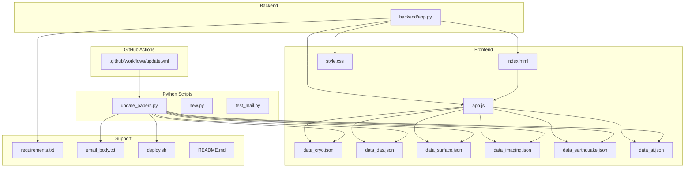
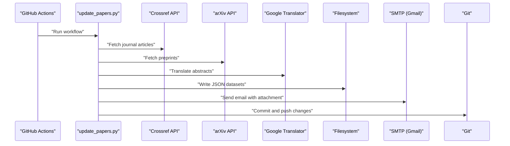
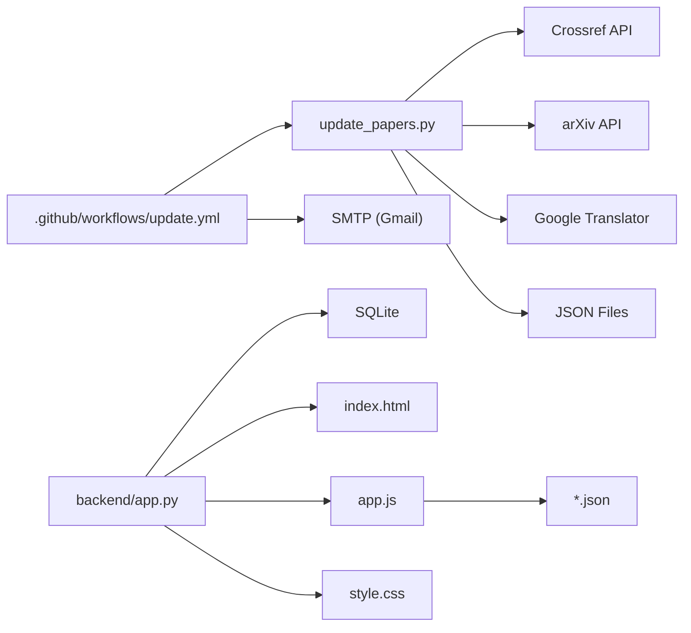
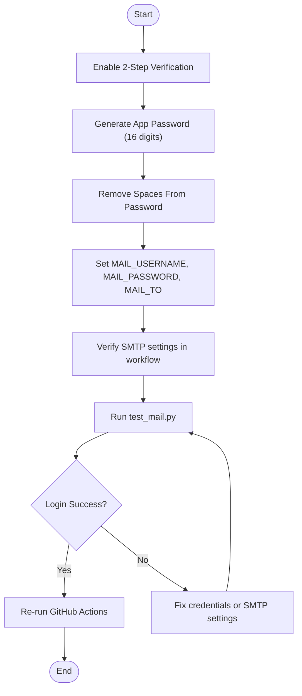

# Troubleshooting & FAQ

<cite>
**Referenced Files in This Document**
- [README.md](file://README.md)
- [.github/workflows/update.yml](file://.github/workflows/update.yml)
- [backend/app.py](file://backend/app.py)
- [app.js](file://app.js)
- [update_papers.py](file://update_papers.py)
- [new.py](file://new.py)
- [test_mail.py](file://test_mail.py)
- [requirements.txt](file://requirements.txt)
- [index.html](file://index.html)
- [style.css](file://style.css)
- [email_body.txt](file://email_body.txt)
- [deploy.sh](file://deploy.sh)
</cite>

## Table of Contents
1. [Introduction](#introduction)
2. [Project Structure](#project-structure)
3. [Core Components](#core-components)
4. [Architecture Overview](#architecture-overview)
5. [Detailed Component Analysis](#detailed-component-analysis)
6. [Dependency Analysis](#dependency-analysis)
7. [Performance Considerations](#performance-considerations)
8. [Troubleshooting Guide](#troubleshooting-guide)
9. [Conclusion](#conclusion)
10. [Appendices](#appendices)

## Introduction
This document provides comprehensive troubleshooting guidance for the paper_weekly system. It focuses on diagnosing and resolving common issues such as GitHub Actions failures, email authentication problems (notably “535 Login fail”), API rate limits, network connectivity issues, frontend loading problems, and data processing bottlenecks. It also includes debugging techniques for the Python scripts, frontend rendering, and backend API, along with performance optimization tips, timeout and memory considerations, and integration pitfalls with external services.

## Project Structure
The system comprises:
- GitHub Actions workflow for automated weekly updates and email notifications
- Python scripts for fetching, filtering, translating, and saving paper data
- Frontend static site (HTML/CSS/JS) that loads pre-generated JSON datasets
- Backend Flask API for local development and optional analytics
- Deployment automation script for pushing updates to GitHub

**Diagram sources**
- [.github/workflows/update.yml:1-48](file://.github/workflows/update.yml#L1-L48)
- [update_papers.py:1-149](file://update_papers.py#L1-L149)
- [new.py:1-181](file://new.py#L1-L181)
- [test_mail.py:1-37](file://test_mail.py#L1-L37)
- [index.html:1-50](file://index.html#L1-L50)
- [app.js:1-148](file://app.js#L1-L148)
- [style.css:1-179](file://style.css#L1-L179)
- [backend/app.py:1-236](file://backend/app.py#L1-L236)
- [requirements.txt:1-7](file://requirements.txt#L1-L7)
- [email_body.txt:1-74](file://email_body.txt#L1-L74)
- [deploy.sh:1-34](file://deploy.sh#L1-L34)
- [README.md:1-40](file://README.md#L1-L40)

**Section sources**
- [.github/workflows/update.yml:1-48](file://.github/workflows/update.yml#L1-L48)
- [update_papers.py:1-149](file://update_papers.py#L1-L149)
- [index.html:1-50](file://index.html#L1-L50)
- [app.js:1-148](file://app.js#L1-L148)
- [backend/app.py:1-236](file://backend/app.py#L1-L236)
- [requirements.txt:1-7](file://requirements.txt#L1-L7)
- [email_body.txt:1-74](file://email_body.txt#L1-L74)
- [deploy.sh:1-34](file://deploy.sh#L1-L34)
- [README.md:1-40](file://README.md#L1-L40)

## Core Components
- GitHub Actions workflow orchestrates Python script execution, email sending, and Git commit/push.
- Python scripts fetch from Crossref and arXiv, translate abstracts, and write JSON datasets consumed by the frontend.
- Frontend loads topic-specific JSON files and renders a responsive UI.
- Backend Flask API exposes endpoints for search, listing, and paper detail retrieval; it also schedules periodic updates locally.
- Email testing script validates SMTP credentials and connectivity.

Key integration points:
- External APIs: Crossref, arXiv, Google Translator, SMTP (Gmail)
- Local storage: JSON datasets and SQLite database (backend)
- CI/CD: GitHub Actions secrets and job steps

**Section sources**
- [.github/workflows/update.yml:1-48](file://.github/workflows/update.yml#L1-L48)
- [update_papers.py:1-149](file://update_papers.py#L1-L149)
- [new.py:1-181](file://new.py#L1-L181)
- [app.js:1-148](file://app.js#L1-L148)
- [backend/app.py:1-236](file://backend/app.py#L1-L236)
- [test_mail.py:1-37](file://test_mail.py#L1-L37)

## Architecture Overview
High-level runtime flow:
- GitHub Actions triggers weekly and on demand
- Python scripts generate JSON datasets and an email body
- Frontend serves static pages from JSON files
- Backend API supports local development and optional analytics

**Diagram sources**
- [.github/workflows/update.yml:1-48](file://.github/workflows/update.yml#L1-L48)
- [update_papers.py:1-149](file://update_papers.py#L1-L149)
- [email_body.txt:1-74](file://email_body.txt#L1-L74)

## Detailed Component Analysis

### GitHub Actions Workflow
- Triggers: schedule and manual dispatch
- Steps: checkout, setup Python, install dependencies, run update script, send email notification, commit and push
- Secrets: MAIL_USERNAME, MAIL_PASSWORD, MAIL_TO
- SMTP configuration: server address, port, secure flag

Common failure points:
- Missing or incorrect secrets
- Network timeouts to external APIs
- Rate limiting by external services
- Email server misconfiguration

**Section sources**
- [.github/workflows/update.yml:1-48](file://.github/workflows/update.yml#L1-L48)
- [README.md:26-31](file://README.md#L26-L31)

### Python Data Pipeline (update_papers.py)
Responsibilities:
- Define topics and keywords
- Fetch from Crossref and arXiv
- Clean and translate abstracts
- Write JSON datasets with metadata

Key behaviors:
- Uses timeouts for external requests
- Cleans abstracts and handles missing fields
- Writes per-topic JSON files

Potential issues:
- API rate limits and transient failures
- Translation service availability
- Disk I/O and file permissions

**Section sources**
- [update_papers.py:1-149](file://update_papers.py#L1-L149)

### Python Data Pipeline (new.py)
Responsibilities:
- Alternative pipeline with different topic set and translation strategy
- Author works lookup via Crossref
- Deep analysis template

**Section sources**
- [new.py:1-181](file://new.py#L1-L181)

### Frontend (index.html + app.js + style.css)
Responsibilities:
- Topic navigation and dataset loading
- Modal rendering for paper details
- Responsive UI and loading states

Common issues:
- JSON file not found or malformed
- CORS errors if served from different origins
- JavaScript exceptions during parsing

**Section sources**
- [index.html:1-50](file://index.html#L1-L50)
- [app.js:1-148](file://app.js#L1-L148)
- [style.css:1-179](file://style.css#L1-L179)

### Backend Flask API (backend/app.py)
Endpoints:
- GET /api/papers
- GET /api/paper/<id>
- POST /api/search
- POST /api/analyze/<id>
- GET /
- Scheduled job for periodic search

Database:
- SQLite table for papers with JSON fields for authors and categories

**Section sources**
- [backend/app.py:1-236](file://backend/app.py#L1-L236)

### Email Testing Script (test_mail.py)
Purpose:
- Validate SMTP credentials and connectivity
- Send a test message

**Section sources**
- [test_mail.py:1-37](file://test_mail.py#L1-L37)

## Dependency Analysis
External dependencies and integrations:
- Crossref API: journal article search and metadata
- arXiv API: preprint search
- Google Translator: abstract translation
- SMTP (Gmail): email delivery
- GitHub Actions: CI/CD orchestration
- Flask, APScheduler, feedparser, requests, deep-translator

**Diagram sources**
- [update_papers.py:1-149](file://update_papers.py#L1-L149)
- [.github/workflows/update.yml:1-48](file://.github/workflows/update.yml#L1-L48)
- [backend/app.py:1-236](file://backend/app.py#L1-L236)
- [index.html:1-50](file://index.html#L1-L50)
- [app.js:1-148](file://app.js#L1-L148)
- [style.css:1-179](file://style.css#L1-L179)

**Section sources**
- [requirements.txt:1-7](file://requirements.txt#L1-L7)
- [update_papers.py:1-149](file://update_papers.py#L1-L149)
- [.github/workflows/update.yml:1-48](file://.github/workflows/update.yml#L1-L48)
- [backend/app.py:1-236](file://backend/app.py#L1-L236)

## Performance Considerations
- API timeouts: requests to Crossref and arXiv are configured with timeouts; adjust if needed for slower networks.
- Translation latency: Google Translator calls can be slow; consider caching translated results.
- JSON generation: writing per-topic files; ensure disk I/O is not bottlenecked by filesystem or permissions.
- Frontend rendering: large JSON files can impact initial load; consider pagination or lazy loading.
- Backend scheduling: APScheduler runs periodic tasks; ensure resource limits are adequate for local dev.

[No sources needed since this section provides general guidance]

## Troubleshooting Guide

### GitHub Actions Failures
Symptoms:
- Workflow fails during “Install dependencies” or “Run update script”
- Email step fails with authentication errors

Checklist:
- Verify secrets are set in GitHub repository Settings > Secrets and variables > Actions
- Confirm YAML configuration for SMTP server address, port, and secure flag
- Review logs for network timeouts or rate limit responses
- Ensure Python dependencies are compatible with the pinned versions

**Section sources**
- [.github/workflows/update.yml:27-39](file://.github/workflows/update.yml#L27-L39)
- [README.md:26-31](file://README.md#L26-L31)

### Email Authentication Problems (“535 Login fail”)
Root causes:
- Incorrect application password
- Two-step verification disabled
- Wrong SMTP configuration in workflow

Resolution steps:
- Enable two-step verification on the sender account
- Generate a 16-digit application-specific password
- Remove spaces and ensure the password is stored in MAIL_PASSWORD
- Confirm server_port is 465 and secure is true in the workflow
- Test credentials locally using the email testing script

**Diagram sources**
- [README.md:26-31](file://README.md#L26-L31)
- [test_mail.py:1-37](file://test_mail.py#L1-L37)
- [.github/workflows/update.yml:27-39](file://.github/workflows/update.yml#L27-L39)

**Section sources**
- [README.md:26-31](file://README.md#L26-L31)
- [test_mail.py:1-37](file://test_mail.py#L1-L37)
- [.github/workflows/update.yml:27-39](file://.github/workflows/update.yml#L27-L39)

### API Rate Limits and Network Connectivity
Symptoms:
- “arXiv API” or “Crossref API” errors
- Timeouts during translation
- Partial or empty datasets

Mitigations:
- Add retry logic with exponential backoff
- Respect rate limits; reduce concurrent requests
- Increase timeouts cautiously
- Monitor external service health and adjust thresholds

**Section sources**
- [update_papers.py:72-124](file://update_papers.py#L72-L124)
- [new.py:94-159](file://new.py#L94-L159)

### Frontend Loading Issues
Symptoms:
- Blank page or “该专题暂无数据”
- JSON parse errors
- CORS errors

Diagnosis:
- Confirm JSON files exist and are readable
- Check browser console for fetch errors
- Validate CORS headers if served from different origin
- Inspect network tab for failed requests

**Section sources**
- [app.js:42-71](file://app.js#L42-L71)
- [index.html:1-50](file://index.html#L1-L50)

### Data Processing Problems
Symptoms:
- Missing translated abstracts
- Inconsistent metadata
- Missing author affiliations

Checks:
- Verify translation service availability
- Ensure abstract cleaning removes unwanted tags
- Validate author and affiliation extraction logic

**Section sources**
- [update_papers.py:54-124](file://update_papers.py#L54-L124)
- [new.py:61-132](file://new.py#L61-L132)

### Backend API Debugging
Endpoints to test:
- GET /api/papers
- GET /api/paper/<id>
- POST /api/search
- POST /api/analyze/<id>

Debugging tips:
- Enable Flask debug mode locally
- Check SQLite database initialization and schema
- Validate JSON serialization/deserialization

**Section sources**
- [backend/app.py:179-217](file://backend/app.py#L179-L217)

### Timeout and Memory Constraints
Symptoms:
- Script hangs or exits early
- Out-of-memory errors

Guidance:
- Reduce max_results or batch processing
- Increase timeouts incrementally
- Monitor memory usage and optimize loops

**Section sources**
- [update_papers.py:104-124](file://update_papers.py#L104-L124)
- [new.py:135-159](file://new.py#L135-L159)

### Integration Problems with External Services
- Crossref: ensure filters and query formatting are correct
- arXiv: confirm feedparser and URL construction
- Google Translator: handle exceptions and fallbacks

**Section sources**
- [update_papers.py:72-124](file://update_papers.py#L72-L124)
- [new.py:94-159](file://new.py#L94-L159)

### Diagnostic Commands and Log Analysis
- View workflow logs in GitHub Actions
- Use curl to test endpoints locally
- Run Python scripts with verbose logging
- Inspect JSON files for correctness
- Check Flask logs for API errors

**Section sources**
- [.github/workflows/update.yml:1-48](file://.github/workflows/update.yml#L1-L48)
- [backend/app.py:225-236](file://backend/app.py#L225-L236)

### Frequently Asked Questions
Q: Why does the frontend show “该专题暂无数据”?
A: The corresponding JSON file is missing or empty. Regenerate data using the update script and ensure the file is present.

Q: How often does the system update?
A: Weekly on schedule and on-demand via manual trigger.

Q: Can I run this locally?
A: Yes, use the backend Flask app for local development and the update scripts to generate datasets.

Q: What are the required secrets?
A: MAIL_USERNAME, MAIL_PASSWORD, MAIL_TO.

Q: How do I fix CORS issues?
A: Serve the frontend from the same origin or configure CORS appropriately.

Q: How do I increase the number of fetched papers?
A: Adjust max_results in the update scripts and regenerate datasets.

Q: How do I change the topics?
A: Modify the TOPICS dictionary in the update scripts.

Q: How do I optimize performance?
A: Reduce concurrent requests, cache translations, and tune timeouts.

**Section sources**
- [README.md:14-25](file://README.md#L14-L25)
- [README.md:26-31](file://README.md#L26-L31)
- [update_papers.py:14-45](file://update_papers.py#L14-L45)
- [new.py:13-49](file://new.py#L13-L49)
- [backend/app.py:175-177](file://backend/app.py#L175-L177)

## Conclusion
By following the troubleshooting procedures and best practices outlined here, you can resolve most issues related to GitHub Actions, email authentication, API rate limits, network connectivity, frontend loading, and data processing. Regular monitoring, conservative timeout tuning, and careful secret management are essential for reliable operation.

[No sources needed since this section summarizes without analyzing specific files]

## Appendices

### Quick Checklist
- Secrets configured: ✅
- SMTP settings correct: ✅
- JSON datasets generated: ✅
- Frontend loads without errors: ✅
- Backend API reachable: ✅
- External APIs responsive: ✅

### Useful Links
- GitHub Actions workflow: [.github/workflows/update.yml](file://.github/workflows/update.yml)
- Update script: [update_papers.py](file://update_papers.py)
- Frontend: [index.html](file://index.html), [app.js](file://app.js), [style.css](file://style.css)
- Backend: [backend/app.py](file://backend/app.py)
- Email test: [test_mail.py](file://test_mail.py)
- Requirements: [requirements.txt](file://requirements.txt)
- Email body template: [email_body.txt](file://email_body.txt)
- Deploy script: [deploy.sh](file://deploy.sh)
- README: [README.md](file://README.md)